# Who are the possible kidnappers?

### OSINT [1990] - 3 Solves

______

***Perform OSINT to gather information on the organisation’s online presence. Start by identifying a related employee and obtain more information. Information are often posted online to build the organization's or the individual's online presence (i.e. blog post). Flag format is the name of the employee and the credentials, separated by an underscore. For example, the name is Tina Lee and the credentials is MyPassword is s3cure. The flag will be govtech-csg{TinaLee_MyPassword is s3cure}***

***This challenge:***
***\- Unlocks other challenge(s)***
***\- Is eligible for Awesome Write-ups Award***

***Addendum:***
***\- Look through the content! Have you looked through ALL the pages? If you believe that you have all the information required, take a step back and analyse what you have.***
***\- In Red Team operations, it is common for Red Team operators to target the human element of an organisation. Social medias such as "Twitter" often have information which Red Team operators can use to pivot into the organisation. Also, there might be hidden portal(s) that can be discovered through "sitemap(s)"?***

***I guess if you can log in with the password, then you should look at the flag format again!***

***Note: engaging/contacting Ms. Miller is not in scope for this ctf.***


### Disclaimer: This challenge was not solved during the CTF.

_____

Now that that's clear, let's move on.


### What organisation is this?

______

For this CTF, most of the challenges follow a **common storyline**. For example, we see the organisations COViD and KoroVax everywhere.

As such, we actually came across [KoroVax's](http://www.korovax.org/) website from the mobile section of the CTF.

Visiting the website, we note that it is a WordPress site.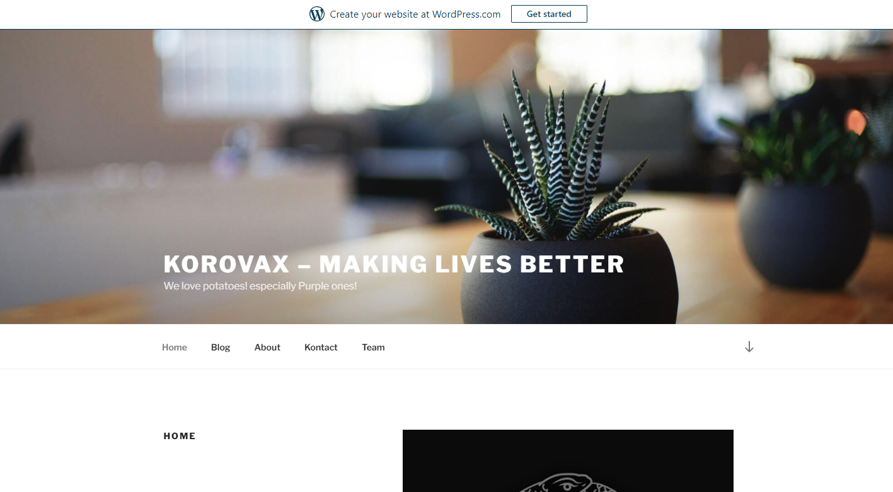

We tried to run `wpscan` on the website, but interestingly enough, it kept failing so we did not continue with that path.


Preliminary investigations led to nothing of interest except for the following information:

The Twitter Handle (@scba) from https://csgctf.wordpress.com/2020/10/01/example-post-3/

The Team from https://csgctf.wordpress.com/team/


We look back to the problem statement:

```
Also, there might be hidden portal(s) that can be discovered through "sitemap(s)"?
```

Hmmm... Let's visit the sitemap of this website then!

`korovax.org/sitemap.xml`

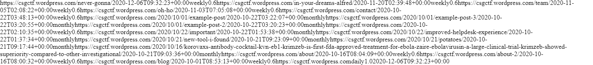


What a mess! Let's clean up everything:

```
https://csgctf.wordpress.com/in-your-dreams-alfred/
2020-11-20T02:39:48+00:00weekly0.6
https://csgctf.wordpress.com/team/
2020-11-05T02:08:22+00:00weekly0.6
https://csgctf.wordpress.com/oh-ho/
2020-11-03T07:05:08+00:00weekly0.6
https://csgctf.wordpress.com/contact/
2020-10-22T03:48:13+00:00weekly0.6
https://csgctf.wordpress.com/2020/10/01/example-post/
2020-10-22T03:22:07+00:00monthly
https://csgctf.wordpress.com/2020/10/01/example-post-3/
2020-10-22T03:20:55+00:00monthly
https://csgctf.wordpress.com/2020/10/01/example-post-2/
2020-10-22T03:20:23+00:00monthly
https://csgctf.wordpress.com/
2020-10-22T02:10:35+00:00weekly0.6
https://csgctf.wordpress.com/2020/10/22/important/
2020-10-22T01:53:38+00:00monthly
https://csgctf.wordpress.com/never-gonna/
2020-10-22T01:46:32+00:00weekly0.6
https://csgctf.wordpress.com/2020/10/22/improved-helpdesk-experience/
2020-10-22T01:37:34+00:00monthly
https://csgctf.wordpress.com/2020/10/21/new-tool-i-found/
2020-10-21T09:23:09+00:00monthly
https://csgctf.wordpress.com/2020/10/21/potatoes/
2020-10-21T09:17:44+00:00monthly
https://csgctf.wordpress.com/2020/10/16/korovaxs-antibody-cocktail-kvn-eb1-krimzeb-is-first-fda-approved-treatment-for-ebola-zaire-ebolavirusin-a-large-clinical-trial-krimzeb-showed-superiority-compared-to-other-investigational/
2020-10-21T09:03:36+00:00monthly
https://csgctf.wordpress.com/about/
2020-10-16T08:04:09+00:00weekly0.6
https://csgctf.wordpress.com/about-2/
2020-10-16T08:00:32+00:00weekly0.6
https://csgctf.wordpress.com/blog/
2020-10-01T08:53:13+00:00weekly0.6
https://csgctf.wordpress.com/
daily1.02020-11-20T02:39:48+00:00
```


We notice a peculiar link called https://csgctf.wordpress.com/oh-ho/, and when clicked, led to this secret page:

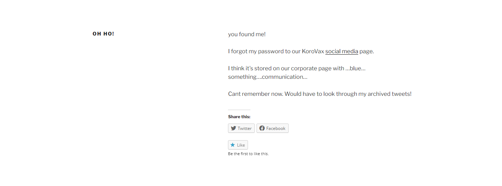

Interesting... a secret social media page? Let's visit the [site](http://fb.korovax.org/)~

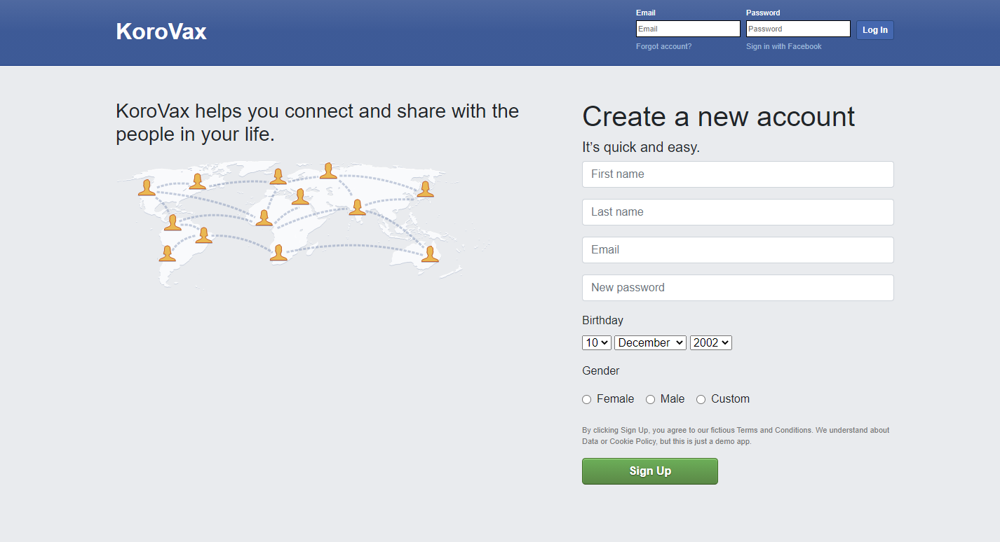

Wow. That looks vaguely similar to another social media platform...


Anyway, we made a throwaway account to gain access to the platform:

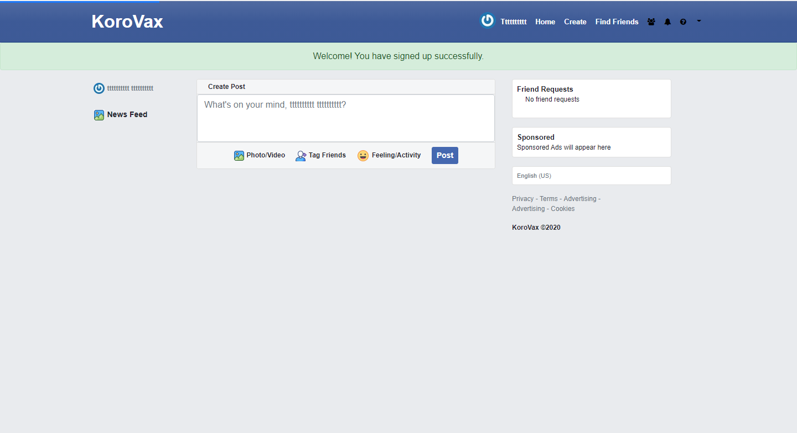


We clicked on "Find Friends", and saw a lot of people who had also made their own accounts. With so many accounts, how are we going to find who the kidnapper is?

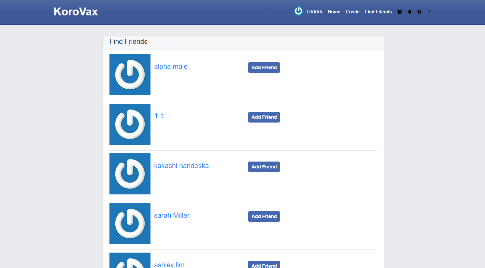


### Who are the kidnappers?

_________

We look back to the information we found:

The Team from KoroVax: Oswell E Spencer, Sarah Miller, Samuel the Dog

The Twitter Handle ([@scba](https://twitter.com/scba)) which is in fact Sarah Miller's personal Twitter account (interestingly enough, it is a real person's Twitter, the first I have ever seen in a CTF)

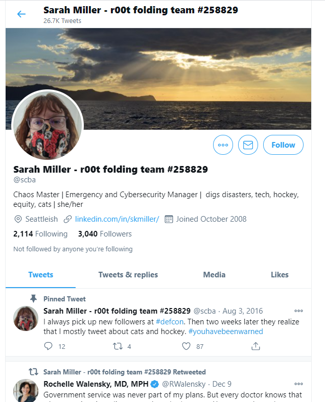


Sarah Miller's name kept popping up... Even the problem description made mention of her last name...

Could it be this person?

Using KoroVax's secret social media platform, we found Sarah Miller's profile, and in there, her email as `sarah.miller@korovax.org`.

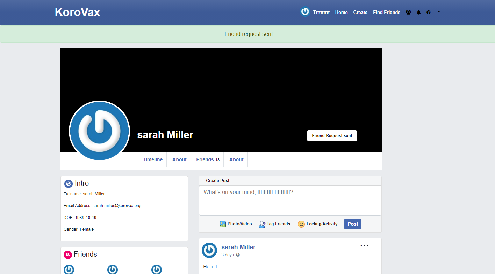

Alright, now we also need her password for the flag!

We look back at the secret post:


Hmm... `...blue... something...communication...` What could it be?


**From this point on, we went down the wrong path that inadvertently solved another challenge but wasn't available to us due to this challenge being unsolved. :<**


Anyway, we searched google for keywords relating to "blue" and "communications" and found this [website](http://bluecomm.com/):


Could this be the missing word to the `something`?


We tried logging into fb.korovax.org with `sarah.miller@korovax.org` and the various passwords below:

```
Blue sky communications
Blue Sky Communications
blue sky communications
```


The password `Blue sky communications` successfully logged us into Sarah Miller's account, and thus that is her credentials.

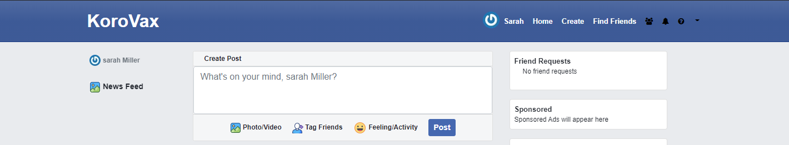


### Flag

____

```
govtech-csg{SarahMiller_Blue sky communications}
```


### What wrong path did we take?

_____________

We found this post:

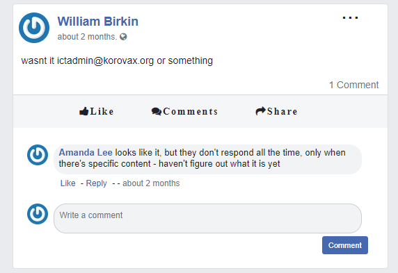


We also found this [post](https://csgctf.wordpress.com/never-gonna/) related to IT:

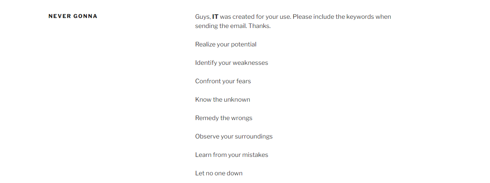


We sent an email with all of the text below:

```
Realize your potential

Identify your weaknesses

Confront your fears

Know the unknown

Remedy the wrongs

Observe your surroundings

Learn from your mistakes

Let no one down
```

And got nothing back...


We then realised that the first character of each line spells out the word `RICKROLL`. Could this be the word they want?

We decided to save time and emailed a bunch of texts related to `RICKROLL` to ictadmin@korovax.org:

```
Never gonna give you up
Never gonna let you down
Never gonna run around and desert you
Never gonna make you cry
Never gonna say goodbye
Never gonna tell a lie and hurt you
rickroll
RICKROLL
https://www.youtube.com/watch?v=dQw4w9WgXcQ
```

(Un)Surprisingly, we got a reply:

```
excellent artist, here's your code, govtech-csg{CE236F40A35E48F51E921AD5D28CF320265F33B3}


 39bc4f5150511ee7c3a703bdd615ed70f79002473d7f61d2dccfc397f7292b5e
```


Yeah, this flag wasn't for this challenge. ¯\\_(ツ)_/¯

