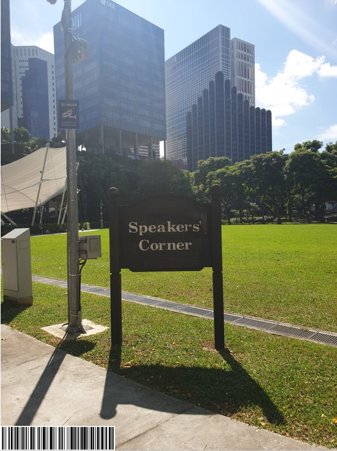
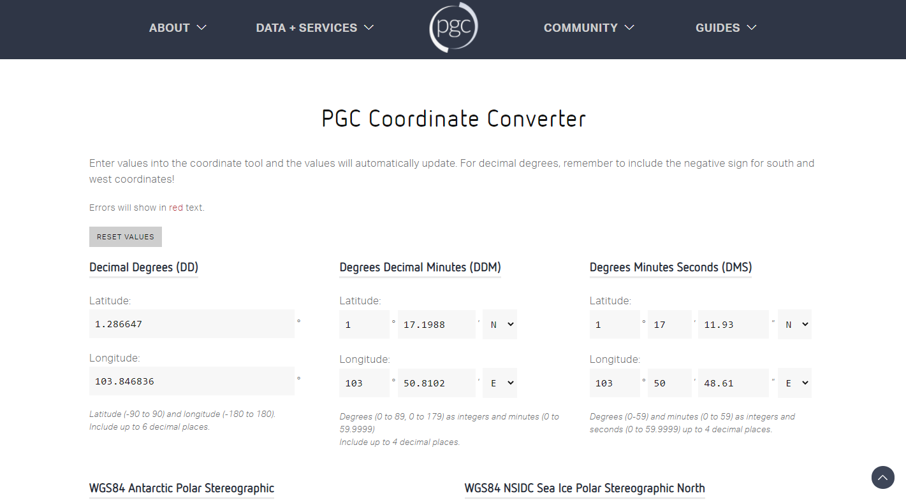
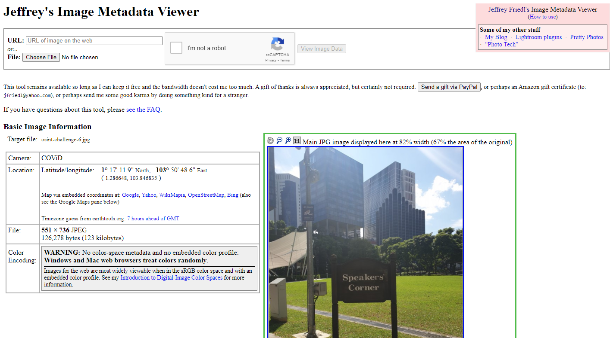
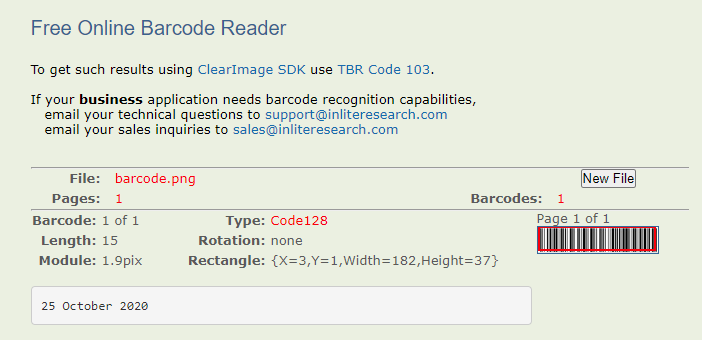
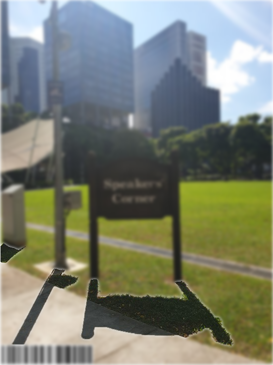
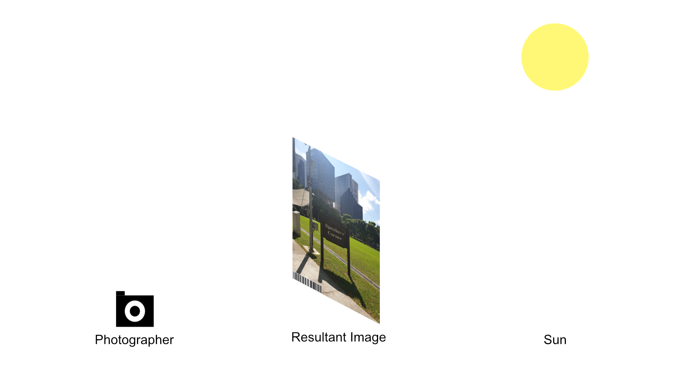
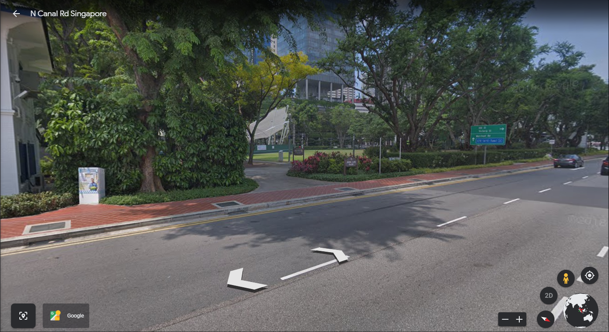
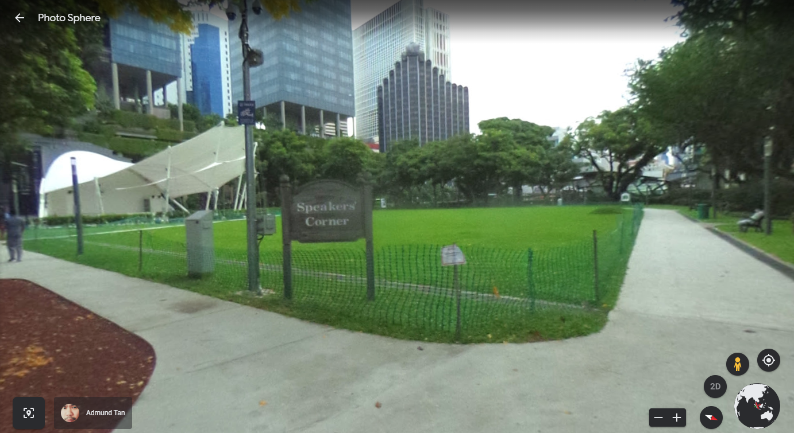
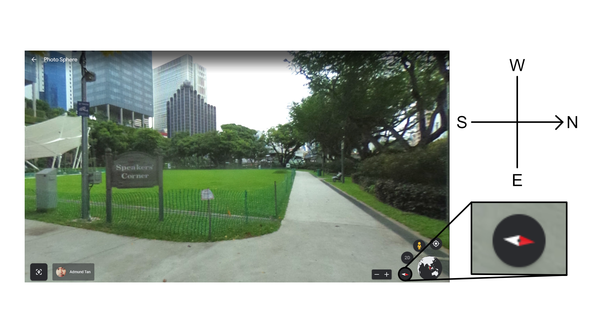
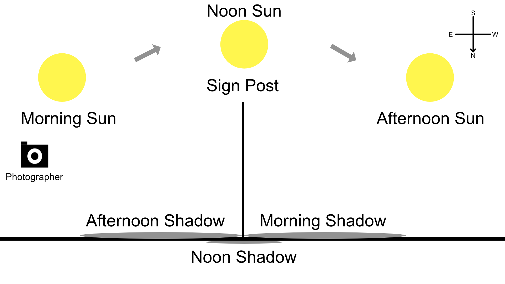

# Only time will tell!

### Forensics [691] - 34 Solves

_____

***This picture was taken sent to us! It seems like a bomb threat! Are you able to tell where and when this photo was taken? This will help the investigating officers to narrow down their search! All we can tell is that it's taken during the day!***

***If you think that it's 7.24pm in which the photo was taken. Please take the associated 2 hour block. This will be 1900-2100. If you think it is 10.11am, it will be 1000-1200.***

***Flag Example: govtech-csg{1.401146_103.927020_1990:12:30_2000-2200}***

***Flag Format: govtech-csg{lat_long_date_[two hour block format]}***
***Use this [calculator](https://www.pgc.umn.edu/apps/convert/)!***

___________

### The Place in the Picture: Speakers' Corner

__________

The image in question is this:



A little bit of Singapore trivia:

Speakers' Corner is an area located within Hong Lim Park. It is an area where citizens and permanent residents can demonstrate, hold exhibitions and performances, as well as freely speaking about issues that would be otherwise restricted in other parts of Singapore. Prior registration with the government is required before such activity may proceed.

Either way, this place is in danger of potentially being bombed, and we need to identify where and when this picture was taken.


### Where was this photo taken?

__________

We know that this is the Speakers Corner; however, we need the exact latitude and longitude of where this person was standing. As such, Google Maps will be of little use for finding the exact location. 

However, we can use the GPS information present within the metadata of the image to our advantage.

Our choice of tool is `ExifTool`: A command line program which allows for reading, writing and editing meta information present in many types of files. If you are using a Linux terminal, you can simply install it using `sudo apt install libimage-exiftool-perl` on UNIX based system. 

Thereafter, run this command with the picture in question:

```bash
$ exiftool osint-challenge-6.jpg

ExifTool Version Number         : 10.80
File Name                       : osint-challenge-6.jpg
Directory                       : .
File Size                       : 123 kB
File Modification Date/Time     : 2020:12:01 10:52:40+08:00
File Access Date/Time           : 2020:12:10 11:59:10+08:00
File Inode Change Date/Time     : 2020:12:10 11:58:16+08:00
File Permissions                : rwxrwxrwx
File Type                       : JPEG
File Type Extension             : jpg
MIME Type                       : image/jpeg
JFIF Version                    : 1.01
X Resolution                    : 96
Y Resolution                    : 96
Exif Byte Order                 : Big-endian (Motorola, MM)
Make                            : COViD
Resolution Unit                 : inches
Y Cb Cr Positioning             : Centered
GPS Latitude Ref                : North
GPS Longitude Ref               : East
Image Width                     : 551
Image Height                    : 736
Encoding Process                : Baseline DCT, Huffman coding
Bits Per Sample                 : 8
Color Components                : 3
Y Cb Cr Sub Sampling            : YCbCr4:2:0 (2 2)
GPS Latitude                    : 1 deg 17' 11.93" N
GPS Longitude                   : 103 deg 50' 48.61" E
GPS Position                    : 1 deg 17' 11.93" N, 103 deg 50' 48.61" E
Image Size                      : 551x736
Megapixels                      : 0.406
```


And there we have it; the GPS information!

```
GPS Latitude                    : 1 deg 17' 11.93" N
GPS Longitude                   : 103 deg 50' 48.61" E
GPS Position                    : 1 deg 17' 11.93" N, 103 deg 50' 48.61" E
```

We can then go to the [calculator](https://www.pgc.umn.edu/apps/convert/) given in the problem statement and convert the positions accordingly.




We obtain latitude and longitude as 1.286647, 103.846836 (to 6 d.p.).

 

There is also another method for finding the GPS location of the picture without the need for any command line tool.

Online tools such this [one](http://exif.regex.info/exif.cgi) can be for finding the metadata of the picture:



However, the precision of this website is not as good as `ExifTool`, as shown by the difference in the decimal points. As such, we still recommend `ExifTool` over all other tools.


### When was this photo taken?

______________

The metadata has the following information:

```
File Modification Date/Time     : 2020:12:01 10:52:40+08:00
File Access Date/Time           : 2020:12:10 11:59:10+08:00
File Inode Change Date/Time     : 2020:12:10 11:58:16+08:00
```

**Note that none of the information here actually accurately identifies the original date and time this photo was taken. The photo was last modified when someone changed something to it, such as adding the barcode.**

Speaking of which, we then looked at the barcode found at the bottom left of the image:


Using this [website](https://online-barcode-reader.inliteresearch.com/), we can obtain the following information:



As such, the date in which this photo was taken was **25 October 2020**. 


Here comes the difficult part: How do we identify the time period? (When we did the challenge, the original 3 attempts limit were removed, but what can we do to ensure that we only use 3 attempts in total?)

The answer: Shadows



From this picture, the shadows are formed at the front of the sign, lamp post and the pillar at the side.

This means the sun is in front of the photographer:



The sun rises in the **east** and sets in the **west**. Now, we have to identify the direction the photographer was standing in.

We bring up Google Earth/Maps and visit Hong Lim Park:



Here, we can vaguely see the blurry sign for "Speakers' Corner", but it clearly (no pun intended) needs a closer look.

Choosing a different position for street view:



There! Much clearer!

Let's focus on the compass direction in the bottom left:



By aligning ourselves to the same angle as the original photo, we can show that the photographer was facing towards the **west**. 

We look back at the latitude: 1.286647

Since the latitude is so close to the equator, we would expect the noon shadow to be extremely short. We can therefore immediately rule out the time period 1100-1300, as the shadows shown in the picture are very long.



Since the sun rises in the east and sets in the west, the shadow positions formed from the sign post looks like the one in the illustration above. Using that, we can conclude that as the shadow was **in front** of the sign when the picture was taken with the photographer facing **west**, the sun has **already** reached past the noon position and is in the process of **setting**. 

As a result, the photograph was likely taken **in the afternoon**, **effectively rejecting all time periods from 0000 to 1200**.

**We now have the following time periods left:**

**1300-1500**

**1400-1600**

**1500-1700**

**1600-1800**

**1700-1900**

**Time periods after 1900 would be too dark to match the photo, and as such were all rejected.**

From here, we note that as mentioned previously, the date at which this photo was taken is **25 October 2020**.

**Around the fall season, the sun sets somewhat early in Singapore, leading to a shorter day time.** 

**We can thus rule out 1700-1900, as it is likely that from 1700 onwards, the sun would have already been in position that is more visible in the photograph.**

**We also rule out 1300-1500, as the shadows would only become longer approximately from 1400 onwards, and this time period seemed too early for this photograph to be taken.**


**We are now left with the last three time periods:**

**1400-1600**

**1500-1700**

**1600-1800**


This should fit within the original limit of 3 attempts!


### Flag

_______

The actual time period turned out to be 1500-1700, and thus the flag is as follows:

```
govtech-csg{1.286647_03.846836_2020:10:25_1500-1700}
```


### Learning Outcomes

______

Things that we can learn from this challenge:

1. Identify the location using the metadata from the image.
2. Use Google Street View to obtain the direction the photographer was facing, and then use shadow analysis to approximate three possible time periods for when the photograph was taken.
3. Use every information where possible, such as the barcode from the bottom left of the picture.