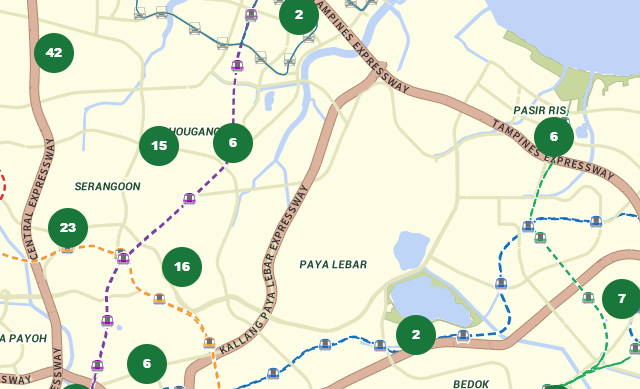
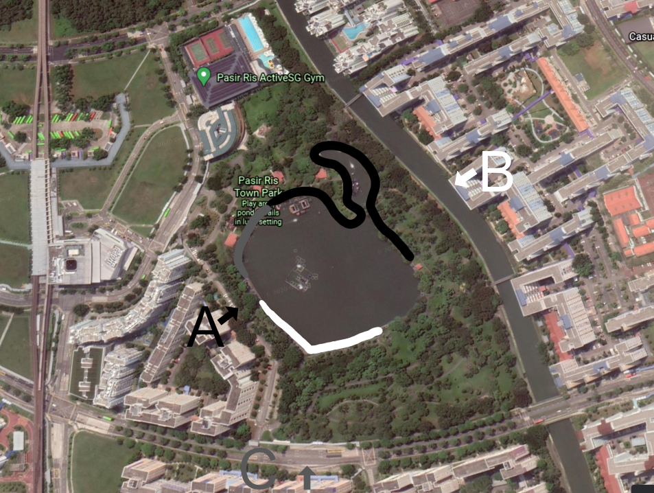
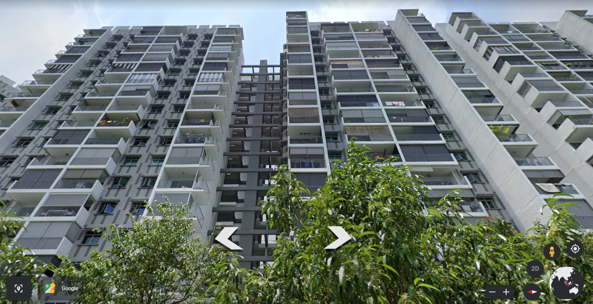
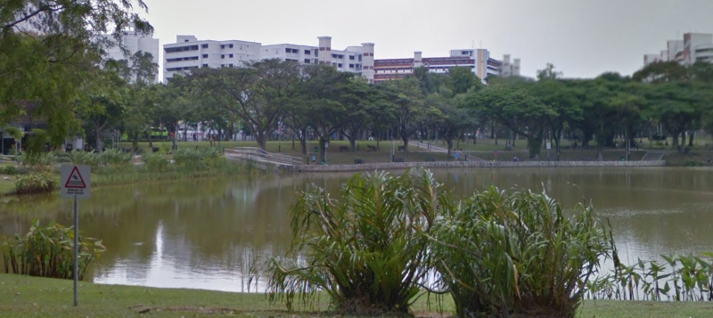
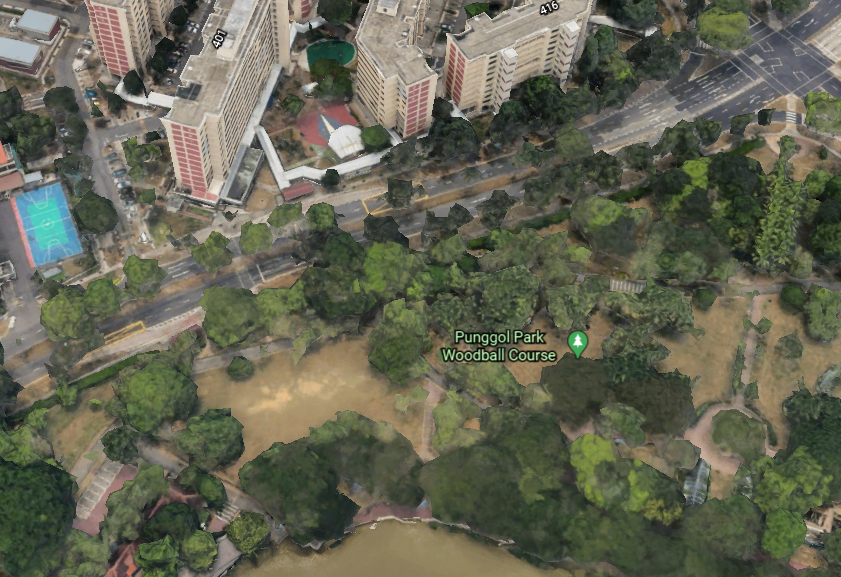
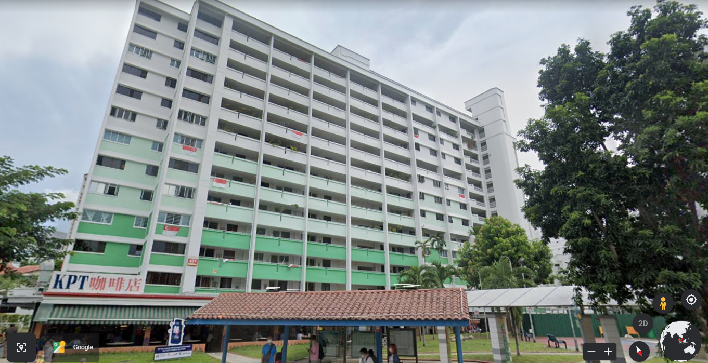

# Sounds of freedom!

## OSINT [750] - 31 Solves

***In a recent raid on a suspected COViD hideout, we found this video in a thumbdrive on-site. We are not sure what this video signifies but we suspect COViD's henchmen might be surveying a potential target site for a biological bomb. We believe that the attack may happen soon. We need your help to identify the water body in this video! This will be a starting point for us to do an area sweep of the vicinity!***

***Flag Format: govtech-csg{postal_code}***

__________

### The Video in Question

______

Let's start off by viewing the video.


After conducting the video, we can then start to identify the relevant landmarks presented in the video, so that it can aid us in finding out where the water body is.


**The process will be as follows:**

**A. Gather information from the video.**

**B. Isolate the correct location and reject the wrong locations using online tools.**

**C. Collect evidence to prove that the location is the same as the one from the video.**


### A. Gather information from the video.

_____


We can use the following list below to identify as many possible information as possible:

1. What is present in the foreground?
2. What is present in the background?
3. What specific infrastructures are present in the vicinity?
4. What is the general shape of the target (the water body) in the video?
5. If present, does the audio provide any additional clues?


Thereafter, we will attempt to narrow down our search.


### 1. What is present in the foreground?

_____________

Let's see what is present in the foreground of the video.


It seems to be reminiscent of a **Housing Development Board (HDB) Flat**. These flats are a form of public housing provided by the Singapore government. An example of a cluster of HDB flats is shown below.


However, it could also be a **condominium**, so we will keep both of these in mind.

**That aside, we also note the air conditioner exhaust placement being on the right of the video taker, as well as the presence of beam like structures.**


### 2. What is present in the background?

Let's shift our focus to the background.


We can note that there is a **bus stop** below the building.


Furthermore, since there is a bus stop, we can also note that the water body is right beside a **road**.


Let's move the video to a **different frame where the camera is panned upwards**.


We see that the water body is surrounded by **a lot of foliage** (red); this **rules out any water body that has little to no trees**. We also see that there are **walkways with red roofs around the park** (blue), as well as more **HDB flats behind coloured green** behind the park area. (yellow) There are also **staircases** (green and magenta) within the park.


### 3. What specific infrastructures are present in the vicinity?

_________

As mentioned previously, we have found:

1. The HDB/Condominium the video taker was in
2. The bus stop at the ground floor beside the road
3. Red roofed walkways in the park
4. Green HDB flats at the back of the park
5. Staircases within the park


### 4. What is the general shape of the target (the water body) in the video?

______________

The water body seems to be **curved**, so when we look for the water body later on, we can take this shape into consideration as well.


### 5. If present, does the audio provide any additional clues?

________

Interestingly enough, when this video was shot, there was a **very loud and deep hum**. Let's just say it goes by this sound:

```
mmmmmmmmmmmmmmmmmmmmmmmMMMMMMMMMMMMMMMMMMMMMMMMMMMMMMMMMMMMmmmmm (The audio clips at the large 'M', meaning it is much louder in real life than what the camera could record.)  
```

Since there are no specific vehicles on the ground that could make such a loud noise, **it must have been from the air.** 

Additionally, the name of the challenge is called "Sounds of freedom!" It sounds like this park is located in the vicinity of an air flight path, likely to be from the Republic of Singapore Air Force. This indicates a **high likelihood of the presence of a nearby air base or airport.** 

**This is an especially important clue, because it essentially rules out all other water bodies in Singapore that are not near any air bases.**


### **B. Isolate the correct location and reject the wrong locations using online tools.**

______________

Alright, now that we have the relevant information, let's bring up Google Maps/Google Earth and find this water body! I will be using Google Earth as it offers a more cinematic view of the area.


Let's identify the various air bases and airports:


Let's start with the process of elimination.


This is Singapore Changi Airport and Changi Air Base. From this satellite image, we **cannot find any nearby HDB flats or condominiums.** Moreover, this area is **not close to any water body** other than the surrounding sea. As such, we reject this location.


This is Singapore Tengah Air Base. From this picture, **it is also very secluded from any HDB flats or condominium**, and the surrounding water bodies are **extremely large**. It is likely that this is not the area either.


This leaves us with three possible locations: Seletar Airport, Sembawang Air Base and Payar Lebar Airbase. Given that these airports/airbases are near many HDB flats, we can assume that the flight paths are likely localized around there.


The park with the water body is likely in this picture.

However, this is still a really large area (approximately 18.95km by 11.33km). How can we start narrowing down our search?

For this we can use the parks and nature reserves service provided by the [NParks](https://www.nparks.gov.sg/gardens-parks-and-nature/parks-and-nature-reserves) website. For those wondering, National Parks Board (NParks) is a statutory board responsible for managing the various parks and nature reserves in Singapore.

Let's now go to the same area as the picture above.


Luckily, this map also happens to show all of the water bodies located around this area.

We know from before that our **water body target is not that big**, and it has a **curved shape**, and as such, we can reject everything to the left of the purple colour MRT line (North East Line). 




From here, ignoring all of the rivers, we see four possible water bodies.


Zooming into the two adjacent water bodies below, we see that it is Bedok Reservoir and an unnamed water body.


Using street view, we can note that the water body is way too large to fit the one from the video.


The other water body is not near any HDB flats, and is thus automatically disqualified.

We can scratch these two water bodies off our list and move on.


Well, it seems like Pasir Ris Town Park actually ticks a bunch of requirements mentioned above, such as the red roof structures, as well as the presence of a road beside the park. 

However, we eventually rejected this park

The main reason is: The shape of the park does not fit the one in the video.

If we look back at the screenshot from the video:


From this point of view, the water body is curved along the top left corner.




We consider three vantage points, namely A, B and C. These vantage points are at the places with HDB flats (or Condominiums)

If we look from A, we would realise that the shape of the top left corner of the park would not match the one from the video.

If we look from B, the top left hand corner of the water body is somewhat pointy instead of a curve. Moreover, there is a lake separating the building from the water body.

If we look from C, the distance between water body and the building would be way too far than the one from the video.


With that, we only have one location left, and that is Punggol Park.


The good sign is that the water body here looks somewhat curvy, which fits the picture from above. Additionally, the water colour is also a dark yellow green, which matches the water colour from the video.


### C. Collect evidence to prove that the location is the same as the one from the video.

______

Now, it is just a matter of confirming that this is indeed the water body. This is important as we only have three attempts, and when conducting real OSINT, sending dispatchers to the wrong location could be a massive waste of time for everyone involved.


Looking from this angle, we see that the red roof structures are also there, and that the shape of the top left corner of the water body also fits the one from the video.

Going into street view at the tip of the arrow:


Bingo! We found the bus stop!


Even the lamp to the left of the bus stop fits the one from the video.

Let's turn around:



Hmm, seemed like the person stood on one of the higher floors and took the video. The air conditioner exhaust placement, along with the presence of the beams in the foreground as mentioned just now also matches.

Are there any more evidence we can find?

Entering the park, we find:



Both staircases seem to coincide with the ones below (green and magenta):


What about the green buildings at the top left corner of the picture above?

Going to the staircase reveals something worrying:


The buildings are *red* in colour, rather than *green*. We note Block 401 here, and that it seems to have a coffee shop at the ground floor.

Going back to satellite view:



Block 401 is still red, even though when viewed from the same vantage point, it should have been green...


The big surprise came when we decided to go into street view right in front of the HDB Block:



It is green here! The coffee shop is also present here as well!

This means that the 3D models that Google Earth/Maps have generated were based off an old model of the block, and it is likely that **these blocks around the estate were repainted a few months ago to green** .


**With all of this, we are convinced that the water body shown in the video is in fact Punggol Park.**


### Flag

_____________

A simple Google Search shows us the address of Punggol Park:


```
Hougang Ave 10, Singapore 538768
```

Since the flag format is `govtech-csg{postal_code}`, we only need the postal code `538768`.

The flag is as follows:

```
govtech-csg{538768}
```

There we have it!


### Tips

____________

This challenge also reveals some limitations that Google Maps/Earth have, such as not updating the 3D models of the HDB blocks. This led to confusion as it was an apparent contradiction to all of the other evidence. It is lucky that Google Street View actually displays the updated block colour so that we can disregard the colour of the 3D models.

This challenge also shows that there are many tools available online that can be used to narrow down from over 350 parks to just a few for further investigation.