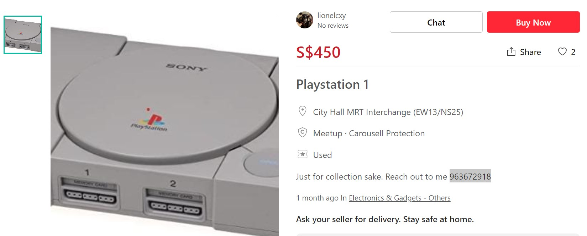
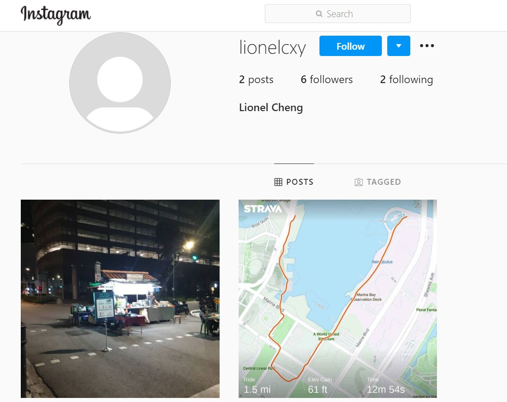
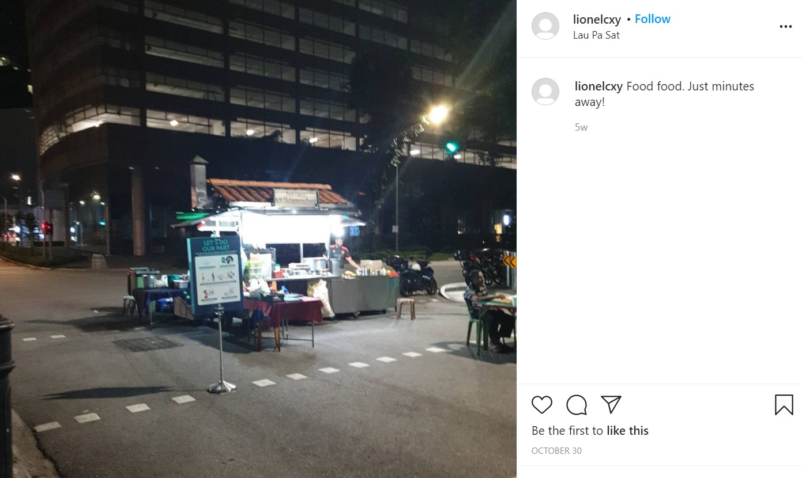
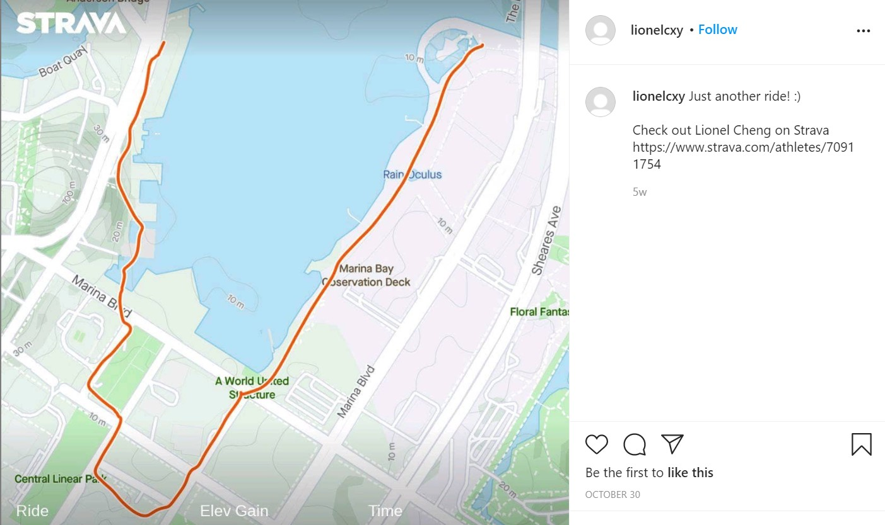
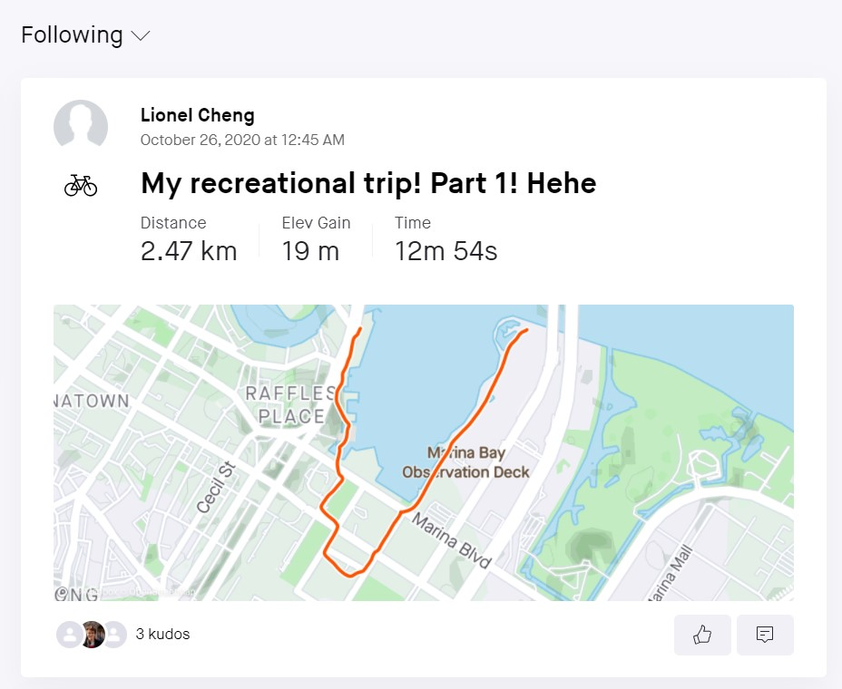
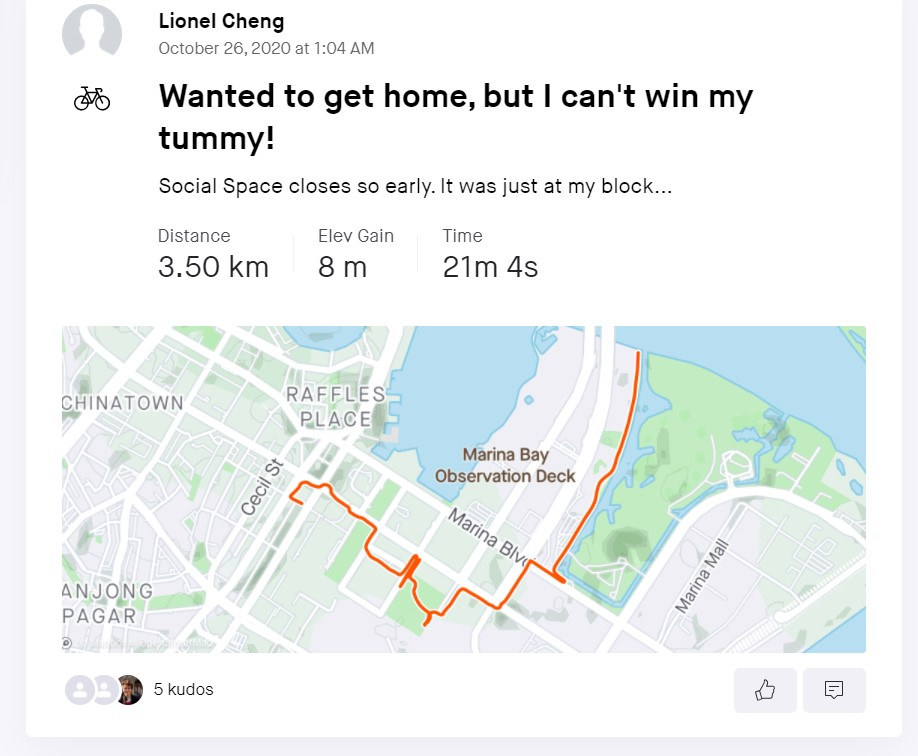

# Hunt him down! 970 Points - 14 Solves (Cat3)

```
After solving the past two incidents, COViD sent a death threat via email today. Can you help us investigate the origins of the email and identify the suspect that is working for COViD? We will need as much information as possible so that we can perform our arrest!

Please view this Document for download instructions.

Example Flag: govtech-csg{JohnLeeHaoHao-123456789-888888}

Flag Format: govtech-csg{fullname-phone number[9digits]-residential postal code[6digits]}
```

So basically, we need to look for the follow information:

- **Full** Name
- **His/Her Phone No.**
- **His/Her Postal Code**


We are given a `.eml` file which when opened, has the following contents:

```
X-Pm-Origin: internal
X-Pm-Content-Encryption: end-to-end
Subject: YOU ARE WARNED!
From: theOne <theOne@c0v1d.cf>
Date: Fri, 4 Dec 2020 21:27:07 +0800
Mime-Version: 1.0
Content-Type: multipart/mixed;boundary=---------------------9d9b7a65470a533c33537323d475531b
To: cyberdefenders@panjang.cdg <cyberdefenders@panjang.cdg>

-----------------------9d9b7a65470a533c33537323d475531b
Content-Type: multipart/related;boundary=---------------------618fd3b1e5dbb594048e34eeb9e9fcdb

-----------------------618fd3b1e5dbb594048e34eeb9e9fcdb
Content-Type: text/html;charset=utf-8
Content-Transfer-Encoding: base64

PGRpdj5USEVSRSBXSUxMIEJFIE5PIFNFQ09ORCBDSEFOQ0UuIEJFIFBSRVBBUkVELjwvZGl2Pg== (Decoded: THERE WILL BE NO SECOND CHANCE. BE PREPARED.)
-----------------------618fd3b1e5dbb594048e34eeb9e9fcdb--
-----------------------9d9b7a65470a533c33537323d475531b--
```

Now that's really little info to work with... there is no IP, only some domains, let's see if we can get anything from the domains `c0v1d.cf` and `panjang.cdg` (*P.S We also tried emailing both emails... but I guess emailing terrorists isn't exactly a safe thing to do but thankfully we didn't receive any death threats*)

Now when we looked up **all the DNS records** for `c0v1d.cf` we see:

```
A
Type	Domain Name	Address	TTL
A	c0v1d.cf	127.0.0.1	299
AAAA
Sorry no record found!
CNAME
Sorry no record found!
MX
Sorry no record found!
NS
Type	Domain Name	NS	TTL
NS	c0v1d.cf	ns03.freenom.com	299
NS	c0v1d.cf	ns01.freenom.com	299
NS	c0v1d.cf	ns02.freenom.com	299
NS	c0v1d.cf	ns04.freenom.com	299
PTR
Sorry no record found!
SRV
Sorry no record found!
SOA
Type	Domain Name	Primary NS	Responsible Email	TTL
SOA	c0v1d.cf	ns01.freenom.com	soa.freenom.com	299
TXT
Type	Domain Name	Record	TTL
TXT	c0v1d.cf	user=lionelcxy contact=lionelcheng@protonmail.com	3308
```

Now... that **TXT record** seems especially promising, we now have a **username and email lead** (*`panjang.cdg` did not seem to exist as a domain*)

Let's give this username to my best buddy **sherlock** to check for social media accounts!

```
python3 sherlock/ lionelcxy
[*] Checking username lionelcxy on:
[+] 500px: https://500px.com/p/lionelcxy
[+] ICQ: https://icq.im/lionelcxy
[+] Instagram: https://www.instagram.com/lionelcxy	
[+] Telegram: https://t.me/lionelcxy
[+] Travellerspoint: https://www.travellerspoint.com/users/lionelcxy
[+] Twitter: https://mobile.twitter.com/lionelcxy
```

Now only the **Instagram** and **Twitter** accounts seem to be related to the terrorist we are searching for.

On the **Twitter** account, we find a **Carousell Post** for a **PS1** (*wowzies, can I actually buy it?*)


Following the Carousell link, we find the **9 digit phone number** we are after (`963672918`)




Alright! We got 1 piece of the puzzle, let's move on to **Instagram**.



What's this? From the latest post, he is suggesting that he lives **somewhere near Lau Pa Sat** as it is captioned `Food food. Just minutes away!`, and the **Strava Post seems to confirm this as well as he went running around the Marina Bay area**





Now... there is a [link](https://www.strava.com/athletes/70911754) on the **strava post** to his **strava account**, let's check it out!

At this point we also made a throw-away account on Strava as you need to be **logged into see his posts**, and we are greeted with **more sweet juicy information!**



So... this is the post that was on Instagram, what about the other post?



Chotto Matte!!! `Social Space... just at my block`!? I think we just found where he lives :smile:!

A quick Google Maps search reveals only **1** `Social Space` cafe that is **located within a few minutes walking distance** of Lau Pa Sat... at **Marina One Residences (Garden Tower)** with the postal code `018935`. Bingo! Just his full name left.


We went onto google and googled `lionelcheng@protonmail.com` which gave a LinkedIn page matching the email exactly... and the terrorist's **full name!**


**Cheng Xiang Yi**, we are coming for you! :smile:

Therefore, piecing the information we gathered so far together, we get: (**Note:** It is English name followed by the full chinese name as stated in the description of the challenge)

```
govtech-csg{LionelChengXiangYi-963672918-018935}
```

and there we have it! Govtech better be sending a SWAT team over now, our terrorist seems pretty rich and powerful.


