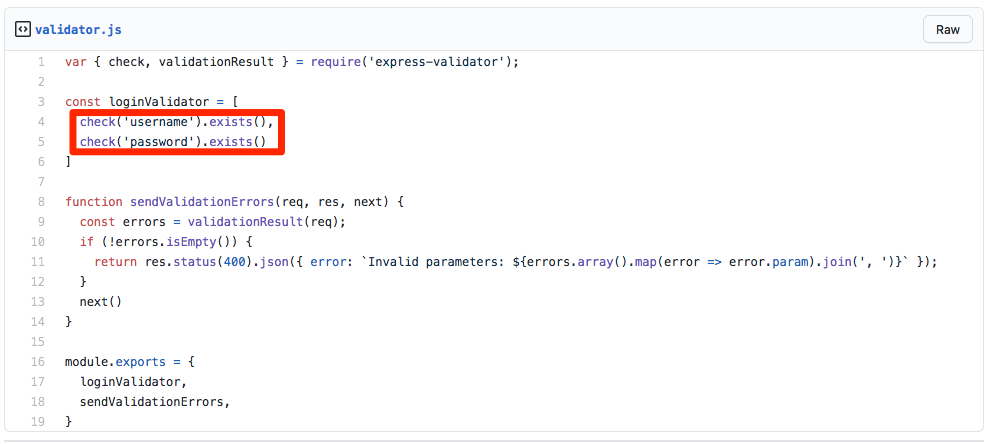
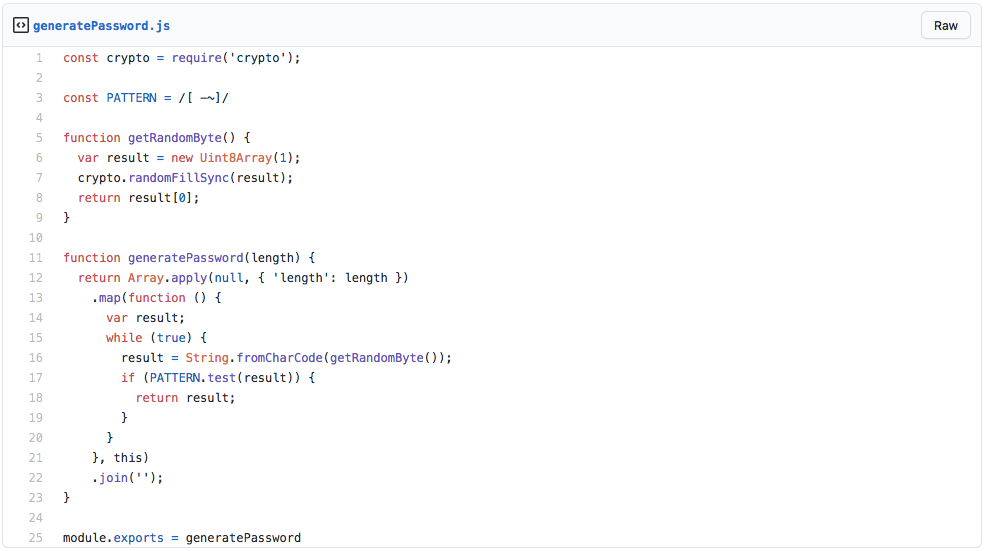
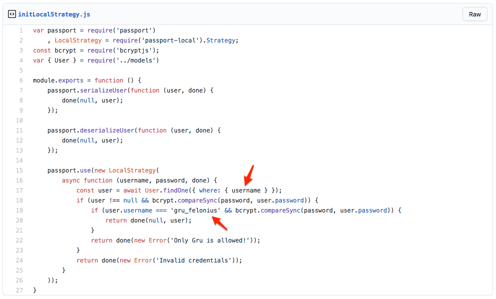
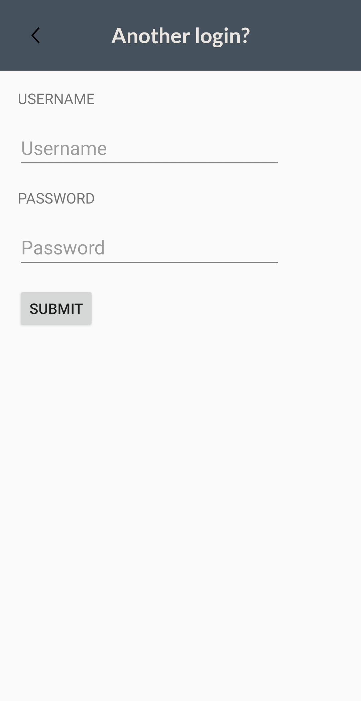
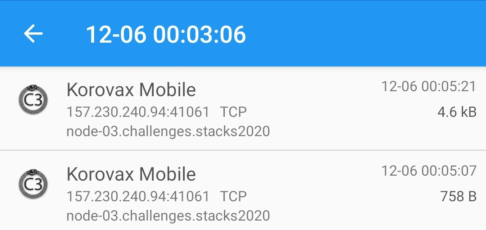
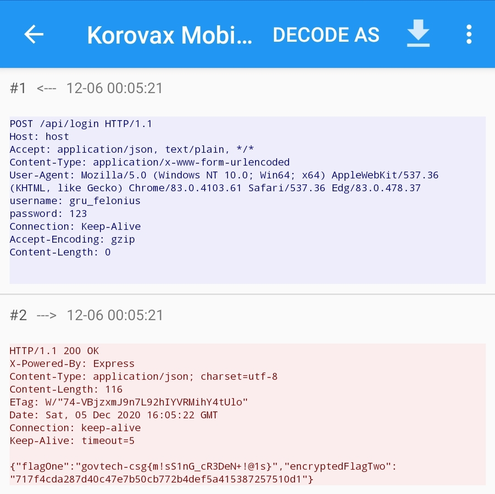

# Logged In
*It looks like COViD's mobile application is connecting to this API! Fortunately, our agents stole part of the source code. Can you find a way to log in?*

*[API Server](http://yhi8bpzolrog3yw17fe0wlwrnwllnhic.alttablabs.sg:41061/)*

## Solution 1 (Web) (Unintended?)
### Analysing the Challenge
1. We are given the source of the challenge, and unzipping it to take a look we can find that inside contains a partial source for the API Server.
2. Looking at the handlers and middlewares of the program, we notice that there is validator which checks for the presence of the username and password field.  
  
3. In helpers, there is a password generator (`generatePassword.js`) and a login checker (`initLocalStrategy.js`) that checks the password which is stored in a sequalise ORM-wrapped MariaDB server, in which the `username` field is passed in directly (this is crucial to the attack)  

  
4. After inspecting the main program (`app.js`), we do realise that the server accepts JSON data input as a payload.
5. Hence, we could conclude that the injection vector would be to perform a SQL injection by taking advantage of the JSON payload and parsing by the server.

### The Attack
- To know which endpoint we are going to check out, we look in the routes folder and the `api.js` file.
- The endpoint is named `/api/login`, and passes through the middlewares as described above.
- We also take note of the username required to pass the check to obtain the password, in this case is `gru_felonius`.
- We simply need to craft a malicious payload and submit it to the server via a POST request.
- Command: `curl -X POST http://yhi8bpzolrog3yw17fe0wlwrnwllnhic.alttablabs.sg:41061/api/login -H "Content-Type: application/json" -d '{"username": "gru_felonius", "password": {"$gt": 0}}'`

(Do note the injection of an object payload to compare the password in order to obtain the "hashed" password of `gru_felonius` from the database)

### Flag!
```govtech-csg{m!sS1nG_cR3DeN+!@1s}```

## Solution 2 (Web)
### Look again!
- Upon getting the flag for the challenge, looking at the flag we see that our solution was unintended (the intended solution was linked to missing credentials)
- So what if we tried the request again but this time with a blank username and password?

### Volia!
- Submit the request again using the command: `curl -X POST http://yhi8bpzolrog3yw17fe0wlwrnwllnhic.alttablabs.sg:41061/api/login -H "Content-Type: application/json" -d '{"username": "", "password": ""}'`
- It works!

**Hmmm... why does it work?**

- Let's look at the source code again, we know that the login endpoint is `/api/login` from above, and it checks for the existence of the `username` and `password` fields in several areas (such as `req.body`, `req.headers`)

- This information is then passed onto many callback functions including a `localAuthenticator` callback function:

- ```javascript
  //api.js
  
  router.post('/login', loginValidator, sendValidationErrors, localAuthenticator, function (req, res) {
    res.json({ "flagOne": process.env.FLAG_ONE, "encryptedFlagTwo": encryptFlag(process.env.FLAG_TWO) })
  });
  ```

- Looking at `localAuthenticator`:

```javascript
//authenticator.js

var passport = require('passport')

function localAuthenticator(req, res, next) {
    passport.authenticate('local', { session: false }, function (err, user, info) {
        if (err) {
            return res.status(401).json({
                "error": err.message
            });
        }
        next();
    })(req, res, next)
}

module.exports = {
    localAuthenticator,
}
```

- It seems like the application is using the `passport` library for authentication. Let's take a look at the **localStrategy (Configuration)** of `passport`, which is used to check whether the credentials are correct:

```javascript
//initLocalStrategy.js

    passport.use(new LocalStrategy(
        async function (username, password, done) {
            const user = await User.findOne({ where: { username } });
            if (user !== null && bcrypt.compareSync(password, user.password)) {
                if (user.username === 'gru_felonius' && bcrypt.compareSync(password, user.password)) {
                    return done(null, user);
                }
                return done(new Error('Only Gru is allowed!'));
            }
            return done(new Error('Invalid credentials'));
        }
    ));
```

- Now when reading through the documentation for the localStrategy, one particular paragraph caught our attention regarding the `return` statements which tell `authenticate` whether the login was successful:

```
Note that it is important to distinguish the two failure cases that can occur. The latter is a server exception, in which err is set to a non-null value. Authentication failures are natural conditions, in which the server is operating normally. Ensure that err remains null, and use the final argument to pass additional details.
```

- In this case, `new Error('Invalid credentials')` is clearly a **non-null value**, the correct way to raise an error should have been something like `return done(null, false, { message: 'Invalid credentials' });`

- Hence, since the return is **always a non-null value**, **anything passed as the password and username** (as long as they are set), will always **result in a login and give us the flag**

Flag: ```govtech-csg{m!sS1nG_cR3DeN+!@1s}```

## Solution 3 (Mobile)
### Interesting mobile challenge
- After attempting the mobile challenge Network?, we see that there is an interesting part of the decompiled Java source code for that activity.
```java
public String f2943e = "yhi8bpzolrog3yw17fe0wlwrnwllnhic.alttablabs.sg";

public String f2944f = "41061";

public String f2945g = ("http://" + this.f2943e + ":" + this.f2944f + "/api/login");
```
*(`sg.gov.tech.ctf.mobile.Admin.NetworkActivity.java`)*
- The decompiled source code indicates that the result of a web request made to the same API server in this challenge is outputted to log.
```java
Log.v("rht", "SERVER REPLIED:");
for (String line : response) {
  Log.v("rht", "Line : " + line);
}
```
*(`sg.gov.tech.ctf.mobile.Admin.NetworkActivity.java`)*
- However, instead of listening and getting the information using `logcat` on Android, we decided to take another approach that is more related to web.

### Packets? Packets!
- It is common knowledge that making a network request over the Internet will lead to packets being sent from the client to server and vice-versa.
- We will capture the packets sent to the server on Android using a tool called "Packet Capture"
- After downloading the application, we start listening for packets from the KoroVax application login page.


### Head of headers
- Upon going to the login page in the mobile application, we see that there are packets successfully captured.  
  
- The flag of our challenge is also found within the packet capture, ```govtech-csg{m!sS1nG_cR3DeN+!@1s}```  
  
- Looking at the request, we see that there are some interesting headers being sent, notably the `username` and `password` header.
- This likely means that the mobile application is able to pass the authentication through these headers, and we verify our hypothesis by make a similar request with random data.
- Command: `curl -X POST http://yhi8bpzolrog3yw17fe0wlwrnwllnhic.alttablabs.sg:41061/api/login -H "username: GOVTECH" -H "password: CSG"`
- Not to our surpise, it worked!

Flag: ```govtech-csg{m!sS1nG_cR3DeN+!@1s}```

## Learning objectives
After this challenge, we have gotten a few learning points:
- Always look at challenges from different angles, such as this challenge which had multiple solutions and even unintended solutions.
- Sometimes, the developer might not have noticed that there would be more than one way to gain access to the program
- Don't be afraid to try multiple different ways, as you might never know which would work!
