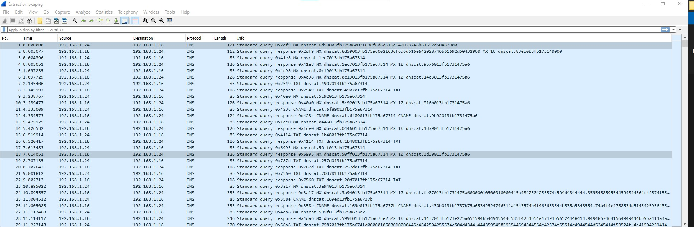
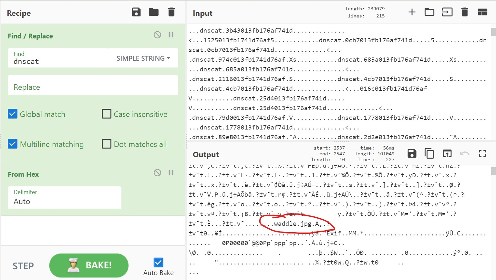

# Exfiltration - (0 Solves) [8 Points]
```
SieberrHealth seems to have broken into 1 of our servers! Oh no!

They seem to have already set up some persistence in our server and we are detecting large amounts of suspicious traffic being transferred to and fro the server.

Can you please check what sensitive data was exfiltrated? We need to know what was compromised as soon as possible!

Here is a Network Capture File of the suspicious traffic we captured.
```

We are given a `Extraction.pcapng`. 


## Initial Analysis

On initial analysis, we see a lot of **DNS Queries** with each packet starting with the header `dnscat`. 



A quick google search reveals that this is `dnscat2` traffic, and is probably not from an authoritative DNS since the headers are exposed.

Reading some of the documentation, we will realise that the data appended after each `dnscat` header is simply **hex-encoded**, so we can **Follow UDP Stream** in wireshark and decode all the hex we get as an initial analysis:




We notice a lot of interesting strings after hex decoding, which suggests that the traffic is **unencrypted**, thankfully. We notice in particular a file being transferred with the name `waddle.jpg`, but part of the **header is seemingly missing**, and also there is a **lot of other data**, so we **can't simply copy and paste the bytes to obtain the image, we will have to dive into the protocol**!


## Diving into the Protocol

dnscat2 has a very well [documented protocol](https://github.com/iagox86/dnscat2/blob/master/doc/protocol.md).

Firstly, we will see that the overall structure of a dnscat2 packet looks like this (for a non-authoritative DNS):

```bash
<tag>.<encoded data> #E.g dnscat.4877013fb11c807430
```

Moving a bit further down, we will see a section describing what each **record type does**, but basically each record type can hold **different lengths of data**:

```
A TXT response is simply the hex-encoded data, with nothing else. In theory, TXT records should be able to contain binary data, but Windows' DNS client truncates TXT records at NUL bytes so the encoding is necessary.

A CNAME or MX record is encoded the same way as the request: either with a tag prefix or a domain postfix. This is necessary because intermediate DNS servers won't forward the traffic if it doesn't end with the appropriate domain name. The MX record type also has an additional field in DNS, the priority field, which can be set randomly and should be ignored by the client.

Finally, A and AAAA records, much like TXT, are simply the raw data with no domain/tag added. However, there are two catches. First, due to the short length of the answers (4 bytes for A and 16 bytes for AAAA), multiple answers are required. Unfortunately, the DNS hierarchy re-arranges answers, so each record must have a one-byte sequence number prepended. The values don't matter, as long as they can be sorted to obtain the original order.

The second problem is, there's no clear way to get the length of the response, because the response is, effectively in blocks. Therefore, the length of the data itself, encoded as a signle byte, is preprended to the message. If the data doesn't wind up being a multiple of the block size, then it can be padded however the developer likes; the padding must be ignored by the other side.
```

Next up, we finally move onto the dnscat2 protocol to see what each hex-encoded data means and holds (skip to the `Messages` section).

We can see that there are 5 message types:

```
/* Message types */
#define MESSAGE_TYPE_SYN    (0x00)
#define MESSAGE_TYPE_MSG    (0x01)
#define MESSAGE_TYPE_FIN    (0x02)
#define MESSAGE_TYPE_ENC    (0x03)
#define MESSAGE_TYPE_PING   (0xFF)
```

and datatypes:

```
uint8_t - an 8-bit (one-byte) value
uint16_t - a 16-bit (two-byte) value
uint32_t - a 32-bit (four-byte) value
uint64_t - a 64-bit (eight-byte) value
ntstring - a null-terminated string (that is, a series of bytes with a NUL byte ("\0") at the end
byte[] - an array of bytes - if no size is specified, then it's the rest of the packet
```


We will be mainly focusing on the **MESSAGE_TYPE_MSG [0x01]** as it contains **juicy data!** The structure is as follows:

```bash
(uint16_t) packet_id
(uint8_t) message_type [0x01]
(uint16_t) session_id
(uint16_t) seq
(uint16_t) ack
#9 bytes above
(byte[]) data
```

So that means that in each hex-encoded data, there is a **9 byte header** followed by the data we want.


## Analysing the Transmission According To The Protocol

*I will be going through this part very briefly as it is just figuring out what is going on*

I like to export the packet dissections as **JSON** from Wireshark so that it is easy to work with later using a python script.

We can then write a simple script to **extract the MSG packets data** as well as show some information about them:

```python
import zlib

contents = {}
with open("capture2Json.json") as f:
    contents = json.loads(f.read())
    
for x in contents:
    data = x["_source"]["layers"]["dns"]["Queries"]
    key = list(data)[0]
    data = data[key]["dns.qry.name"]
    
    encodedData = data[7:].replace(".", "") #All periods shouold be ignored according to the documentation
    
    if (encodedData[4:6] == "01"): #If the packet type is an MSG packet
        data = encodedData[18:]
        
        if (len(data) > 0):
            seqNum = encodedData[10:14]

            session_id = encodedData[6:10]
                
            print("[SESSION_ID] " + session_id + "  [Sequence No.] " + seqNum + " [len of data] " + str(len(data)) + " [Hash] " + str(zlib.crc32(bytes.fromhex(data))) )
```

And we get the following output:

```bash
...
[SESSION_ID] 3fb1  [Sequence No.] bbd5 [len of data] 212 [Hash] 4289257948
[SESSION_ID] 3fb1  [Sequence No.] bbd5 [len of data] 212 [Hash] 4289257948
[SESSION_ID] 3fb1  [Sequence No.] bc3f [len of data] 212 [Hash] 2109088517
[SESSION_ID] 3fb1  [Sequence No.] bc3f [len of data] 212 [Hash] 2109088517
[SESSION_ID] 3fb1  [Sequence No.] bca9 [len of data] 212 [Hash] 3866796125
[SESSION_ID] 3fb1  [Sequence No.] bca9 [len of data] 212 [Hash] 3866796125
[SESSION_ID] 3fb1  [Sequence No.] bd13 [len of data] 212 [Hash] 2404327798
[SESSION_ID] 3fb1  [Sequence No.] bd13 [len of data] 212 [Hash] 2404327798
[SESSION_ID] 3fb1  [Sequence No.] bd7d [len of data] 212 [Hash] 1869810710
[SESSION_ID] 3fb1  [Sequence No.] bd7d [len of data] 212 [Hash] 1869810710
...
```

As we can see from above, it seems like our data is all in the **same session**, with **increasing sequence number**. It seems like each data packet is **transmitted twice** as we can see that the hash is the same for 2 consecutive data packets. 

Now, we can come up with a plan to extract the image `waddle.jpg`:

- Find the **start and end** of the image and extract all the data packets in-between the start and end (inclusive of the start and end)
- Remember to only extract every 2 packets if not we will get getting duplicate data

For the start, since the header is damaged, I opted to use the `Exif` **chunk signature** (`0x45786966`), and hoped that everything important will be **within that same packet**.

As for the end, we can simply find out the footer signature of a jpeg, which is `0xffd9`. However for this, we will realise that there are multiple `0xffd9` throughout the data, which is not uncommon as the chances of image data having `0xffd9` is pretty high. So what I did was to select the **very last packet with `0xffd9`** in hopes that it is the end of the image. (I found out the sequence number of this packet is `1c4f`).

Hence, we have the final script:

```python
import json, zlib

contents = {}
with open("capture2Json.json") as f:
    contents = json.loads(f.read())

sequenceData = {}
started = False
lastSequence = ""
imageData = b""

#Looks for the "download" command packet
for x in contents:
    data = x["_source"]["layers"]["dns"]["Queries"]
    key = list(data)[0]
    data = data[key]["dns.qry.name"]

    encodedData = data[7:].replace(".", "") #All periods shouold be ignored according to the documentation

    #Find SYN
    if (encodedData[4:6] == "01"):
        data = encodedData[18:]
        if (len(data) > 0):
            seqNum = encodedData[10:14]

            session_id = encodedData[6:10]
                
            print("[SESSION_ID] " + session_id + "  [Sequence No.] " + seqNum + " [len of data] " + str(len(data)) + " [Hash] " + str(zlib.crc32(bytes.fromhex(data))) )

            if (started):
                if (data.find("ffd9") != -1 and seqNum == "1c4f"):
                    imageData += bytes.fromhex(data)
                    break
                elif (seqNum != lastSequence):
                    lastSequence = seqNum
                    imageData += bytes.fromhex(data)
            else:

                if (data.find("45786966") != -1):
                    print("Start")
                    started = True
                    imageData += bytes.fromhex(data)
                    lastSequence = seqNum


with open("out.jpg", "wb") as f:
    f.write(imageData)
```

After outputting the data, we then have to simply fix the header with the correct header:

```bash
FF D8 FF E0 00 00 4A 46 49 46 00 #ÿØÿà..JFIF.
```

And wala, out comes a fixed jpg with the flag:


```
 IRS{dnS_C2_anD_XfIlTrAtion_w0w}
```


## Learning Points:

- dnscat2 protocol 
- In general, how to read and extract data from a (custom) protocol 