# Adventure Time

## Reverse Engineering [8 points]

***SieberrHealth has been ramping up their marketing efforts, and in doing so, has commissioned a group of game developers in creating a game.***

***Unbeknownst to them, one of the team members is in fact, you guessed it, our very own secret agent.***

***Of course, he has to leak information discreetly, so what else could be more fitting than this fun creation?***

***(It is interesting to note that the game is extremely unfinished according to him.)***

***Anyway, you know what the kids always say, "Eh you can hack the game right?"***

***Give it a go and see what you can find.***

_____

### The Game

_________

A game called "SieberrAdventure" is given. Opening up the game in your respective systems will show some sprites briefly before the game abruptly closes.

This is because the timer is set to only 1 second. Once the time runs out, the game exits.

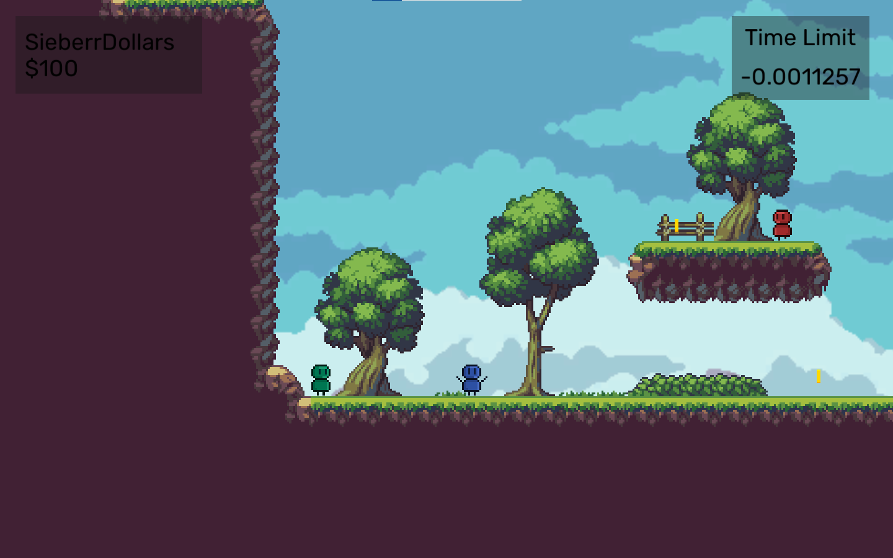


### Game Patching

______

There is thus a need for modifying the game to get pass the Time Limit check.

By googling "unity game reverse engineering", this result shows up as the second one in the list (https://defcon937.com/2020/07/dcg937-july-meeting-reverse-engineering-c-and-modifying-unity3d-games/).

Using this, there are two tools that can aid in modifying the game, namely ILSpy and dnSpy. This writeup will be focusing on ILSpy.

The writeup will split into two sections:

1. Patching via ILSpy and Reflexil
2. Direct Decompiling and Recompiling

Link to ILSpy: [https://github.com/icsharpcode/ILSpy](https://github.com/icsharpcode/ILSpy/tree/v6.0)
Link to Reflexil: https://github.com/sailro/Reflexil

__________________


### Patching via ILSpy and Reflexil

______

Install ILSpy and drag the .dll for Reflexil into the root folder of ILSpy. 

Then, open it up. This is what you should see.


Unity compiles all game C# scripts into Assembly-CSharp.dll, and so that is the target file. 

Drag it to the left window.


Given that the short 1 second time limit renders the game impossible to play, there is a need to focus on the script that controls the time limit, which appears to be `CountDownTimer`:

```c#
// CountDownTimer
using UnityEngine;
using UnityEngine.UI;

public class CountDownTimer : MonoBehaviour
{
	private float currentTime;

	private float startingTime = 1f;

	[SerializeField]
	private Text countdownText;

	private void Start()
	{
		currentTime = startingTime;
	}

	private void Update()
	{
		currentTime -= 1f * Time.deltaTime;
		countdownText.text = currentTime.ToString();
		if (currentTime <= 0f)
		{
			currentTime = 0f;
			Application.Quit();
		}
	}
}

```


From here, there are **two ways** to go about removing the time limit: Either modify `startingTime` to `100000000f`, or delete `Application.Quit();`.

Click on the cogwheel button to activate Reflexil.


To remove `Application.Quit();`, simply find the operand at offset 70 and delete it.

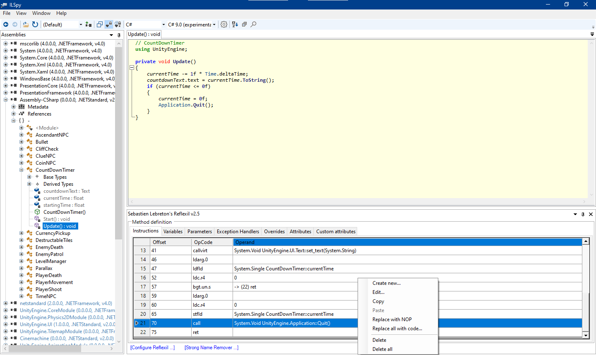

To increase the time limit, find `startingTime` with ILSpy and modify the value accordingly.


Now, save the .dll.

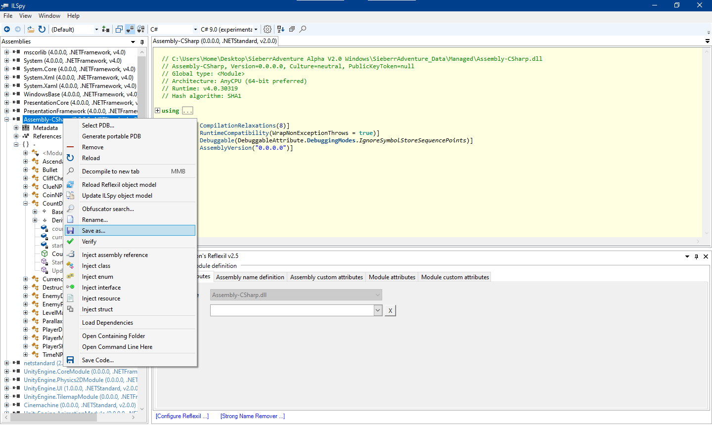

Rename it as Assembly-CSharp.dll to replace the original one.

The game should now be playable.

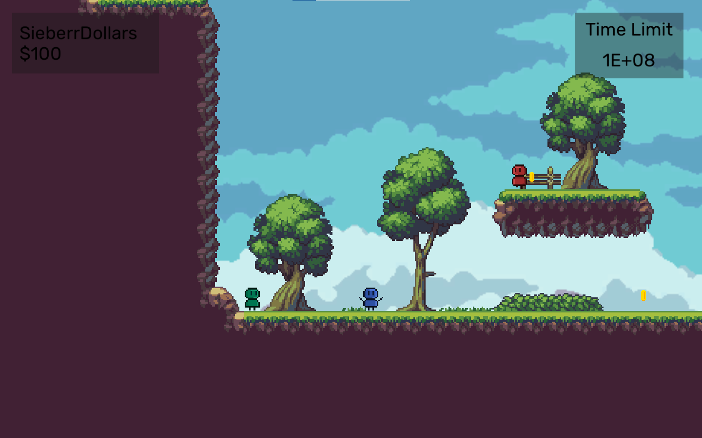


With this, further reconnaissance can be performed by talking to the 4 NPCs (blue colour) in the game.

To allow yourself to try out the game, the images will not be shown. Instead, here are their dialogues when interacted with:

| NPC       | Dialogue                                                     |
| --------- | ------------------------------------------------------------ |
| Clue      | That cliff... Ever wonder what's on top of it?               |
| Coin      | If you can show me you have $100000000, I'll give you something in return! |
| Time      | I'm making something right now. If you want to see it, wait until the timer below runs out. (100000000s) |
| Ascendant | "Ever wonder what's beyond us?<br/>We are just mere NPCs populating this desolate land...<br/>You, on the other hand, can go to the 'Next Level'..."<br/>Well, that's what the manuscripts said, but does that place actually exist, or... |


### Solving Clue NPC's Challenge

________

The cliff is extremely high such that it's out of sight entirely. To get to this cliff, the player must somehow be enabled to jump all the way up to that location.

Looking at `PlayerMovement.cs`:

```c#
using UnityEngine;

public class PlayerMovement : MonoBehaviour
{
	private float movementSpeed = 10f;

	public float jumpForce;

	public Rigidbody2D RB;

	public Transform feet;

	public LayerMask groundLayers;

	public Animator anim;

	private float mx;

	[HideInInspector]
	public bool isFacingRight = true;

	private void Update()
	{
		mx = Input.GetAxisRaw("Horizontal");
		if (Input.GetButtonDown("Jump") && IsGrounded())
		{
			Jump();
		}
		if (Mathf.Abs(mx) > 0.05f)
		{
			anim.SetBool("isRunning", value: true);
		}
		else
		{
			anim.SetBool("isRunning", value: false);
		}
		if (mx > 0f)
		{
			base.transform.localScale = new Vector3(1f, 1f, 1f);
			isFacingRight = true;
		}
		else if (mx < 0f)
		{
			base.transform.localScale = new Vector3(-1f, 1f, 1f);
			isFacingRight = false;
		}
		anim.SetBool("isGrounded", IsGrounded());
		Debug.Log("To add into the map later: IRS{H0p3");
	}

	private void FixedUpdate()
	{
		Vector2 velocity = new Vector2(mx * movementSpeed, RB.velocity.y);
		RB.velocity = velocity;
	}

	private void Jump()
	{
		Vector2 velocity = new Vector2(RB.velocity.x, jumpForce);
		RB.velocity = velocity;
	}

	public bool IsGrounded()
	{
		if (Physics2D.OverlapCircle(feet.position, 0.5f, groundLayers) != null)
		{
			return true;
		}
		return false;
	}
}

```

Note that the first part of the flag is found here: `Debug.Log("To add into the map later: IRS{H0p3");`


Focusing on the `IsGrounded()` function:

```c#
public bool IsGrounded()
	{
		if (Physics2D.OverlapCircle(feet.position, 0.5f, groundLayers) != null)
		{
			return true;
		}
		return false;
	}
```

The function is simple; it checks if the player is touching the ground, and if so, the code in `Update()` will run:

```c#
if (Input.GetButtonDown("Jump") && IsGrounded())
	{
		Jump();
	}
```

If the player is in the air, `IsGrounded()` returns a `false` and the player will be unable to jump. 

Therefore, the simplest way to get around is to change `false` to `true`.

Using Reflexil:

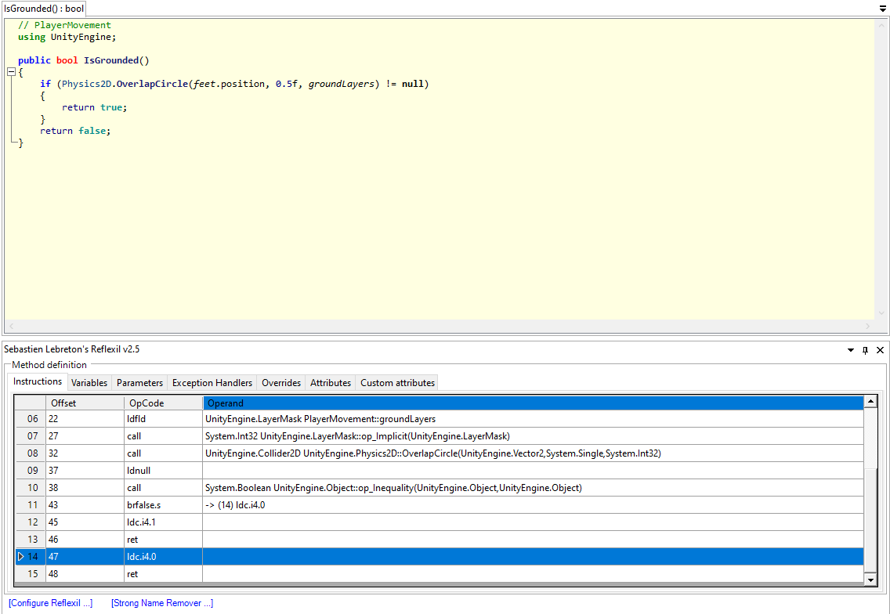

OpCode `call` at Offset 38 triggers an inequality check, thus corresponding to `Physics2D.OverlapCircle(feet.position, 0.5f, groundLayers) != null` OpCode `brfalse.s` (Meaning: Transfers control to a target instruction if value is false, a null reference, or zero.)  jumps to Offset 47 with OpCode `Idc.i4.0`. By comparing this with `Idc.i4.1`, we can deduce that `Idc.i4.0` likely means `false`. 

As such, change this to `Idc.i4.1`.


Sure enough, reloading the .dll will give this result.

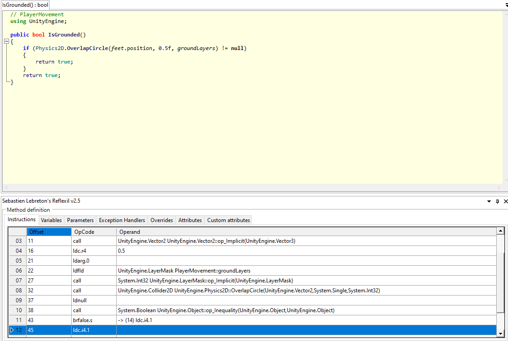


The player can now perform infinite jumping.

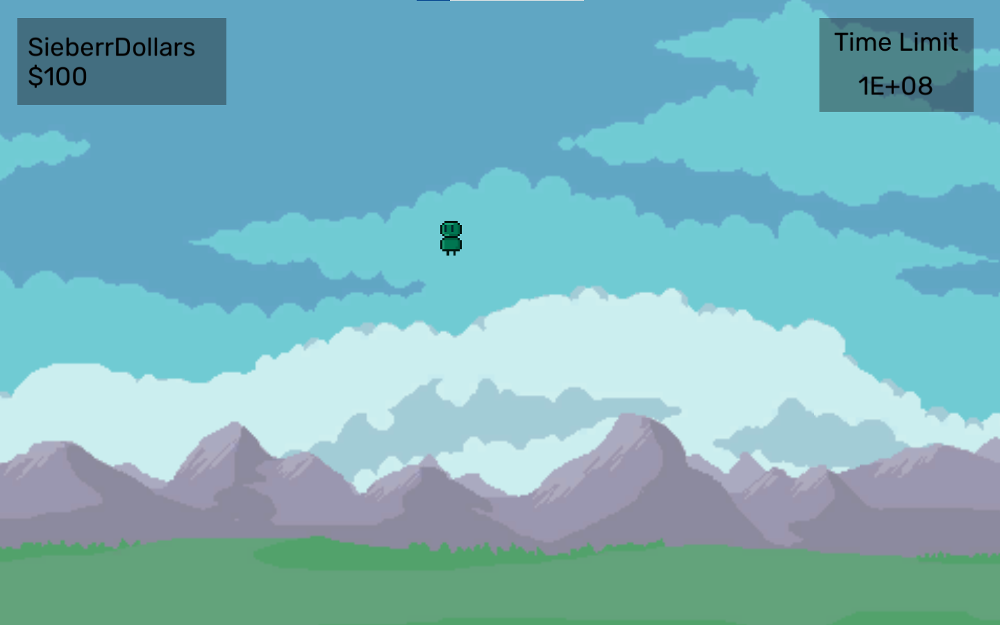


Repeatedly jump to find the cliff:

 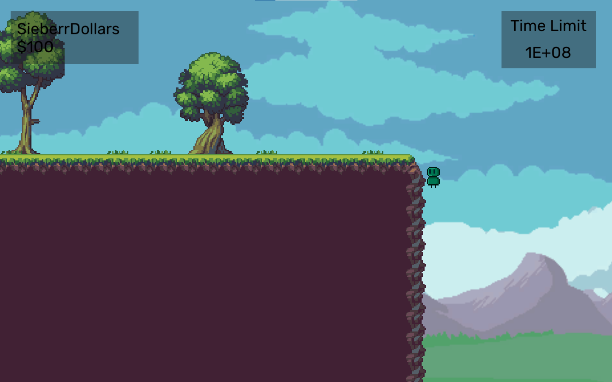


Walk left to find the second part of the flag:


The Clue NPC will give a different response after you reached the cliff. Play the game yourself to find out!


### Solving Coin NPC's Challenge

__________

Coin NPC needs you to have at least $100000000, but with only 8 coins each worth $100 and a starting value of $100, how are you going to solve this challenge?

A potential approach would be to find the `requirement` variable in `CoinNPC` and change the value, but you would quickly realise:

```c#
public ulong requirement;
```

The variable isn't initialised.

In fact, even the `currency` variable in `LevelManager` also suffers from the same fate:

```c#
public ulong currency;
```

Wait, `worth` from `CurrencyPickup` is initialised though!

```c#
public ulong worth = 100uL;
```

Let's change it to `100000000uL`!

This would have been possible, but then Reflexil refuses to change if the number is above 127. (int8)

What can be done about this?

Enter `IncreaseCurrency()` from `LevelManager`:

```c#
public void IncreaseCurrency(ulong amount)
	{
		currency += amount;
		currencyUI.text = "$" + currency;
	}
```

It seems like a relatively harmless piece of code:

1. Takes in `amount`.
2. Adds it to `currency`.
3. Displays `currency` on the UI.

Analysing the function with Reflexil:

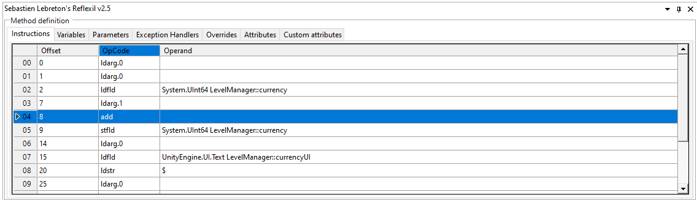

Notice that Offset 8 has an OpCode for `add`.

What if it is changed to `mul` (multiply)?


Well, now each coin collect get's multiplied to the current value of `currency`. A few coins collected will exceed the `requirement` set in the code. As such, interacting with Coin NPC will give you the third part of the flag.


### Solving Time NPC's Challenge

___

This part is extremely straightforward. Timer NPC wants you to wait for 100000000 seconds which is about 3.17 years.

The CTF is 12 hours. How?

If you can do the `CountDownTimer` obstacle, this is exactly the same:

1. Find `NPCStartingTime` and change its value to something small.
2. Walk over there and interact with it to get the fourth part of the flag.


### Solving Ascendant NPC's Challenge

________

Look back at Ascendant NPC's dialogue:

```
"Ever wonder what's beyond us?
We are just mere NPCs populating this desolate land...
You, on the other hand, can go to the 'Next Level'..."
Well, that's what the manuscripts said, but does that place actually exist, or...
```


While that comment became somewhat metaphysical, you would notice that `Next Level` was quoted out.

This, along with other clues within the dialogue, actually points to a **hidden scene** named "Next Level" in the game. None of the code written in the game actually leads to that hidden scene.

Bringing up Unity's API Documentation:


This is the code that should be used.

Put it simply, the following code needs to be injected:

```C#
using UnityEngine.SceneManagement;
```

Along with:

```c#
SceneManager.LoadScene("Next Level");
```


This injection can be performed anywhere on any C# script, but this writeup will use `AscendantNPC`'s `OnCollisionEnter2D` function as an example.

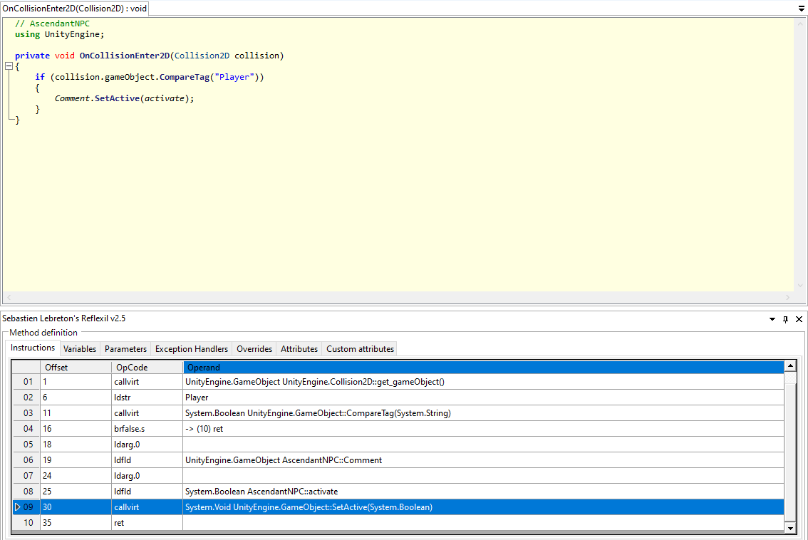

Right below Offset 30 and before OpCode `ret` (return), add a `call`, with operand type `Method Reference`, and then find `SceneManager.LoadScene()`, particularly the one asking for a `string` input:


Aside from that, the actual `string` is needed to be pushed into this method, and so another OpCode needs to be added *in front* of the call method.

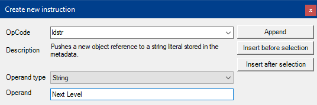

The table should look like this now:

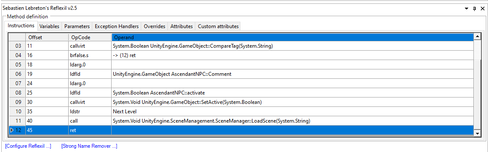


Save the .dll, start the game and interact with Ascendant NPC. You should see this:


That is the fifth and final part of the flag.


### Direct Decompiling and Recompiling

_________

If you have Visual Studio (not VS Code) or other capable C# IDEs, you can use this method as it is **much faster**.

Open the same .dll using ILSpy.

Instead of patching with Reflexil, click on Save Code instead.

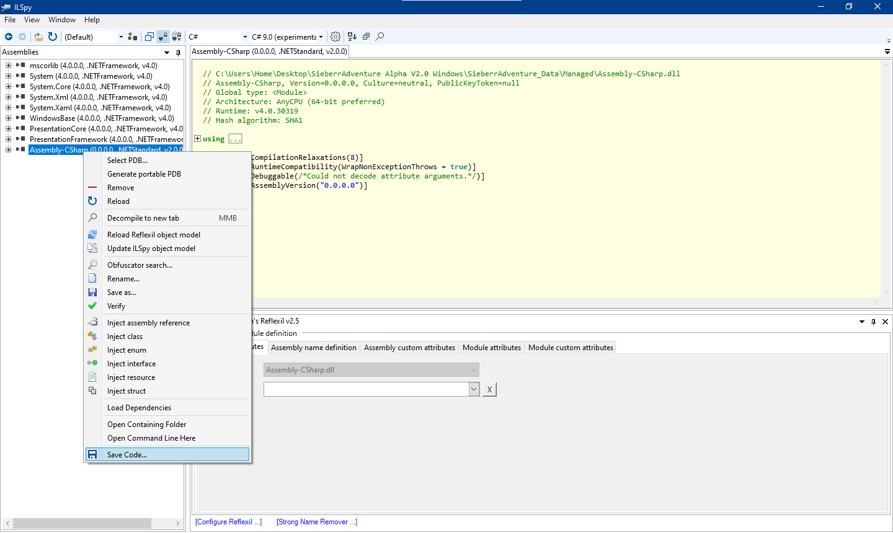

This will drop all the C# files, along with a CSPROJ file into a folder.


Open the CSPROJ file up.

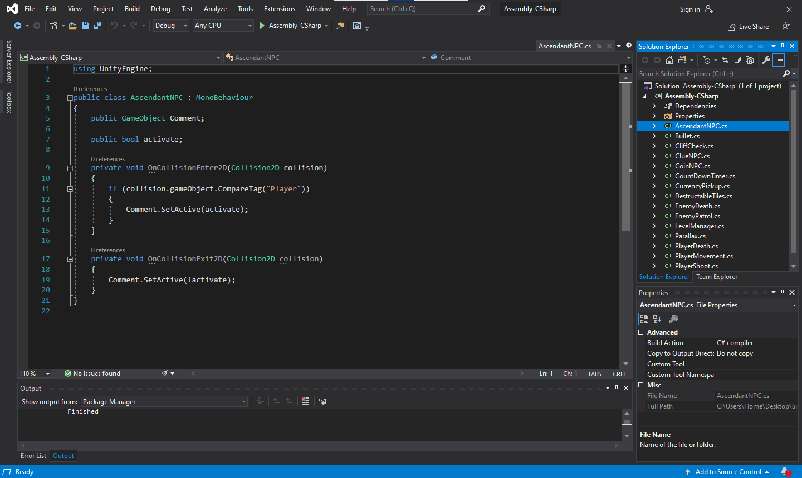


You can now edit whatever you want. Once you are done, just build the solution and copy the compiled Assembly-CSharp.dll file from `\bin\Debug\netstandard2.0`.

Do note that any variables declared as `public` may not change in game as Unity seems to override it with the values inputted within the original Unity Editor.


### Flag

______

`IRS{H0pe_y0u_lik3d_un1ty_gAm3_pAtch1ng_g00dn3ss}`