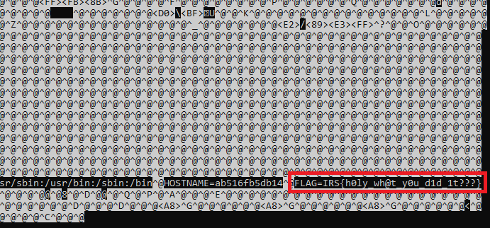

# IRS Internal CTF
## THE 2.0 [misc]

_Same executable, same challenge. Can you get to `env`?_

### A note on 2.0

Originally, this challenge was going to be a lot harder: you'd have to read the flag out from `/proc/self/mem` or some other nonsense, and that would've filled the pwn quota for this ctf by a stretch.

On the flip side, I couldn't actually solve my own challenge that way. So I made things a whole lot simpler, by adding this ol' line to the `Dockerfile`:

`RUN apt install -y gdb`

As well as these few lines to `docker-compose.yml`:
```
    security_opt:
      - seccomp:unconfined
    cap_add:
      - sys_ptrace
```

That simplifies things _a lot_. There is this cool command --- an offspring of `gdb` called `gcore` --- that will dump the memory of any process to a very nice file, allowing you to extract out the `env` flag via the simple trick you would've learnt from the first edition of THC.

We're rambling off into the void. How about we talk about what the challenge is actually about?

### Running old tricks into the ground

The description says that we need to get into `env`. If you'll recall from the previous writeup --- or from adventures through IDA --- there is a small whitelist for inputted commands:
```sh
$ echo $FLAG
Woah, real hacking ain't allowed here.
$ env
Woah, ...
```
There may be some other way to get to the environment variables. I frankly don't know. This challenge is simple enough anyway that the presence of another solution is not a big deal, points-wise.

If we want to access `env`, dumping the memory of any command-line process is always enough. The presence of `getenv()` was really just left in the binary as a hint for what the intended solution was; removing `getenv()` and `char *flag` would still leave the environment variable, `$FLAG`, embedded somewhere inside the executable's RAM.

In any case, if we want to grab the flag, we can dump the memory of _any_ process:


```sh
$ ps
   PID TTY          TIME CMD
    1 ?        00:00:00 pwncat
    7 ?        00:00:00 socat
  186 ?        00:00:00 a.out
  189 ?        00:00:00 sh
  190 ?        00:00:00 ps
$ gcore 1
0x00007facd9dc1c2a in wait4 () from /lib/x86_64-linux-gnu/libc.so.6
Saved corefile core.1
[Inferior 1 (process 1) detached]
$ tar cf tempfile /root
$ stat tempfile
  File: tempfile
  Size: 573440 ... #that's really big. Let's compress it.
...
$ rm tempfile
$ tar zcf tempfile /root
$ stat tempfile
  File: tempfile
  Size: 86828 ... #that's a lot better
$ base64 tempfile
...
```
The base64 is rather long, but I C-c'd it anyway, and you can get the file back client-side:
```sh
you@home-terminal:~$ base64 -di copied_base64.txt > tempfile
you@home-terminal:~$ tar zxf tempfile root/core.1
you@home-terminal:~$ grep FLAG root/core.1 | less
```
You should see something like this:
<p align="center">

</p>
With that, you're done!

## Flag
`IRS{h0ly_wh@t_y0u_d1d_1t???}`