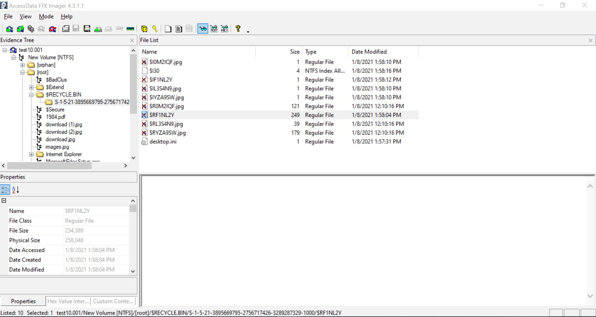
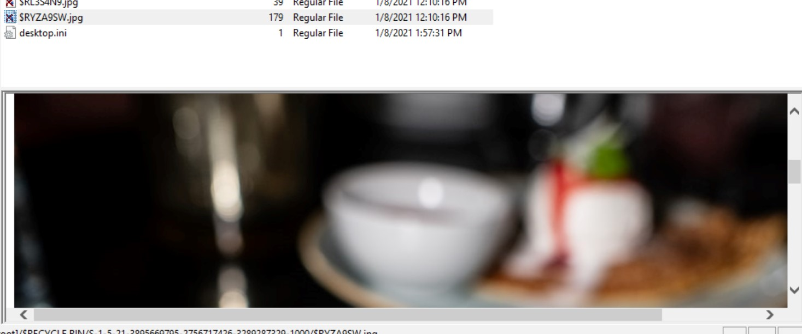
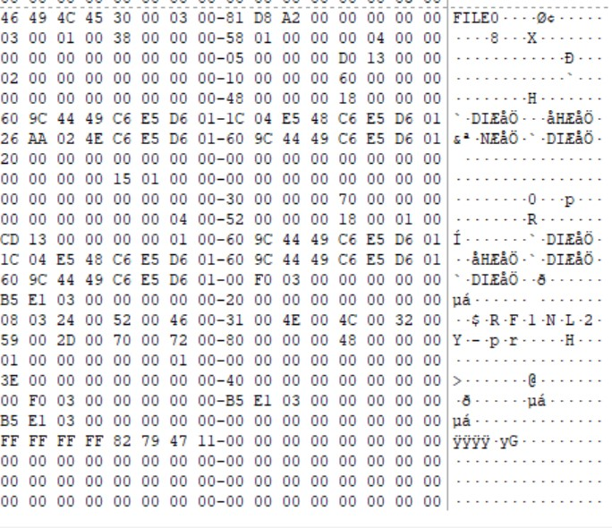
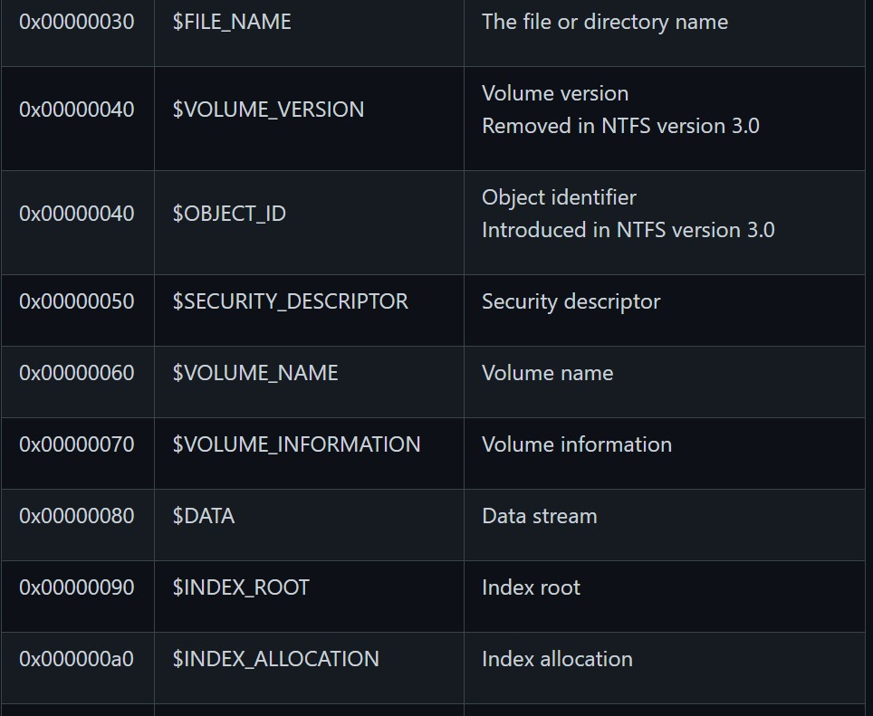
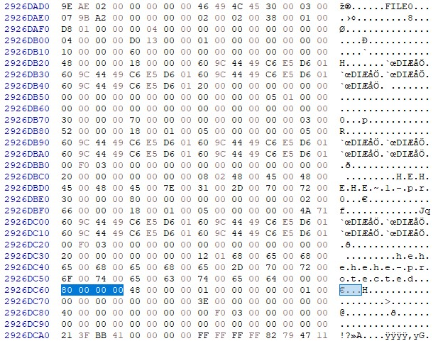
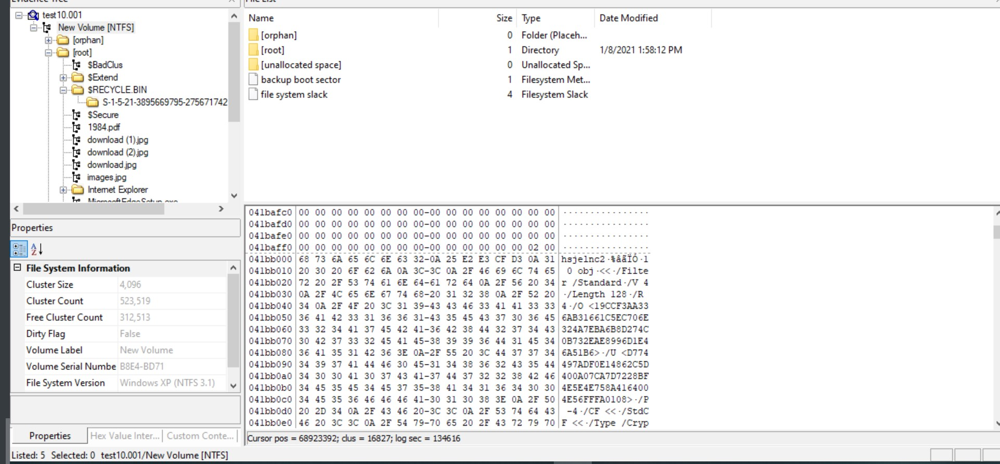

# Pwned - (0 Solves) [10 Points]

```
Oh no!!! One of our computers got pwned by SieberrHealth's feared hacker "The Duck". We have locked down the computer and made a forensic image of the hard drive in hopes that someone can help us find if they left anything that will aid in our war against SieberrHealth.

Can you help us check out this Image of the Hard Drive?

Note: There is no real malware in the hard drive, though it is still always good practice to do any live analysis in a virtual machine
```

We are given a `test10.zip` with a `test10.001`, running `file` on it reveals that it is a probably an **image of a NTFS partition/system**. Let's open it up in **FTK Imager** to take a look at what's inside. 


## Initial Analysis

Since the description says `help us find anything that will aid in our war against SieberrHealth`, we can assume that the attackers have tried to erase their traces and our task is to find if they left anything behind. So let's find look at the **Recycle Bin**!



As we can see, there are many entries in the Recycle Bin, an "X" indicates a user has **Permanently Deleted** option after moving the file to the recycle bin. But clicking on some of the files, we can still see the images, such as this:



Why is that so? If you do a quick google search you will realise that when you "Permanently delete" a file, it is not deleted, but simply **marked as deleted** in a **Master File Table**, and other new files that are added to the system will then make use of this **Free Space** for storage, overriding the data. However, if little to no new files are added to the system, the "Permamently Deleted" files are not deleted at all, and the data remains there.

Looking at the list of deleted files, we can see that most have a size of only 1, which suggests that the data is probably gone, since practically no data has only size 1. But when we look at the files which do have a **decent size**, we notice that **1 file in particular** `$RF1NLZY`, the largest file of deleted files, can't seem to load. That's odd... if there's an MFT entry, shouldn't FTK imager be able to extract the data?


## Investigating the MFT

Let's dive into the MFT to take a look at what's going on!

First, what is the MFT? The MFT stands for the **Master File Table (MFT)**, and is sort of a **directory** used in **NTFS systems** (in layman terms) that tells the system where **<u>each</u> file is stored**, their name and size etc. Each file has **it's own <u>MFT entry</u>** in the table.

The first **16 entries** in an MFT are reserved by the system for special purposes.

Thankfully, FTK Imager includes an `$MFT` file with the "parsed MFT", so we can take a look at it. We will jump to our desired file `$RF1NLZY` to look at it's MFT entry:



But hey, *how do we read an MFT entry?*

We first have to understand the **structure of each MFT entry**, we can look at the [NTFS docs](https://github.com/libyal/libfsntfs/blob/main/documentation/New%20Technologies%20File%20System%20(NTFS).asciidoc#5-the-master-file-table-mft). Each MFT entry has a fixed length of **1024 bytes**

| Offset | Size | Value         | Description                                                  |
| ------ | ---- | ------------- | ------------------------------------------------------------ |
| 0      | 4    | "BAAD" "FILE" | Signature                                                    |
| 4      | 2    |               | The fix-up values offset Contains an offset relative from the start of the MFT entry According to `[MSDN]` this value is the update sequence array offset |
| 6      | 2    |               | The number of fix-up values According to `[MSDN]` this value is the update sequence array size. |
| 8      | 8    |               | Metadata transaction journal sequence number Contains a $LogFile Sequence Number (LSN) |
| 16     | 2    |               | Sequence (number)                                            |
| 18     | 2    |               | Reference (link) count                                       |
| 20     | 2    |               | Attributes offset (or first attribute offset) Contains an offset relative from the start of the MFT entry |
| 22     | 2    |               | Entry flags See section: [MFT entry flags](https://github.com/libyal/libfsntfs/blob/main/documentation/New Technologies File System (NTFS).asciidoc#mft_entry_flags) |
| 24     | 4    |               | Used entry size Contains the number of bytes of the MFT entry that are in use |
| 28     | 4    |               | Total entry size Contains the number of bytes of the MFT entry **Could this be used to store data larger than 1024 - header continuously?** |
| 32     | 8    |               | Base record file reference See section: [The file reference](https://github.com/libyal/libfsntfs/blob/main/documentation/New Technologies File System (NTFS).asciidoc#file_reference) |
| 40     | 2    |               | First available attribute identifier                         |

So we can see that each MFT entry starts with the signature `FILE` as we can see above. 

<u>Analysing this **MFT entry**'s header:</u>

```bash
46 49 4C 45 #"FILE" signature
3000 #Fix-up values
0300 #No. of fix-up values
81D8A20000000000 #Metadata
0300 #Sequence no.
0100 #Refernece count
3800 #Attributes offset (0x38 = 56) [!!!]
0000 #MFT Entry Flags - (0x0000 means that the file is DELETED) [!!!]
58010000 #Used entry size of MFT in bytes
00040000 #Total entry size for MFT entry in bytes
0000000000000000 #Base record file reference
0500 #First available attribute identifer
```

Even though the MFT says this file is deleted, we know that nothing is truly deleted as that's how a filesystem works.

In each MFT entry, there are **attributes** which contain information, here is a list of the types of attributes:


We will be focusing on the **$DATA attribute** since it contains **data!!!**, and it has a signature of `0x00000080`

The docs states that a **$DATA attribute** simply contains data, and there is nothing much special about it. Hence, we just need to use the general structure of an attribute:

| Offset | Size | Value | Description                                                  |
| ------ | ---- | ----- | ------------------------------------------------------------ |
| 0      | 4    |       | Attribute type (or type code) See section: [The attribute types](https://github.com/libyal/libfsntfs/blob/main/documentation/New Technologies File System (NTFS).asciidoc#attribute_types) |
| 4      | 4    |       | Size (or record length) The size of the attribute including the 8 bytes of the attribute type and size |
| 8      | 1    |       | **<u>Non-resident flag (or form code) 0 ⇒ RESIDENT FORM 1 ⇒ NONRESIDENT FORM</u>** |
| 9      | 1    |       | Name size (or name length) Contains the number of characters without the end-of-string character |
| 10     | 2    |       | Name offset Contains an offset relative from the start of the MFT entry |
| 12     | 2    |       | Attribute data flags See section: [MFT attribute data flags](https://github.com/libyal/libfsntfs/blob/main/documentation/New Technologies File System (NTFS).asciidoc#mft_attribute_data_flags) |
| 14     | 2    |       | Attribute identifier (or instance) **An unique identifier to distinguish between attributes that contain segmented data.** |

<u>Analysing the **$DATA Attribute**:</u>

```bash
80000000 #Header - $DATA 
48000000 #Size of the attribute (0x48 = 72)
01 #Non-resident flag (since 0x01) - This means that the data/file is too big to be stored directly in the MFT and is stored somewhere else in the filesystem [!!!]
00 #No. of characters of name
0000 #Name offset
0000 #Attribute data flags
0100 #Attribute identifer
```

What is important here is that the **Non-resident flag** is set, so that means that the data is stored somewhere else in the filesystem and not in the MFT since it is too large. (Makes sense, since the MFT entry can store at most 1024 bytes including the headers and stuff)

When the **Non-resident flag is set**, there is a **special format that follows**:

| Offset | Size | Value | Description                                                  |
| ------ | ---- | ----- | ------------------------------------------------------------ |
| 0      | 8    |       | First (or lowest) Virtual Cluster Number (VCN) of the data   |
| 8      | 8    |       | Last (or highest) Virtual Cluster Number (VCN) of the data **Seen this value to be -1 in combination with data size of 0** |
| 16     | 2    |       | Data runs offset (or mappings pairs offset) Contains an offset relative from the start of the MFT attribute |
| 18     | 2    |       | Compression unit size Contains the compression unit size as `2^(n)` number of cluster blocks. This value is used for compressed data in the data runs. **A value of 0 indicates the attribute data is uncompressed.?** **Seen on XP, compressed MFT attribute data with compression unit size of 0.** **So it looks more the default compression unit size (16 cluster blocks) should be used.** |
| 20     | 4    |       | Padding Contains zero-bytes                                  |
| 24     | 8    |       | Allocated data size (or allocated length) Contains the allocated data size in number of bytes. This value is not valid if the first VCN is nonzero. |
| 32     | 8    |       | Data size (or file size) Contains the data size in number of bytes. This value is not valid if the first VCN is nonzero. |
| 40     | 8    |       | Valid data size (or valid data length) Contains the valid data size in number of bytes. This value is not valid if the first VCN is nonzero. |

Let's analyse the the next 48 bytes of data:

```bash
0000000000000000 #First VCN
3E00000000000000 #Last VCN
4000 #Data runs offset [!!!]
0000 #Compression unit size
00000000 #Padding
00F0030000000000 #Allocated data size
B5E1030000000000 #Data size
B5E1030000000000 #Valid data szie
```

We see a **Data Runs**! Data runs contain information about which cluster and how many clusters the data is stored in. 

| Offset | Size                            | Value | Description                                                  |
| ------ | ------------------------------- | ----- | ------------------------------------------------------------ |
| 0.0    | 4 bits                          |       | Number of cluster blocks value size Contains the number of bytes used to store the data run size |
| 0.4    | 4 bits                          |       | Cluster block number value size Contains the number of bytes used to store the data run size |
| 1      | Size value size                 |       | **Data run number of cluster blocks Contains the number of cluster blocks** |
| …      | Cluster block number value size |       | **Data run STARTING cluster block number**                   |

**<u>Note:</u>** If a data runs **does not end with 0000** afterwards, that is **another data run**. This signifies that the file is stored in **pieces in different places around the filesystem**

Let's analyse this data run!

```
0000000000000000
```

Wait... *it's empty*? That's weird... perhaps that's why FTK Imager was unable to extract this "deleted file"! 


## The Trick

The trick here is that this MFT entry has been **tampered with** and the **data runs offset values deleted**. However, there still **exists another MFT record - that of the deleted files original location!** Now FTK Imager doesn't show the **original name of the file and path**, but opening it in `Autopsy` reveals the original path of `$RF1NLZY`: `F:\hehehehe-protected`. Now that's a suspicious file.

If you try to find the MFT record of `hehehehe-protected` in the `$MFT` in FTK Imager, you will find a record. But for some reason, the **$DATA attribute does not point to the location of the data**, instead it says that it is "Resident Data", while there is clearly no data.

 Instead, if you try some external MFT parser, such as that of Volatility's `mftparser`, we will see some very interesting results:

```bash
volatility -f test10.001 mftparser > mftparser.txt

...
***************************************************************************
MFT entry found at offset 0x2926dad8
Attribute: In Use & File
Record Number: 5072
Link count: 2


$STANDARD_INFORMATION
Creation                       Modified                       MFT Altered                    Access Date                    Type
------------------------------ ------------------------------ ------------------------------ ------------------------------ ----
2021-01-08 13:58:04 UTC+0000 2021-01-08 13:58:04 UTC+0000   2021-01-08 13:58:04 UTC+0000   2021-01-08 13:58:04 UTC+0000   Archive

$FILE_NAME
Creation                       Modified                       MFT Altered                    Access Date                    Name/Path
------------------------------ ------------------------------ ------------------------------ ------------------------------ ---------
2021-01-08 13:58:04 UTC+0000 2021-01-08 13:58:04 UTC+0000   2021-01-08 13:58:04 UTC+0000   2021-01-08 13:58:04 UTC+0000   HEHEHE~1

$FILE_NAME
Creation                       Modified                       MFT Altered                    Access Date                    Name/Path
------------------------------ ------------------------------ ------------------------------ ------------------------------ ---------
2021-01-08 13:58:04 UTC+0000 2021-01-08 13:58:04 UTC+0000   2021-01-08 13:58:04 UTC+0000   2021-01-08 13:58:04 UTC+0000   hehehehe-protected

$DATA


$OBJECT_ID
Object ID: 40000000-0000-0000-00f0-030000000000
Birth Volume ID: 00000000-0000-0000-0000-000000000000
Birth Object ID: 213fbb41-0000-0000-ffff-ffff82794711
Birth Domain ID: 969ba200-0000-0000-509b-a20000000000

***************************************************************************
...
```

If you search up `hehehe-protected` in a Hex-Editor, you will also realise that there lies several different MFT entries for hehehe-protected. But all of these **don't seem to appear in FTK Imager's MFT Parser**. After looking through them you will realise that the only good one is the one by volatility's `mftparser` (the rest do not seem to even have `$DATA` attributes, so let's take a look at it!)



There are a few `$DATA` attributes, but it seems like only 1 has a length that is **not 0**. We can employ the same method in analysing $DATA attributes from above, so let's skip directly to the **Data Run**.

```bash
2 #Size of Starting Cluster Block No.
1 #Size of No. of Cluster Blocks
3F #No. of Cluster Blocks (0x3F = 63)
BB 41 #Starting Cluster Block No. (0x41BB = 16827)
0000 #Since it is 0000 afterwards, there is only 1 datastream
```

We now have the cluster block number where the data is stored!

Jumping to there in **FTK Imager** (Click on NTFS > Right click on the hex viewer > Go to Sector/Cluster):



Nice! We see what appears to be a **PDF**! Next, we also need to calculate the length of the data. We know that the data spreads across 63 clusters, and from FTK Imager in `File System Information`, we know that each **Cluster Size** is **4096 bytes**. Hence the data size is (63 * 4096 = 258048 bytes), we then simply have to select this data block and extract the data!


## Final

We can then easily fix the header by replacing the first few bytes with the PDF header `%PDF-1.7`, but then it is **password-protected**!

Oh no! Looking around the image, we find a text file that is not deleted and just sitting there (`A Message.txt`):

```
Hehehe, you have been P W N E D!!!
We have cleaned up all our traces, you will never find us.
~ SieberrHealth Duck

In the rare event you do, perhaps you are worthy of joining us, have this "key":
RzhAN307U2EuOSVDOWp3Xw==

Those who know what to do with it will be deemed worthy.
```

Hmm a key? Decoding the base64, we get `G8@7};Sa.9%C9jw_` and inputting it as the password to the PDF, we get the flag!


```
IRS{NTF3_Ma3teR_duck_t@ble!!!}
```


## Learning Points

- The NTFS and MFT
- What is "Permanently Deleted" from the Recycle Bin is sometimes not actually deleted at all
- Automated recovery tools seem to sometimes miss out other MFT entries, which is problematic if an attacker is smart enough to purge some of the MFT entries of the file (though honestly really dumb if they do not purge *every* entry). 

## Addendum

- I took quite some time to make this challenge as it seems like windows actually overwrites deleted file data pretty quickly with temporary files (even so if you have tons of programs) and this PDF file was relatively small.
- I ended up making a partition to simulate an external HDD/drive, and the files stayed there for quite some time even after being deleted!
- Interestingly, if you take a look at the MFT entry for `hehehehe-protected`, you will see that it is still marked as **Allocated & In use** :thinking:

