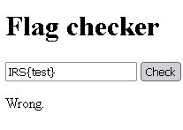
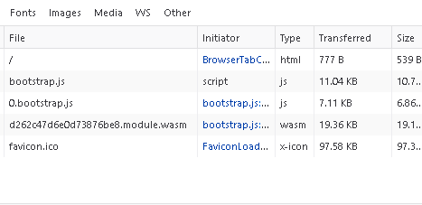
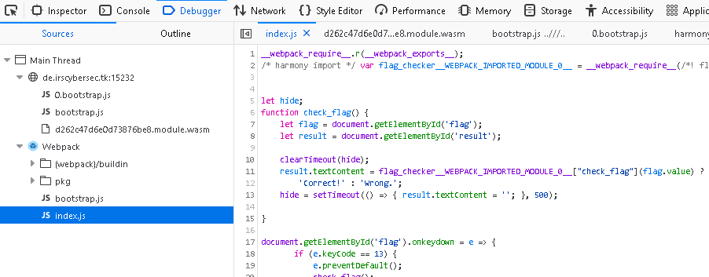
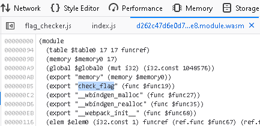
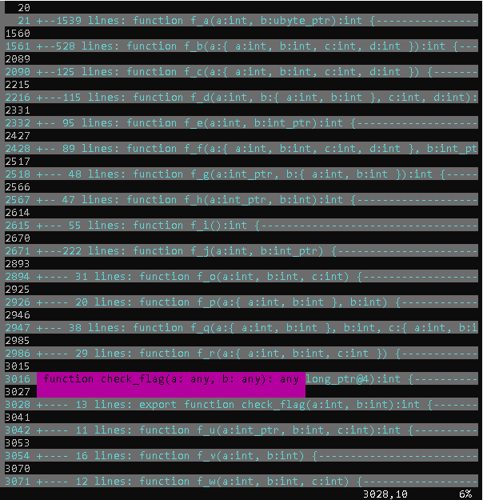
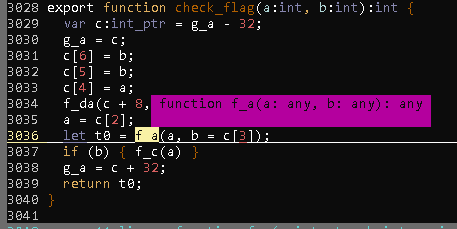
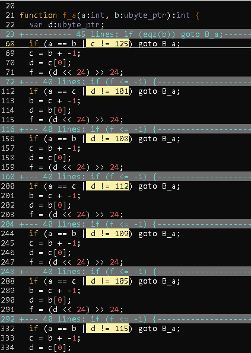
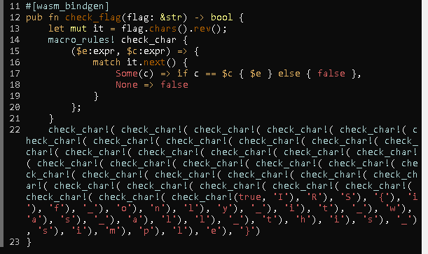

# Flag checker v1 [50]
`http://challs.sieberrsec.tech:15231/`

## Solving
A simple flag checking form is present on the site:



In `http://challs.sieberrsec.tech:15231/index.js`:
```js
function check_flag() {
    let flag = document.getElementById('flag');
    let result = document.getElementById('result');
    
    clearTimeout(hide);
    result.textContent = btoa(flag.value) === "SVJTe2luc3AzY3RfZTFlbWVudH0=" ?
        'Correct!' : 'Wrong.';
    hide = setTimeout(() => { result.textContent = ''; }, 500);

}
```
Unwrap the base64 password to get the flag:
```js
>>> atob("SVJTe2luc3AzY3RfZTFlbWVudH0=")
"IRS{insp3ct_e1ement}"
```
# Flag checker v2 [900]
_Same interface, another `check_flag()`._

_Easy, right?_

http://de.irscybersec.tk:15232/

## Inspecting

The site looks about the same. Let's have a look at the console:



Uh oh. Where's `index.js`? The debugger will tell show where it's gone:



`index.js`, once unpacked, is pretty similar to its rendition in the original `flag checker`. The difference here is that the base64 flag comparison in the first challenge is replaced with some obscene reference to `flag_checker__WEBPACK_IMPORTED_MODULE__0["check_flag"]`.

By following the chain of imports, it's quickly apparent that the internal `check_flag` function is implemented in `wasm`.



So the main challenge is to figure out how `check_flag` is implemented within wasm. Splendid.

## wasm eyeballing

Reading the lisp-like disassembly of a wasm module is frightening, so I elected to use a [Tool](https://github.com/WebAssembly/wabt) :tm:

```sh
$ wget http://de.irscybersec.tk:15232/d262c47d6e0d73876be8.module.wasm
$ wasm-decompile *.wasm > decompiled.ts
```

Opening the output of the decompiler in vim, I see a lot of functions surrounding `check_flag()`:



`check_flag()` looks like this:



I have `f_a` highlighted here, because (unlike the other functions) `f_a` is an _incredibly_ long function, clocking in at ~1.5k lines of pseudocode. Some amount of fiddling with code folding will make the pattern in `f_a` obvious:



These comparisons look suspiciously like ASCII values. What if we try converting each of them in sequence?

```sh
$ grep ' [a-z] != [0-9]' *.ts | # filter for lines with the highlighted string in the pic above
> grep '[0-9]*' -o | # get the ASCII values only for each line
> python -c 'while 1: print(chr(int(input())))' 2>/dev/null | # convert each value to ASCII
> tr -d \\n | rev # remove newlines and reverse the string 
S{if_only_it_was_all_this_simple}
```

That _almost_ looks like the flag, except that it has the header missing. But if we add the header ourselves, we can try the flag against the online flag checker:


It works!

## So, what is actually happening in `check_flag()`?

This is the actual source for `check_flag()` (The last line was written with a vim macro):



`check_flag()` takes a string (the input string from the website) and individually checks every character using `check_char!`. I wanted to avoid someone running `strings` on the `.wasm` file to find the flag, so I couldn't insert the actual flag as a single string constant anywhere in the source file.
