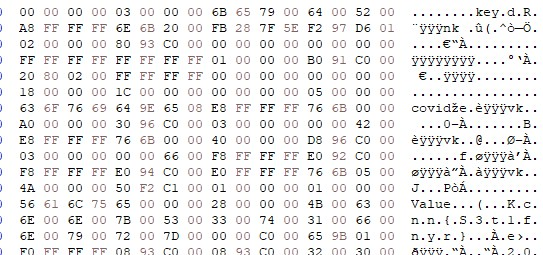

# Corrupted Hive [3000 Points] 

### *This challenge was not solved during the competition*

```
From intel sources, we discovered that the attacker likes to use registry to create persistency. From Forensic-challenge-2, we noted that the registry patch contains a specific key word. Search the registry hive and find the flag.
```

We are given a registry hive which was supposedly 'corrupt'.
We first tried to use regripper to open the registry hive, but we got "Select Not Found" for every plugin in regripper. (Indeed it is corrupt, sad.)

Afterwards, we tried to repair the registry hive by fixing all the `hbin` headers as we noticed they were largely missing. But after hours of work, no luck, and the CTF ended :sweat:.

## So how do you solve this?

After the CTF, we asked the staff member who made this challenge: `w31q` on how to solve it.

Apparently, the goal was **not to fix the corrupted hive** (since it is probably corrupted beyond imagination - *that English dictionary, gosh*), but rather **scrap the various data fragments out of the hive by understanding the file structure**

## Let's Dive in!

After solving forensics-challege-2 (`Voices in the head`), we are given a hint that the registry patch we are looking for contains the word `covid` in it.

A quick search in HxD revealed a word `covid` and some words such as "Govtech" around it. But what in the world is this and where is the flag!?



And here's where we have to dive into the [registry file format](https://github.com/msuhanov/regf/blob/master/Windows%20registry%20file%20format%20specification.md#key-node) in order to understand what is going on. 

**<u>Note:</u>** All values stored in the registry are in **little-endian!**

- A registry is made out of **5 subtrees**, which are:
  - HKEY_CLASSES_ROOT
  - HKEY_CURRENT_USER
  - HKEY_LOCAL_MACHINE
  - HKEY_USERS
  - HKEY_CURRENT_CONFIG
- In **each subtree** we have **keys,subkeys** and **entities**
- **Keys** store **at least 1 subkey** (*1 level down from a subtree*)
- **Subkeys** store **entries** and **other subkeys** (*1 level down from keys*)
- **Entries** store that **juicy data** (*1 level down from subkeys*)

*Wait wait, so uhm, how exactly does this look like!?*


The **base block** is basically like a **header for the registry**, but we are not focused on that today.

Next up is the **Hive Bins**, which **contains <u>cells</u>** (*with no gaps between them*)

Each **<u>cell</u>** has a format of:

| Offset | Length | Field     | Description                                                  |
| ------ | ------ | --------- | ------------------------------------------------------------ |
| 0      | 4      | Size      | Size of a current cell in bytes, including this field (aligned to 8 bytes): the size is positive if a cell is unallocated or negative if a cell is allocated (use absolute values for calculations) |
| 4      | ...    | Cell data |                                                              |

and in **<u>Each "Cell Data"</u>** contains **<u>a</u>** **record** (also known as your **keys, subkeys and entries**)

| Record            | Description                                             |
| ----------------- | ------------------------------------------------------- |
| Index leaf (li)   | Subkeys list                                            |
| Fast leaf (lf)    | Subkeys list with name hints                            |
| Hash leaf (lh)    | Subkeys list with name hashes                           |
| Index root (ri)   | List of subkeys lists (used to subdivide subkeys lists) |
| Key node (nk)     | Registry key node                                       |
| Key value (vk)    | Registry key value                                      |
| Key security (sk) | Security descriptor                                     |
| Big data (db)     | List of data segments                                   |

After staring at it, we will know that the `nk` signature stands for a **Key Cell Table** or **Key Node** inside a cell

Let's take a look at the breakdown of the `nk key` based of [this format](https://github.com/msuhanov/regf/blob/master/Windows%20registry%20file%20format%20specification.md#key-node).

```
A8 FF FF FF --> Size
6E 6B --> nk header
20 00 --> bit Mask (Flags)
FB 28 7F 5E F2 97 D6 01  --> Timestamp
02 00 00 00 --> Access Bits
80 93 C0 00 --> Parent Key Node offset relative to the start of hbin data [!!!]
00 00 00 00 --> No. of subkeys
00 00 00 00 --> No. of volatile subkeys
FF FF FF FF --> Subkeys list offset (Note: FF FF FF FF means nowhere, so this does not exist)
FF FF FF FF --> Subkeys list offset
01 00 00 00 --> No. of Key Values
B0 91 C0 00 --> Key values list offset [!!!]
20 80 02 00 --> Key Security Offset
FF FF FF FF --> Class Name Offset
00 00 00 00 --> Largest subkey name length
00 00 00 00 --> Largest subkey class name length
18 00 00 00 --> Largest value name length
1C 00 00 00 --> Largest value data size
00 00 00 00 --> WorkVar
05 00 --> Key name Length <<<
00 00 --> Class Name Length
63 6F 76 69 64 --> Key Name String (aka "covid") <<<
```

As we can see from here, it is probably a **subkey** since it has a **parent key node** and it **points to other subkeys**, let's follow them! 

Since we have a hex offset of `B091C0` in little-endian, converted to big-endian it is `C091B0`. We then have to + `1000` (in hex) since the Hive Bin has an offset of 1000 to the start of the file. We then end up with this:

*Wait!? Where is the signature? What is this?*

As stated in the docs, a cell data can contain `Raw Value Data` (*aka no signature*) **and** any **other record**, but it still follows the **cell format!**

```
F0 FF FF FF --> Size of cell
60 93 C0 00 --> Cell data (aka offset to another cell)
```

*Now you might ask, what about the rest of the data? Well tbh I am not sure... but let's just take it that these first 4 bytes gives us an offset*


Calculating the offset in big-endian, we have: C09360 + 1000 = **C0A360**, and we end up at a **Key-Value** (*we are close to the data*)! Again, let's analyse the Key-Value:

```
E0 FF FF FF --> Size
76 6B --> Signature
03 00 --> Name Length
1A 00 00 00--> Data size
F0 F1 C1 00--> Data offset (relative from start of hbin data again)
01 00 00 00--> Data type (REG_SZ)
01 00 --> Flags
C0 00 --> Spare
4B 65 79 --> Value name string (length 3: "Key")
```

Let's jump to the data at `C20250` (big-endian address), we find another `Raw Value Data`, which looks **oddly like base64**

```
B0 FF FF FF --> Size
5A 00 33 00 5A 00 75 00 62 00 48 00 46 00 76 00 63 00 43 00 31 00 7A 00 62 00 33 00 52 00 37 00 56 00 7A 00 4E 00 75 00 4D 00 54 00 55 00 33 00 64 00 58 00 56 00 66 00 56 00 54 00 46 00 68 00 4D 00 33 00 30 00 3D
>>> in ASCII (cleaned up)
Z3ZubHFvcC1zb3R7VzNuMTU3dXVfVTFhM30=
>>> Decoded
gvnlqop-sot{W3n157uu_U1a3}
```

Now... that looks really really like the flag! But how do you decode it? After trying several different ciphers, we finally realised there was some white text in the docx from the previous challenge.

It read `The attacker like to use Bifid Cipher`, and hence we end up with:

```
govtech-csg{R3g157ry_H1v3}
```

(somehow, we still haven't figured out the bifid cipher grid)